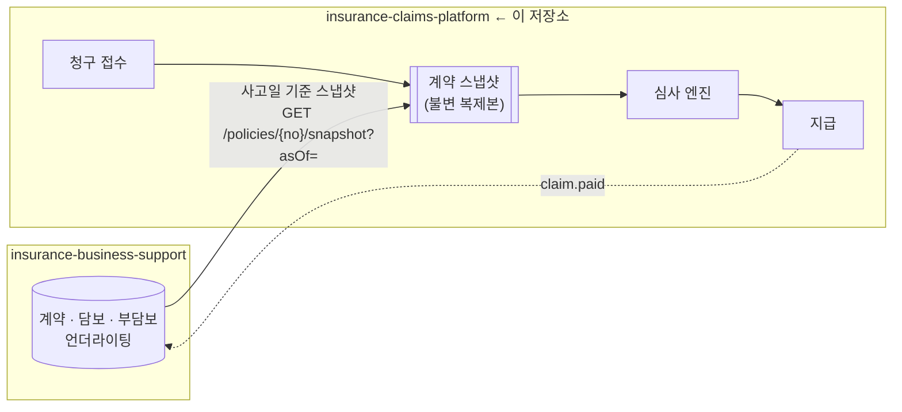

# 실손의료보험 청구 자동화 플랫폼

> 사고일 시점의 계약을 고정해, **설명 가능한 심사**로 보험금을 산출하는 백엔드 시스템

[]()
[]()
[]()
[]()

---

## 이 프로젝트가 푸는 문제

실손의료보험 청구 심사는 "얼마를 줄 것인가"를 계산하는 문제가 아니다.
**"이 금액이 왜 나왔는지 설명할 수 있는가"** 의 문제다.

고객이 30만원을 청구했는데 12만 4천원이 지급되면, 그 차액 17만 6천원을 항목별로 설명해야 한다.
설명하지 못하면 민원이 되고, 민원이 분쟁이 되고, 분쟁이 감독기관 검사가 된다.

이 시스템의 모든 설계 결정은 한 문장으로 수렴한다:

> **심사 결과의 모든 단계는 재현 가능하고, 설명 가능하며, 사후에 변조 불가능해야 한다.**

### 산출 예시 — 통원, 상급종합병원, 4세대

| 항목 | 금액 |
|---|---|
| 총 진료비 | 300,000원 |
| ─ 급여 공단부담금 | 120,000원 → **보상 대상 아님** |
| ─ 급여 본인부담금 | 60,000원 |
| ─ 비급여 | 120,000원 |

```
급여   : 60,000 - max(60,000×20%, 20,000)  = 60,000 - 20,000 = 40,000
                      ↑ 12,000    ↑ 상급종합 최소공제 (더 큼)
비급여 : 120,000 - max(120,000×30%, 30,000) = 120,000 - 36,000 = 84,000
                      ↑ 36,000 (더 큼)  ↑ 30,000
───────────────────────────────────────────────
지급액 124,000원
```

이 계산의 **모든 단계가 룰 ID·약관 조항·입출력과 함께 영구 기록**된다.

---

## 🎯 기능 요구 사항

구현 전에 기능을 쪼개 적고, 끝난 것만 체크한다. 체크되지 않은 항목은 **아직 동작하지 않는다.**

### Phase 0 — 골격

- [x] Gradle 멀티모듈 (`claims-domain`에 Spring/JPA/Jackson **클래스패스 부재**)
- [x] `Money` — 원 단위 정수 (원화에 `scale=2`는 틀렸다)
- [x] `AggregateRoot` · `DomainEvent` · `EventId`(ULID) — 이벤트를 `record()`하는 뼈대
- [x] ArchUnit 아키텍처 규칙 11종 (의존 방향 · 금지 임포트 · **검사 대상 공백 탐지**)
- [x] Testcontainers PostgreSQL + Flyway + `ddl-auto: validate` (H2 금지)
- [x] Transactional Outbox — 테이블 · `OutboxAppender` · 원자성 통합 테스트
- [x] GitHub Actions CI + 커버리지 게이트
- [x] `SnapshotChecksum` + 계약 테스트 — business-support와 같은 바이트열에 고정

### Phase 2 — 청구 접수 + 스냅샷 연동 ← **다음**

> 선행 조건: business-support Phase 1 (스냅샷 API) — **충족됨**

- [ ] `Claim` 애그리거트 + 상태머신 (v1의 "PENDING에서 못 벗어남"을 고친다)
- [ ] 사고일 기준 스냅샷 조회 → **불변 복제본으로 저장** + 체크섬 검증
- [ ] 민감 타입 — `toString()`이 마스킹된 값을 반환 (로깅 사고를 타입이 막는다)
- [ ] 지급기한 — 영업일 계산 · 서류 보완 중 시계 정지
- [ ] 청구 접수 REST API + 인증·인가 (v1은 전 엔드포인트가 공개였다)
- [ ] 상태 전이 위반 → 500이 아니라 **409**

### Phase 3 — 심사 엔진

- [ ] 룰 카탈로그 `R-{단계}-{번호}` 8단계
- [ ] `RuleTrace` — 룰 ID · 약관 조항 · 입출력 · 판정 (append-only)
- [ ] 자기부담금 `max(정률, 최소공제금액)` · 급여/비급여 분리
- [ ] `BenefitLedger` — 계약 응당일 기준 보장연도 · 한도 소진
- [ ] 부지급 시 `DenialReason` 강제 (메서드 시그니처로)
- [ ] 골든 케이스 — **금액이 조용히 바뀌는 것을 막는 장치**

### Phase 4 — 지급 + Outbox/Kafka

- [ ] 예약/확정 분리 + `CHECK (used_amount <= annual_limit)`
- [ ] 결정적 멱등키를 외부 이체 API에 전달
- [ ] **타임아웃을 실패로 취급하지 않는다** — 대사로 확인될 때까지 `PAID` 보류
- [ ] Outbox 폴링 릴레이 + `policy.corrected` 수신 → 재심사 유발

### Phase 6 — 운영 강화

- [ ] 민감 컬럼 암호화 · `audit_log`
- [ ] 관측성 (메트릭 · 추적)
- [ ] OpenAPI 생성 + CI drift 검사

---

## 📐 프로그래밍 요구 사항

**스스로 건 제약이다. 지켜지길 바라는 게 아니라, 어기면 빌드가 막히도록 만들었다.**

### 지금 빌드가 막는 것

| 제약 | 강제 장치 |
|---|---|
| 도메인에 Spring·JPA·Jackson을 쓰지 않는다 | **클래스패스에 없다** (`claims-domain/build.gradle`) |
| 의존 방향은 전부 도메인을 향한다 | Gradle이 컴파일을 거부 + ArchUnit |
| `ApplicationEventPublisher`를 쓰지 않는다 | ArchUnit — 애그리거트가 `record()` → `OutboxAppender` |
| 애플리케이션이 기술 상세를 모른다 | ArchUnit — JPA·Kafka·HTTP 임포트 금지 |
| 금액은 `Money` VO로만 (원 단위 정수) | ArchUnit이 도메인의 `BigDecimal` **금액** 필드를 거부 |
| 도메인이 로깅하지 않는다 · `System.out` 금지 | ArchUnit |
| `Date`·`Calendar`·Joda를 쓰지 않는다 | ArchUnit (`java.time`만) |
| **검사 대상이 비어 있으면 실패한다** | ArchUnit — 규칙이 통과한 것과 볼 게 없던 것은 다르다 |
| 테스트에 H2를 쓰지 않는다 | Testcontainers + Flyway + `ddl-auto: validate` |
| 비밀값에 기본값을 주지 않는다 | 미설정 시 기동 실패가 정상 |
| 스냅샷으로 받아선 안 될 정보는 받지 않는다 | 계약 테스트의 **금지 필드 목록** 29개 |
| 커밋된 소스가 빌드에 실제로 들어간다 | CI의 "무시된 소스" 가드 (`.gitignore` 오탐 검출) |

### 아직 규칙만 있고 강제 장치가 없는 것

해당 코드가 없기 때문이다. **Phase에 들어갈 때 강제 장치를 함께 넣는다.**

| 제약 | 넣을 곳 |
|---|---|
| `@Transactional` 안에서 외부로 발행하지 않는다 | Phase 4 — ArchUnit + Outbox |
| 민감정보를 로그·이벤트에 넣지 않는다 | Phase 2 — 민감 타입의 `toString()` 마스킹 |
| `rule_trace`·`policy_snapshot`은 수정·삭제 불가 | Phase 3 — DB 계정 권한 회수 |
| 심사는 `PolicySnapshot`만 본다 (읽기모델 금지) | Phase 3 — ArchUnit + 심사 입력 타입 |
| 부지급에는 반드시 `DenialReason`이 붙는다 | Phase 3 — **메서드 시그니처** |
| 만들고 안 쓰는 포트를 두지 않는다 | Phase 2 — ArchUnit (v1의 죽은 코드) |

전체 목록: [`CLAUDE.md`](CLAUDE.md) — 절대 규칙 10개

---

## 시스템 구성

이 저장소는 2개 저장소로 구성된 시스템의 **보상(Claims) 측**이다.



| 저장소 | 역할 |
|---|---|
| [`insurance-business-support`](https://github.com/hyunolike/insurance-business-support) | 청약 · 언더라이팅 · 계약 보전 — **계약 정보의 원천** |
| `insurance-claims-platform` (이 저장소) | 청구 접수 · 심사 · 지급 — **보상 처리** |

경계와 통합 방식: [`docs/design/01-context-map.md`](docs/design/01-context-map.md)

---

## 핵심 설계 결정

### 1. 계약 스냅샷 — 사고일 시점을 고정한다

청구 접수 시점에 **사고일 기준 계약 상태를 조회해 불변 복제본으로 저장**한다.
이후 모든 심사·재심사는 저장된 스냅샷만 본다.

```
2026-03-14  사고 발생        ← 이 시점의 계약 조건으로 심사
2026-04-02  청구 접수        ← 여기서 스냅샷 확보 후 고정
2026-05-10  계약 변경(부담보 해제)
2026-06-01  민원 → 재심사    ← 여전히 3/14 기준으로 재현됨
```

얻는 것: **심사 재현성, 분쟁 대응력, 장애 격리**(계약 서버가 죽어도 심사 계속), **성능**(심사 중 네트워크 호출 0회).

### 2. 심사 트레이스 — 모든 판정에 근거를 남긴다

```jsonc
{
  "ruleId": "R-CAL-020", "ruleName": "급여 자기부담금 차감",
  "clause": "실손의료보험 표준약관 제3조 제1항",
  "input":  { "claimBase": 60000, "coinsuranceRate": "0.20", "minDeductible": 20000 },
  "output": { "deductible": 20000, "payable": 40000 },
  "verdict": "APPLIED"
}
```

`rule_trace` 테이블은 **append-only**다. 애플리케이션 DB 계정에 `UPDATE`/`DELETE` 권한이 없다.
재심사는 기존 심사를 수정하지 않고 **새 심사를 생성**한다.

### 3. 지급기한을 1급 도메인 개념으로

표준약관상 보험금은 접수 후 **3영업일**(조사 필요 시 10영업일) 이내에 지급해야 하고,
초과하면 지연이자가 붙는다. 이걸 화면에 표시만 하는 값이 아니라 **시스템이 추적하는 SLA**로 다룬다.

- 접수 시 영업일 기준 기한 자동 계산 (공휴일 반영)
- 서류 보완 중 **시계 정지**, 보완 시 재개
- 심사자 큐는 **기한 임박순 정렬**이 기본
- 초과 시 지연이자 자동 산출 + P1 알림

### 4. 돈이 걸린 경로는 이중으로 막는다

| 사고 | 방어 |
|---|---|
| 한도 초과 지급 | 낙관적 락 + 예약/확정 분리 + **DB `CHECK (used_amount <= annual_limit)`** |
| 중복 지급 | `UNIQUE(claim_id, adjudication_id)` + 결정적 멱등키를 외부 이체 API에 전달 + 단방향 상태 전이 |
| 이체 결과 불명 | **타임아웃을 실패로 취급하지 않는다.** 조회 대사로 확인될 때까지 `PAID` 전환 보류 |

---

## 🤔 설계하며 고민한 것

### 왜 아직 청구 접수가 없는가 — 순서를 지켰다

가장 만들고 싶었던 것은 심사 엔진이다. 그런데 심사의 입력은 **사고일 시점의 계약**이고,
그 원천은 이 저장소에 없다. 스냅샷 API보다 먼저 청구 접수를 만들면 계약 조회를 목으로
채우게 되고, **그 목이 곧 설계가 된다.** 실제 응답과 어긋난 것을 나중에 알게 된다.

그래서 business-support의 Phase 1이 끝날 때까지 이 저장소는 골격에서 멈춰 있었다.
두 레포로 나눈 대가이자, 나누었기 때문에 지킬 수 있는 순서다.

### 대신 `SnapshotChecksum`만 먼저 당겨왔다

계약 테스트는 **양쪽이 있어야 성립한다.**

```
business-support : 렌더한 결과가 정확히 이 바이트인가?        (제공자 의무)
claims (여기)     : 이 바이트를 해싱하면 이 체크섬이 나오는가?  (소비자 기대)
```

한쪽만 있으면 **자기가 만든 값을 자기가 확인하는 순환 검증**이다. "오늘의 동작이
바뀌지 않았다"는 알 수 있지만, 상대와 합의했는지는 알 수 없다.

이것이 실제로 막는 사고: 어느 한쪽이 Jackson 설정을 바꾸거나 필드 표현을 바꾸면
(`0.20` → `0.2`), **이미 저장된 모든 스냅샷의 무결성 검증이 실패한다.**
그때는 심사가 전부 수동 회부로 빠진다. 그 사고를 배포가 아니라 PR에서 잡는다.

### 두 레포에 같은 코드를 의도적으로 중복시켰다

`Money`·`EventId`·`AggregateRoot`·`DomainEvent`는 양쪽 저장소에 똑같이 있다.
공유 라이브러리로 빼면 두 바운디드 컨텍스트가 **컴파일 타임에 다시 묶인다.**
계약 쪽 필요로 타입이 바뀌면 보상 쪽이 원치 않는 변경을 강제로 받는다.

대신 두 레포가 주고받는 계약(스냅샷 응답, 체크섬 알고리즘)은 **계약 테스트**로 맞춘다.
결합 없이 안전성만 가져가는 방식이다. 각 파일 상단에 그 이유를 적어 두었다.

### 빈 모듈을 미리 만들어 둔 이유

`claims-rules`, `claims-adapter-web/messaging/policy/external`은 지금 `package-info.java`만
갖고 있다. 책임 경계를 먼저 고정해야 나중에 "일단 여기 넣자"가 생기지 않는다.

다만 빈 모듈에는 함정이 있다. **ArchUnit은 검사할 클래스가 0개면 조용히 통과한다.**
그래서 규칙과 별개로 "이 패키지에 클래스가 로드되었는가"를 검사하는 테스트를 뒀다.

```java
// 규칙이 통과하는 것과 검사할 대상이 없는 것은 다르다
assertPackagePopulated(classes, "com.insurance.claims.domain");
```

이 안전장치가 실제로 `ImportOption.DoNotIncludeJars` 때문에 **형제 모듈이 하나도
로드되지 않던 상황**을 잡아냈다. 그전까지 모든 아키텍처 규칙은 아무것도 검사하지 않은 채
초록색이었다.

### CI를 켜자 "한 번도 동작한 적 없던" 것들이 나왔다

로컬 빌드가 통과한다고 동작하는 게 아니었다. CI가 처음 돌자:

| 드러난 것 | 왜 안 보였나 |
|---|---|
| `gradlew` 스텁이 dash에서 즉시 실패 | 로컬 `/bin/sh`가 bash였다 |
| `.gitignore`의 `out/`이 `port/out/` 패키지를 삼킴 | 로컬엔 파일이 있었다 |
| **Outbox 이벤트 직렬화가 전부 실패** | 통합 테스트가 Docker 부재로 skip |
| `-parameters` 누락 — 붙는 순간 모든 엔드포인트가 400 | 웹 테스트가 0건이었다 |
| jsonb를 문자열로 비교 — 키 순서가 바뀌면 깨짐 | 우연히 순서가 맞았다 |
| `Money` 규칙이 `coinsuranceRate`를 금액으로 오탐 | 비율 필드가 아직 없었다 |

**"테스트가 통과한다"와 "테스트가 실행됐다"는 다르다.** skip을 성공으로 읽지 않는 것이
이 프로젝트에서 배운 가장 값비싼 교훈이다. 맨 위 배지가 통과 수와 skip 수를 따로 적는
이유이기도 하다.

---

## 기술 스택

| 영역 | 선택 |
|---|---|
| 언어 | Java 21 (LTS) |
| 프레임워크 | Spring Boot 3.x — **단, 도메인 모듈에서는 배제** |
| 빌드 | Gradle 멀티모듈 |
| DB | PostgreSQL 15 (JSONB, 부분 인덱스, 파티셔닝) |
| 마이그레이션 | Flyway |
| 메시징 | Kafka (Transactional Outbox 경유) |
| 캐시 | Redis |
| 테스트 | JUnit 5, AssertJ, **Testcontainers**, ArchUnit |

---

## 모듈 구조

```
claims-domain/              ← 순수 자바. Spring 의존성 0 (클래스패스에 없음)
claims-application/         ← 유스케이스, 포트 정의
claims-rules/               ← 심사 룰 엔진
claims-adapter-web/         ← REST
claims-adapter-persistence/ ← JPA, Flyway
claims-adapter-messaging/   ← Kafka, Outbox 릴레이
claims-adapter-policy/      ← business-support ACL
claims-adapter-external/    ← 이체·알림·FDS (스텁)
claims-bootstrap/           ← Spring Boot 앱
```

**의존 방향은 전부 도메인을 향한다.** 역방향은 Gradle이 컴파일을 거부하고, ArchUnit이 빌드를 깬다.

---

## 문서

### 설계 (정본)

| 문서 | 내용 |
|---|---|
| [00. 도메인 사전](docs/design/00-domain-glossary.md) | 실손 도메인 용어·세대별 구조·상태값·부지급 사유코드 |
| [01. 컨텍스트 맵](docs/design/01-context-map.md) | **두 레포 경계**, 스냅샷 통합, 장애 격리 |
| [02. 도메인 모델](docs/design/02-domain-model.md) | 애그리거트, 상태머신, 동시성 전략 |
| [03. 심사 파이프라인](docs/design/03-adjudication.md) | **룰 카탈로그 8단계**, 계산 워크스루 |
| [04. 이벤트·통합](docs/design/04-events-and-integration.md) | 이벤트 카탈로그, Outbox, 멱등성 3층 |
| [05. API](docs/design/05-api.md) | REST 명세, 오류 코드 매핑 |
| [06. 데이터 모델](docs/design/06-data-model.md) | 스키마, 암호화, 인덱스 근거 |
| [07. 아키텍처](docs/design/07-architecture.md) | 모듈 구조, **아키텍처 강제 장치** |
| [08. 로드맵](docs/design/08-roadmap.md) | Phase 0~6, 완료 조건 |

### 아카이브

[`docs/archive/v1/`](docs/archive/v1/) — v1 기획·설계 문서.
현재 설계와 내용이 다르므로 **참고용 이력**으로만 본다.

---

## 시작하기

> **Phase 0(골격) 완료.** 멀티모듈 구조·아키텍처 강제 장치·CI·Outbox 기반이 동작한다.
> 업무 로직은 [로드맵](docs/design/08-roadmap.md) Phase 2부터 들어간다.
> 선행 조건이던 business-support Phase 1(스냅샷 API)이 완료되어 **Phase 2를 시작할 수 있다.**

### 요구사항

- Java 21
- Docker & Docker Compose

### 실행

```bash
cp .env.example .env      # 비밀값 설정 (미설정 시 기동 실패)
docker compose up -d      # PostgreSQL, Redis, Kafka(KRaft)
./gradlew clean build
./gradlew :claims-bootstrap:bootRun
```

### 검증

```bash
./gradlew build                                  # 전체 빌드 + 테스트
./gradlew test --tests '*ArchitectureTest'       # 아키텍처 규칙
./gradlew jacocoTestCoverageVerification         # 커버리지 게이트
./gradlew contractTest                           # ★ business-support와의 계약
```

통합 테스트(Flyway 마이그레이션, Outbox 트랜잭션 원자성)는 Testcontainers로 돈다.
**Docker가 없으면 실패가 아니라 skip** 되므로, 로컬에 Docker 없이도 빌드는 통과한다
(`@Testcontainers(disabledWithoutDocker = true)`).

> ⚠️ 그래서 **로컬 초록색은 증거가 아니다.** Docker 없이 돌리면 8건이 skip되고,
> 그 8건이 이 저장소에서 실제로 사고를 잡아낸 테스트들이다. CI에서 확인할 것.

심사 골든 케이스(`:claims-rules:test --tests '*GoldenCaseTest'`)는 Phase 3부터 생긴다.

---

## 개발 규약

### 브랜치

| 브랜치 | 용도 |
|---|---|
| `main` | 배포 기준 |
| `develop` | 통합 |
| `feat/#이슈` · `fix/#이슈` · `docs/#이슈` · `refactor/#이슈` | 작업 |

`main`/`develop` 직접 푸시 금지. PR은 **CI 전체 통과 필수**.

### 커밋

```
<type>: <내용> #<이슈번호>

feat · fix · docs · refactor · test · chore
```

### 머지 전 체크

```
□ ./gradlew build 통과
□ ArchUnit 규칙 통과
□ contractTest 통과 (business-support와의 계약)
□ 커버리지 게이트 통과 (도메인 브랜치 85% / 라인 90%)
□ 골든 케이스 통과 (Phase 3부터, 심사 로직 변경 시)
□ OpenAPI drift 없음 (Phase 6부터, API 변경 시)
□ 해당 Phase의 완료 조건 체크리스트 충족
```

---

## 이 설계가 v1에서 고친 것

| v1 문제 | 재설계 |
|---|---|
| 상태 전이 API 미노출 (PENDING에서 못 벗어남) | 전체 상태머신 + 심사자 API |
| 로깅 인자 순서 버그로 실명 평문 노출 | **타입 수준 마스킹** — `toString()`이 마스킹된 값 반환 |
| 상태 전이 위반 → 500 | → **409 Conflict** |
| 포트를 만들고 안 씀 (죽은 코드) | **ArchUnit이 빌드를 깬다** |
| 트랜잭션 커밋 전 이벤트 발행 | **Transactional Outbox** |
| Flyway 마이그레이션이 테스트에서 실행된 적 없음 | **Testcontainers + `ddl-auto: validate`** (H2 배제) |
| 브랜치 커버리지 22%, 컨트롤러 8% | 커버리지 게이트 + MockMvc 테스트 |
| CI 없음, 30초 셀프 머지 | GitHub Actions + 브랜치 보호 |
| DB 비밀번호 평문 커밋 | 환경변수 + 기본값 없음 + 시크릿 스캐닝 |
| 인증 전무 (전 엔드포인트 공개) | Phase 2부터 인증·인가 |
| 문서와 코드 전면 불일치 | OpenAPI 생성 + CI drift 검사 |
| 한도·보장연도 개념 부재 | `BenefitLedger` + 계약 응당일 기준 보장연도 |
| `Money` scale=2 (원화에 부적합) | 원 단위 정수 |

v1의 기획·설계 문서는 [`docs/archive/v1/`](docs/archive/v1/)에 이력으로 보관되어 있다.

---

## 라이선스

교육 및 포트폴리오 목적으로 작성되었습니다.

> 본 저장소의 약관 수치(자기부담률·최소공제금액·한도·지급기한)는 **설계 예시**이며,
> 실제 상품 약관 및 관련 법령으로 검증되지 않았습니다. 실무 적용 시 반드시 확인이 필요합니다.
