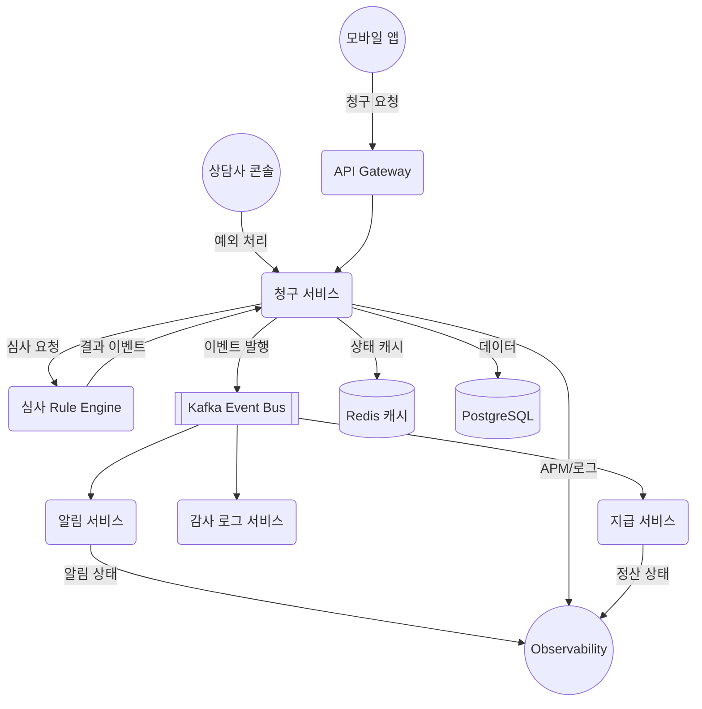
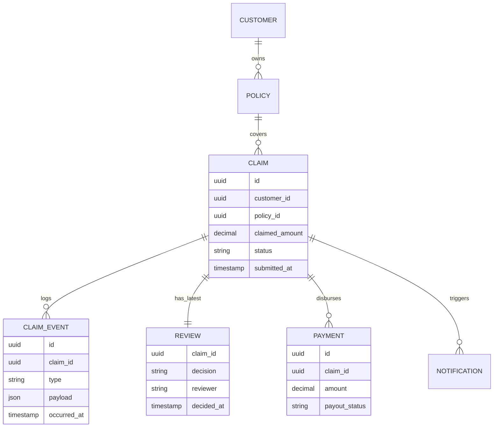

# 보험금 청구 자동화 시스템

> 이벤트 기반 아키텍처로 보험금 청구부터 지급까지의 전 과정을 자동화하는 백엔드 시스템

## 프로젝트 개요

보험금 청구 과정을 **청구 → 심사 → 지급 → 알림**의 이벤트 흐름으로 자동화하여, 처리 시간을 단축하고 고객 경험을 개선합니다.

### 핵심 목표

- **처리 시간**: 평균 10분 → 7분 이하로 단축
- **재오픈율**: 고객 문의 재오픈율 5% → 2% 이하로 감소
- **자동화율**: 수동 심사 개입 최소화, Rule Engine 기반 자동 승인

### 주요 특징

- 이벤트 기반 비동기 처리 (Kafka)
- 분산 캐싱으로 빠른 상태 조회 (Redis)
- 중복 지급 방지 및 트랜잭션 정합성 보장
- 개인정보 암호화 및 감사 로그 자동 기록
- Observability 기반 실시간 모니터링

---

## 시스템 아키텍처

### 전체 구조도



### 서비스 구성

#### API Layer
- **Claim API**: 보험금 청구 생성, 상태 조회
- **Payment API**: 지급 상태 관리
- **Query API**: 통합 조회 (타임라인, 알림 히스토리)

#### Application Layer
- **Claim Service**: 청구 생성/상태 전환/데이터 적재 담당
- **Rule Engine Service**: 자동 심사 규칙 실행 및 승인/거부 판정
- **Payment Service**: 보험금 지급 처리
- **Notification Service**: 고객 알림 발송 (Push, SMS, Email)
- **Event Publisher**: Kafka 이벤트 발행 관리

#### Infrastructure Layer
- **Kafka**: 이벤트 버스, 서비스 간 비동기 통신
- **Redis**: 분산 캐시 및 분산 락
- **PostgreSQL**: 영속 데이터 저장소
- **Encryption Module**: 개인정보 암호화

---

## 이벤트 흐름

```
claim.requested → claim.reviewed → claim.approved → claim.disbursed
```

### 1. 청구 생성 (claim.requested)
- 고객이 모바일 앱에서 보험금 청구 등록
- Claim Service가 데이터 저장 후 이벤트 발행
- Notification Service가 "청구 접수 완료" 알림 발송

### 2. 자동 심사 (claim.reviewed)
- Rule Engine이 심사 규칙 실행
- 자동 승인/거부 판정 후 결과 저장
- 심사 결과를 Kafka로 발행

### 3. 승인 확정 (claim.approved)
- 승인된 청구에 대해 이벤트 발행
- Payment Service가 지급 프로세스 시작
- Audit Service가 승인 이력 기록

### 4. 지급 완료 (claim.disbursed)
- Payment Service가 계좌 이체 처리
- 지급 완료 이벤트 발행
- Notification Service가 "지급 완료" 알림 발송
- Observability에 SLA 지표 기록

---

## API 엔드포인트

### 청구 생성
```http
POST /claims
Authorization: Bearer {token}

{
  "policyId": "uuid",
  "claimedAmount": 250000,
  "documents": [{"type": "RECEIPT", "url": "https://..."}],
  "accidentAt": "2024-07-01T10:12:00Z"
}
```

### 청구 상태 조회
```http
GET /claims/{claimId}
Authorization: Bearer {token}
```

**응답 예시**:
```json
{
  "claimId": "uuid",
  "status": "IN_REVIEW",
  "timeline": [
    {"type": "claim.requested", "occurredAt": "2024-07-01T10:13:00Z"},
    {"type": "claim.reviewed", "occurredAt": "2024-07-02T02:00:00Z"}
  ],
  "payout": {
    "amount": 230000,
    "status": "PENDING"
  }
}
```

### 심사 결정 등록
```http
POST /claims/{claimId}/review
Authorization: Service-to-Service

{
  "decision": "APPROVED",
  "reason": "자동 심사 규칙 #12",
  "reviewer": "rule-engine"
}
```

### 지급 상태 업데이트
```http
POST /claims/{claimId}/payout
Authorization: Service-to-Service

{
  "amount": 230000,
  "method": "ACCOUNT_TRANSFER",
  "payoutStatus": "SUCCESS"
}
```

자세한 API 명세는 [API.md](docs/API.md) 참고

---

## 데이터베이스 구조

### 핵심 엔터티



자세한 ERD는 [ERD.md](docs/ERD.md) 참고

---

## 기술 스택

### Core Stack
| 영역 | 기술 | 선택 이유 |
|------|------|-----------|
| Language | Java 24 | 토스 표준 |
| Framework | Spring Boot | 생태계, 안정성 |
| Build | Gradle | 대규모 프로젝트 표준 |
| DB | PostgreSQL | 금융권 선호, ACID 보장 |
| Cache | Redis | 분산 락, 고속 캐싱 |
| Messaging | Kafka | 이벤트 중심 아키텍처 |
| ORM | JPA + QueryDSL | 가독성 + 성능 |

### Observability
| 항목 | 기술 |
|------|------|
| Metrics | Micrometer + Prometheus |
| Logging | Logback + JSON 포맷 |
| Tracing | 분산 추적 (traceId 헤더) |
| Monitoring | Grafana 대시보드 |

자세한 기술 스택은 [skillset.md](docs/skillset.md) 참고

---

## 프로젝트 구조

```
toss/
├── docs/                    # 문서
│   ├── API.md              # API 명세
│   ├── ERD.md              # 데이터베이스 설계
│   ├── SEQUENCE.md         # 시퀀스 다이어그램
│   ├── MVP-feature.md      # MVP 기능 범위
│   ├── skillset.md         # 기술 스택
│   ├── mindmap.md          # 시스템 구조 개요
│   ├── SCAMPER.md          # 아이디어 도출
│   └── SMART.md            # 프로젝트 목표
├── src/
│   ├── main/
│   │   ├── java/
│   │   │   └── com/insurance/claim/
│   │   │       ├── api/           # REST API Controllers
│   │   │       ├── application/   # Application Services
│   │   │       ├── domain/        # Domain Models
│   │   │       ├── infrastructure/ # Kafka, Redis, DB
│   │   │       └── config/        # Configuration
│   │   └── resources/
│   └── test/
└── README.md
```

---

## 시작하기

### 필수 요구사항
- Java 24
- Gradle 7.x+
- Docker & Docker Compose (로컬 개발 환경)

### 로컬 환경 실행

1. 인프라 실행 (Kafka, Redis, PostgreSQL)
```bash
docker compose up -d
```

| 서비스 | 이미지 | 호스트 포트 | 비고 |
|--------|--------|-------------|------|
| PostgreSQL | `postgres:15-alpine` | 5432 | DB/USER/PASSWORD = `claim` / `claim` / `changeme` |
| Redis | `redis:7-alpine` | 6379 | 기본 설정 |
| Zookeeper | `confluentinc/cp-zookeeper:7.5.0` | 2181 | Kafka 의존성 |
| Kafka | `confluentinc/cp-kafka:7.5.0` | 9092 (호스트), 29092 (컨테이너 간) | 애플리케이션은 `localhost:9092` 사용 |
| Kafka UI | `provectuslabs/kafka-ui:latest` | 8081 | http://localhost:8081 |

> `docker compose down -v`로 전체 리소스를 종료/정리할 수 있습니다.

2. 애플리케이션 빌드
```bash
./gradlew clean build
```

3. 애플리케이션 실행
```bash
./gradlew bootRun
```

4. API 테스트
```bash
curl http://localhost:8080/health
```

### 환경 변수 설정
```bash
# application.yml 또는 환경 변수로 설정
DB_HOST=localhost
DB_PORT=5432
KAFKA_BOOTSTRAP_SERVERS=localhost:9092
REDIS_HOST=localhost
REDIS_PORT=6379
```

---

## 개발 워크플로우

### 브랜치 전략
- `main`: 프로덕션 배포 브랜치
- `feat/#이슈번호`: 기능 개발
- `fix/#이슈번호`: 버그 수정

### 커밋 메시지 규칙

| 타입 | 설명 | 예시 |
|------|------|------|
| feat | 새로운 기능 추가 | `feat: 보험금 청구 API 추가` |
| fix | 버그 수정 | `fix: 중복 지급 방지 로직 수정` |
| docs | 문서 변경 | `docs: API 명세 업데이트` |
| refactor | 기능 변화 없는 코드 개선 | `refactor: 청구 서비스 책임 분리` |
| test | 테스트 관련 작업 | `test: 청구 생성 시나리오 추가` |
| chore | 빌드, 패키지 유지보수 | `chore: Kafka 의존성 업데이트` |

> 커밋 메시지는 `타입: 내용` 형태로 작성하고, 내용은 명령형으로 간결하게 요약합니다.

---

## 주요 설계 원칙

### 1. 이벤트 기반 아키텍처
- 모든 상태 변경은 이벤트로 발행
- 서비스 간 느슨한 결합 유지
- 장애 격리 및 독립 배포 가능

### 2. 멱등성 보장
- API 중복 호출 시 동일한 결과 반환
- `If-Match` 헤더로 낙관적 락 구현
- Kafka 메시지 재처리 안전성 확보

### 3. 개인정보 보호
- 민감 데이터 암호화 저장
- 감사 로그 자동 기록
- 접근 권한 최소화

### 4. 관측 가능성
- 모든 API 응답에 `traceId` 포함
- 분산 추적으로 전체 흐름 가시화
- SMART 지표 실시간 모니터링

---

## 문서

- [시스템 구조 개요](docs/mindmap.md)
- [API 명세](docs/API.md)
- [데이터베이스 설계](docs/ERD.md)
- [시퀀스 다이어그램](docs/SEQUENCE.md)
- [MVP 기능 범위](docs/MVP-feature.md)
- [기술 스택 선정](docs/skillset.md)
- [프로젝트 목표 (SMART)](docs/SMART.md)
- [아이디어 도출 (SCAMPER)](docs/SCAMPER.md)

---

## 라이센스

이 프로젝트는 교육 및 포트폴리오 목적으로 작성되었습니다.
