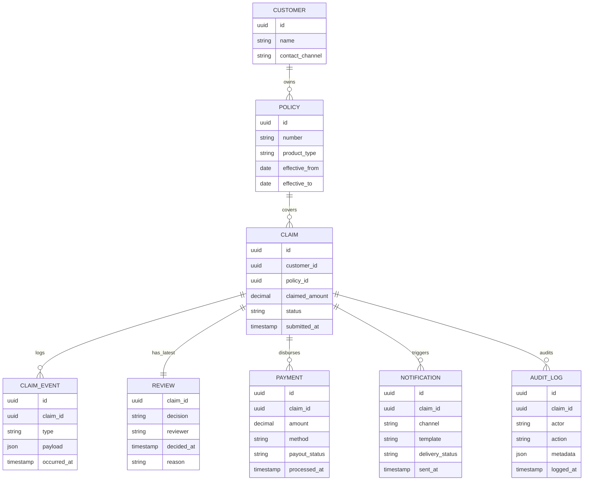

## 보험금 청구 자동화 ERD

### 개요
마인드맵/SCAMPER/SMART 요구사항을 바탕으로 `청구-심사-지급-알림` 흐름에 필요한 핵심 엔터티를 정의했다. 모든 이벤트는 `ClaimEvent`로 표준화하고, Rule Engine·지급 서비스·알림 서비스가 동일한 스키마를 구독한다.

### Mermaid ERD

### 설계 메모
- `ClaimEvent`는 Kafka 이벤트 스키마와 동일하게 유지해 이력 조회와 재처리를 단순화한다.
  - 이벤트 타입 (type 필드): `claim.requested`, `claim.reviewed`, `claim.approved`, `claim.disbursed`
  - snake_case 명명 규칙 사용
- `Review`는 최신 심사 상태만 저장하며, 이력은 `ClaimEvent`(`claim.reviewed`)로 남긴다.
- `Notification`과 `AuditLog`는 Observability 및 규제 준수를 위한 최소 스키마로 정의했다.
- SMART 목표의 측정(처리 시간, 재오픈율)은 `Claim`의 status 전환과 `ClaimEvent` 타임스탬프 차이를 통해 산출한다.
