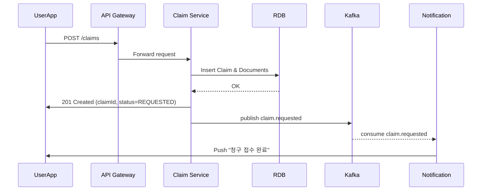
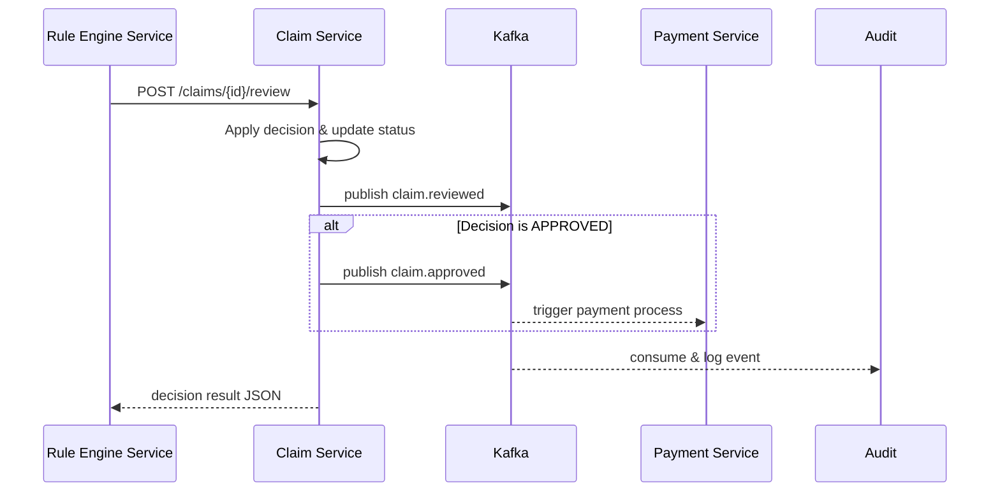
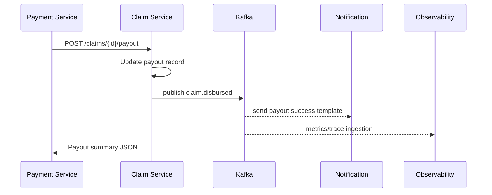

## 보험금 청구 자동화 시퀀스

API 문서의 주요 흐름(`POST /claims` → `POST /claims/{id}/review` → `POST /claims/{id}/payout` → 알림/상태 조회)을 이벤트 기반 구조와 함께 표현했다.

### 1. 청구 생성 & 이벤트 발행


### 2. 자동 심사/예외 처리


### 3. 지급 및 알림


### 활용 메모
- 모든 API 응답에는 `traceId` 헤더를 포함, Observability가 시퀀스 전반을 추적.
- 실패 시 서비스는 에러 응답과 함께 `claim.failed` 이벤트를 발행해 재처리 큐에 적재.
- `Timeline` 조회(`GET /claims/{id}`)는 `ClaimEvent` 스트림을 기반으로 캐시를 갱신해 실시간 상태 표시를 보장.

### 전체 이벤트 흐름
```
claim.requested → claim.reviewed → claim.approved → claim.disbursed
```
