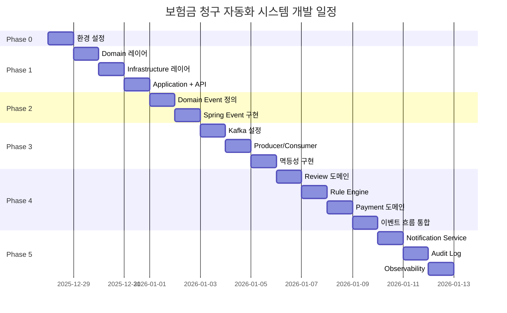

# 보험금 청구 자동화 시스템 WBS (Work Breakdown Structure)

## 📋 목차
- [WBS 개요](#wbs-개요)
- [프로젝트 타임라인](#프로젝트-타임라인)
- [작업 분해 구조](#작업-분해-구조)
- [의존성 매트릭스](#의존성-매트릭스)
- [진행 상황 체크리스트](#진행-상황-체크리스트)

---

## WBS 개요

### 문서 목적
프로젝트의 모든 작업을 **계층적으로 분해**하고, 작업 간 의존성과 일정을 명확히 정의합니다.

### WBS 구조
```
Level 1: Phase (단계)
  └─ Level 2: Work Package (작업 패키지)
      └─ Level 3: Task (세부 작업)
          └─ Level 4: Activity (활동)
```

### 일정 요약

| Phase | 기간 | 시작일 | 완료일 | 주요 산출물 |
|-------|------|--------|--------|------------|
| Phase 0 | 1일 | 2025-12-28 | 2025-12-28 | 개발 환경 완성 |
| Phase 1 | 3일 | 2025-12-29 | 2025-12-31 | 청구 생성/조회 API |
| Phase 2 | 2일 | 2026-01-01 | 2026-01-02 | 이벤트 기반 구조 (동기) |
| Phase 3 | 3일 | 2026-01-03 | 2026-01-05 | Kafka 비동기 처리 |
| Phase 4 | 4일 | 2026-01-06 | 2026-01-09 | 심사 + 지급 자동화 |
| Phase 5 | 3일 | 2026-01-10 | 2026-01-12 | 알림 + Observability |

**전체 기간: 16일 (2025-12-28 ~ 2026-01-12)**

---

## 프로젝트 타임라인

### Gantt Chart



### 주요 마일스톤

| 마일스톤 | 날짜 | 완료 기준 |
|----------|------|-----------|
| M1: 첫 API 완성 | 2025-12-31 | `POST /claims`, `GET /claims/{id}` 동작 |
| M2: 이벤트 기반 전환 | 2026-01-05 | Kafka로 비동기 이벤트 처리 |
| M3: MVP 완성 | 2026-01-09 | 청구 → 심사 → 지급 전체 흐름 동작 |
| M4: 전체 완성 | 2026-01-12 | 알림, 감사 로그, 모니터링 완료 |

---

## 작업 분해 구조

### Phase 0: 기반 설정 (1일)

#### WBS ID: 0.0 기반 설정
**목표:** 개발 환경 완성 및 인프라 준비
**소요 시간:** 1일
**담당:** Backend Developer

##### 0.1 빌드 설정
**소요:** 2시간
- [ ] 0.1.1 `build.gradle` 의존성 추가
  - Spring Data JPA
  - Spring Kafka
  - Spring Data Redis
  - Validation
  - Lombok
  - PostgreSQL Driver
- [ ] 0.1.2 Gradle 빌드 테스트
  ```bash
  ./gradlew clean build
  ```
- [ ] 0.1.3 빌드 성공 확인

**산출물:** `build.gradle`

##### 0.2 애플리케이션 설정
**소요:** 2시간
- [ ] 0.2.1 `application.yml` 작성
  ```yaml
  spring:
    datasource:
      url: jdbc:postgresql://localhost:5432/claim
      username: claim
      password: changeme
    jpa:
      hibernate:
        ddl-auto: validate
      show-sql: true
    kafka:
      bootstrap-servers: localhost:9092
      consumer:
        group-id: claim-service
    data:
      redis:
        host: localhost
        port: 6379
  ```
- [ ] 0.2.2 Profile 분리 (`application-local.yml`, `application-dev.yml`)
- [ ] 0.2.3 환경 변수 외부화

**산출물:** `application.yml`

##### 0.3 DB 마이그레이션 설정
**소요:** 3시간
- [ ] 0.3.1 Flyway 의존성 추가
- [ ] 0.3.2 초기 DDL 스크립트 작성 (`V1__init.sql`)
  - CUSTOMER 테이블
  - POLICY 테이블
  - CLAIM 테이블
  - CLAIM_EVENT 테이블
  - REVIEW 테이블
  - PAYMENT 테이블
  - NOTIFICATION 테이블
  - AUDIT_LOG 테이블
- [ ] 0.3.3 인덱스 생성 스크립트
  ```sql
  CREATE INDEX idx_policy_status ON claims(policy_number, status);
  CREATE INDEX idx_claim_submitted ON claims(submitted_at);
  ```
- [ ] 0.3.4 마이그레이션 실행 테스트

**산출물:** `src/main/resources/db/migration/V1__init.sql`

##### 0.4 인프라 실행
**소요:** 1시간
- [ ] 0.4.1 Docker Compose 실행
  ```bash
  docker compose up -d
  ```
- [ ] 0.4.2 PostgreSQL 연결 확인
  ```bash
  psql -h localhost -U claim -d claim
  ```
- [ ] 0.4.3 Kafka 토픽 생성
  ```bash
  kafka-topics --create --topic claim.requested
  kafka-topics --create --topic claim.reviewed
  kafka-topics --create --topic claim.approved
  kafka-topics --create --topic claim.disbursed
  ```
- [ ] 0.4.4 Redis 연결 확인
  ```bash
  redis-cli ping
  ```

##### 0.5 헬스 체크
**소요:** 1시간
- [ ] 0.5.1 애플리케이션 실행
  ```bash
  ./gradlew bootRun
  ```
- [ ] 0.5.2 Health Check API 확인
  ```bash
  curl http://localhost:8080/health
  ```
- [ ] 0.5.3 Actuator 엔드포인트 확인
  ```bash
  curl http://localhost:8080/actuator/health
  ```

**완료 기준:**
- [ ] 빌드 성공
- [ ] 애플리케이션 실행 성공
- [ ] DB 연결 성공
- [ ] Kafka/Redis 연결 성공

---

### Phase 1: 청구 생성 + 조회 (3일)

#### WBS ID: 1.0 청구 기능 구현
**목표:** 핵심 도메인 완성 및 첫 번째 API 구현
**소요 시간:** 3일
**담당:** Backend Developer

##### 1.1 Domain 레이어 (1일)

###### 1.1.1 Claim 엔티티
**소요:** 3시간
- [ ] 1.1.1.1 `Claim.java` 클래스 작성
  - 필드: id, claimNumber, policyNumber, claimAmount, status, createdAt
  - 빌더 패턴 적용
  - 비즈니스 메서드: `approve()`, `reject()`
- [ ] 1.1.1.2 단위 테스트 작성
  ```java
  @Test
  void approve_shouldChangeStatus_whenPending() { ... }
  ```
- [ ] 1.1.1.3 테스트 통과 확인

**산출물:** `domain/model/Claim.java`

###### 1.1.2 ClaimStatus enum
**소요:** 30분
- [ ] 1.1.2.1 `ClaimStatus.java` 작성
  - PENDING, IN_REVIEW, APPROVED, REJECTED, PAID, CANCELLED
- [ ] 1.1.2.2 description 필드 추가

**산출물:** `domain/model/ClaimStatus.java`

###### 1.1.3 Value Objects
**소요:** 2시간
- [ ] 1.1.3.1 `ClaimNumber.java` 작성
  - 형식: `CLM-YYYYMMDD-XXXXX`
  - `generate()` 정적 팩토리 메서드
  - `from(String)` 검증 로직
- [ ] 1.1.3.2 `Money.java` 작성
  - BigDecimal 래핑
  - 비교 메서드: `isGreaterThan()`, `isLessThanOrEqual()`
  - 연산 메서드: `add()`, `subtract()`
- [ ] 1.1.3.3 단위 테스트 작성
- [ ] 1.1.3.4 불변성 검증

**산출물:** `domain/vo/ClaimNumber.java`, `domain/vo/Money.java`

###### 1.1.4 Repository 인터페이스
**소요:** 1시간
- [ ] 1.1.4.1 `ClaimRepository.java` 인터페이스 작성
  ```java
  public interface ClaimRepository {
      Claim save(Claim claim);
      Optional<Claim> findById(Long id);
      List<Claim> findByPolicyNumber(String policyNumber);
      List<Claim> findByStatus(ClaimStatus status);
  }
  ```
- [ ] 1.1.4.2 JavaDoc 작성

**산출물:** `domain/repository/ClaimRepository.java`

###### 1.1.5 Domain Service
**소요:** 1.5시간
- [ ] 1.1.5.1 `ClaimDomainService.java` 작성
  - `validateClaim(Claim)` 메서드
  - 사고일 검증 로직
  - 중복 청구 검증 로직
- [ ] 1.1.5.2 단위 테스트 작성
- [ ] 1.1.5.3 예외 케이스 테스트

**산출물:** `domain/service/ClaimDomainService.java`

##### 1.2 Infrastructure 레이어 (1일)

###### 1.2.1 JPA Entity
**소요:** 2시간
- [ ] 1.2.1.1 `ClaimEntity.java` 작성
  - JPA 애노테이션 (`@Entity`, `@Table`, `@Column`)
  - 인덱스 정의 (`@Index`)
  - Auditing 필드 (`@CreatedDate`, `@LastModifiedDate`)
- [ ] 1.2.1.2 `ClaimStatusEntity.java` enum 작성
- [ ] 1.2.1.3 `@PrePersist`, `@PreUpdate` 콜백 구현

**산출물:** `infrastructure/persistence/ClaimEntity.java`

###### 1.2.2 JPA Repository
**소요:** 1시간
- [ ] 1.2.2.1 `ClaimJpaRepository.java` 인터페이스 작성
  ```java
  public interface ClaimJpaRepository extends JpaRepository<ClaimEntity, Long> {
      List<ClaimEntity> findByPolicyNumber(String policyNumber);
      List<ClaimEntity> findByStatus(ClaimStatusEntity status);
  }
  ```
- [ ] 1.2.2.2 커스텀 쿼리 메서드 작성 (`@Query`)

**산출물:** `infrastructure/persistence/ClaimJpaRepository.java`

###### 1.2.3 Mapper
**소요:** 2시간
- [ ] 1.2.3.1 `ClaimMapper.java` 작성
  - `toEntity(Claim)` 메서드
  - `toDomain(ClaimEntity)` 메서드
- [ ] 1.2.3.2 매핑 로직 테스트
- [ ] 1.2.3.3 null 안전성 검증

**산출물:** `infrastructure/persistence/ClaimMapper.java`

###### 1.2.4 Repository 구현체
**소요:** 2시간
- [ ] 1.2.4.1 `ClaimRepositoryImpl.java` 작성
  ```java
  @Repository
  @RequiredArgsConstructor
  public class ClaimRepositoryImpl implements ClaimRepository {
      private final ClaimJpaRepository jpaRepository;
      private final ClaimMapper mapper;
      // ...
  }
  ```
- [ ] 1.2.4.2 모든 메서드 구현
- [ ] 1.2.4.3 통합 테스트 작성 (`@DataJpaTest`)
- [ ] 1.2.4.4 쿼리 성능 확인 (EXPLAIN ANALYZE)

**산출물:** `infrastructure/persistence/ClaimRepositoryImpl.java`

##### 1.3 Application 레이어 (0.5일)

###### 1.3.1 Claim Service
**소요:** 3시간
- [ ] 1.3.1.1 `ClaimService.java` 작성
  - `createClaim(ClaimCreateRequest)` 메서드
  - `getClaim(Long claimId)` 메서드
- [ ] 1.3.1.2 DTO 변환 로직 (`toResponse()`)
- [ ] 1.3.1.3 `@Transactional` 적용
- [ ] 1.3.1.4 예외 처리 (`ClaimNotFoundException`)
- [ ] 1.3.1.5 통합 테스트 작성

**산출물:** `application/service/ClaimService.java`

##### 1.4 API 레이어 (0.5일)

###### 1.4.1 DTO 정의
**소요:** 1시간
- [ ] 1.4.1.1 `ClaimCreateRequest.java` 작성
  - Validation 애노테이션 (`@NotNull`, `@DecimalMin`)
- [ ] 1.4.1.2 `ClaimResponse.java` 작성
  - Builder 패턴
- [ ] 1.4.1.3 JSON 직렬화 테스트

**산출물:** `api/dto/request/ClaimCreateRequest.java`, `api/dto/response/ClaimResponse.java`

###### 1.4.2 Controller
**소요:** 2시간
- [ ] 1.4.2.1 `ClaimController.java` 작성
  - `POST /claims` 엔드포인트
  - `GET /claims/{id}` 엔드포인트
- [ ] 1.4.2.2 API 문서화 (`@Operation`, `@ApiResponse`)
- [ ] 1.4.2.3 MockMvc 테스트 작성
- [ ] 1.4.2.4 Postman 테스트

**산출물:** `api/controller/ClaimController.java`

###### 1.4.3 예외 처리
**소요:** 1시간
- [ ] 1.4.3.1 `GlobalExceptionHandler.java` 작성
  - `@ExceptionHandler(ClaimNotFoundException.class)`
  - `@ExceptionHandler(MethodArgumentNotValidException.class)`
- [ ] 1.4.3.2 `ErrorResponse.java` DTO 작성
- [ ] 1.4.3.3 예외 응답 형식 표준화
- [ ] 1.4.3.4 예외 케이스 테스트

**산출물:** `api/exception/GlobalExceptionHandler.java`

**Phase 1 완료 기준:**
- [ ] `POST /claims` API 동작
- [ ] `GET /claims/{id}` API 동작
- [ ] 통합 테스트 통과
- [ ] Postman으로 End-to-End 테스트 성공

---

### Phase 2: 이벤트 발행 - 동기식 (2일)

#### WBS ID: 2.0 이벤트 기반 구조
**목표:** Spring Event로 이벤트 기반 아키텍처 기반 마련
**소요 시간:** 2일
**담당:** Backend Developer

##### 2.1 Domain Event 정의 (0.5일)

###### 2.1.1 ClaimCreatedEvent
**소요:** 1시간
- [ ] 2.1.1.1 `ClaimCreatedEvent.java` 작성
  - 필드: claimId, claimNumber, policyNumber, createdAt
  - `from(Claim)` 정적 팩토리 메서드
- [ ] 2.1.1.2 불변성 보장 (final 필드)
- [ ] 2.1.1.3 직렬화 테스트

**산출물:** `domain/event/ClaimCreatedEvent.java`

###### 2.1.2 ClaimApprovedEvent
**소요:** 1시간
- [ ] 2.1.2.1 `ClaimApprovedEvent.java` 작성
- [ ] 2.1.2.2 JSON 직렬화 설정

**산출물:** `domain/event/ClaimApprovedEvent.java`

##### 2.2 Event Publisher 구현 (0.5일)

###### 2.2.1 ClaimService 수정
**소요:** 2시간
- [ ] 2.2.1.1 `ApplicationEventPublisher` 주입
- [ ] 2.2.1.2 `createClaim()` 메서드에 이벤트 발행 추가
  ```java
  ClaimCreatedEvent event = ClaimCreatedEvent.from(saved);
  eventPublisher.publishEvent(event);
  ```
- [ ] 2.2.1.3 트랜잭션 커밋 후 발행 확인
- [ ] 2.2.1.4 테스트: 롤백 시 이벤트 미발행 검증

**산출물:** 수정된 `ClaimService.java`

##### 2.3 Event Listener 구현 (1일)

###### 2.3.1 Notification Listener
**소요:** 2시간
- [ ] 2.3.1.1 `ClaimEventListener.java` 작성
- [ ] 2.3.1.2 `@EventListener` 메서드 구현
  ```java
  @EventListener
  public void handleClaimCreated(ClaimCreatedEvent event) {
      log.info("청구 생성 이벤트: {}", event.getClaimNumber());
  }
  ```
- [ ] 2.3.1.3 비동기 처리 (`@Async`) 적용
- [ ] 2.3.1.4 예외 격리 (`@TransactionalEventListener`)

**산출물:** `application/listener/ClaimEventListener.java`

###### 2.3.2 Audit Listener
**소요:** 2시간
- [ ] 2.3.2.1 `AuditEventListener.java` 작성
- [ ] 2.3.2.2 이벤트 수신 시 로그 기록
- [ ] 2.3.2.3 통합 테스트 작성

**산출물:** `application/listener/AuditEventListener.java`

###### 2.3.3 통합 테스트
**소요:** 2시간
- [ ] 2.3.3.1 이벤트 발행/수신 테스트
- [ ] 2.3.3.2 여러 Listener 동시 실행 확인
- [ ] 2.3.3.3 순서 보장 테스트 (`@Order`)

**Phase 2 완료 기준:**
- [ ] 이벤트 발행 동작 확인
- [ ] 여러 Listener 수신 확인
- [ ] 로그에 이벤트 메시지 출력
- [ ] 트랜잭션 롤백 시 이벤트 미발행 확인

---

### Phase 3: Kafka 전환 - 비동기 이벤트 (3일)

#### WBS ID: 3.0 Kafka 비동기 처리
**목표:** Spring Event → Kafka 전환
**소요 시간:** 3일
**담당:** Backend Developer

##### 3.1 Kafka 설정 (0.5일)

###### 3.1.1 Producer 설정
**소요:** 1시간
- [ ] 3.1.1.1 `KafkaProducerConfig.java` 작성
  ```java
  @Configuration
  public class KafkaProducerConfig {
      @Bean
      public ProducerFactory<String, Object> producerFactory() { ... }
  }
  ```
- [ ] 3.1.1.2 Serializer 설정 (JSON)
- [ ] 3.1.1.3 Acks 설정 (`acks=all`)
- [ ] 3.1.1.4 Retry 정책 설정

**산출물:** `config/KafkaProducerConfig.java`

###### 3.1.2 Consumer 설정
**소요:** 1시간
- [ ] 3.1.2.1 `KafkaConsumerConfig.java` 작성
- [ ] 3.1.2.2 Deserializer 설정
- [ ] 3.1.2.3 Group ID 설정
- [ ] 3.1.2.4 오프셋 관리 전략 (`enable.auto.commit=false`)

**산출물:** `config/KafkaConsumerConfig.java`

###### 3.1.3 토픽 생성
**소요:** 30분
- [ ] 3.1.3.1 토픽 정의 클래스 작성
  ```java
  public class KafkaTopics {
      public static final String CLAIM_REQUESTED = "claim.requested";
      public static final String CLAIM_REVIEWED = "claim.reviewed";
      // ...
  }
  ```
- [ ] 3.1.3.2 토픽 자동 생성 설정
- [ ] 3.1.3.3 파티션/복제 계수 설정

**산출물:** `infrastructure/messaging/KafkaTopics.java`

##### 3.2 Producer 구현 (1일)

###### 3.2.1 Event Publisher
**소요:** 2시간
- [ ] 3.2.1.1 `ClaimEventPublisher.java` 작성
  ```java
  @Component
  public class ClaimEventPublisher {
      private final KafkaTemplate<String, Object> kafkaTemplate;

      public void publishClaimCreated(Claim claim) {
          ClaimCreatedEvent event = ClaimCreatedEvent.from(claim);
          kafkaTemplate.send("claim.requested", claim.getId().toString(), event);
      }
  }
  ```
- [ ] 3.2.1.2 파티션 키 전략 (claimId)
- [ ] 3.2.1.3 헤더 설정 (traceId, schema-version)

**산출물:** `infrastructure/messaging/ClaimEventPublisher.java`

###### 3.2.2 ClaimService 수정
**소요:** 1시간
- [ ] 3.2.2.1 Spring Event → Kafka Producer 전환
- [ ] 3.2.2.2 비동기 발행 설정
- [ ] 3.2.2.3 발행 실패 시 예외 처리

###### 3.2.3 Producer 테스트
**소요:** 2시간
- [ ] 3.2.3.1 메시지 발행 테스트
- [ ] 3.2.3.2 Kafka UI에서 메시지 확인
- [ ] 3.2.3.3 파티션 분배 확인
- [ ] 3.2.3.4 헤더 검증

##### 3.3 Consumer 구현 (1일)

###### 3.3.1 Event Consumer
**소요:** 2시간
- [ ] 3.3.1.1 `ClaimEventConsumer.java` 작성
  ```java
  @Component
  public class ClaimEventConsumer {
      @KafkaListener(topics = "claim.requested", groupId = "claim-service")
      public void handleClaimRequested(ClaimCreatedEvent event) {
          log.info("이벤트 수신: {}", event);
      }
  }
  ```
- [ ] 3.3.1.2 여러 토픽 구독 설정
- [ ] 3.3.1.3 수동 커밋 구현

**산출물:** `infrastructure/messaging/ClaimEventConsumer.java`

###### 3.3.2 에러 핸들링
**소요:** 2시간
- [ ] 3.3.2.1 `@RetryableTopic` 설정
- [ ] 3.3.2.2 Dead Letter Topic 설정
- [ ] 3.3.2.3 최대 재시도 횟수 설정 (3회)
- [ ] 3.3.2.4 DLT Consumer 구현

**산출물:** Dead Letter Queue 처리 로직

###### 3.3.3 Consumer 테스트
**소요:** 2시간
- [ ] 3.3.3.1 메시지 수신 테스트
- [ ] 3.3.3.2 재시도 동작 확인
- [ ] 3.3.3.3 DLT 전달 확인
- [ ] 3.3.3.4 오프셋 커밋 검증

##### 3.4 멱등성 구현 (0.5일)

###### 3.4.1 Redis 기반 중복 방지
**소요:** 2시간
- [ ] 3.4.1.1 `IdempotentEventProcessor.java` 작성
  ```java
  public boolean isProcessed(String eventId) {
      return redisTemplate.opsForValue()
          .setIfAbsent("event:" + eventId, "1", 1, TimeUnit.HOURS);
  }
  ```
- [ ] 3.4.1.2 Consumer에서 멱등성 체크
- [ ] 3.4.1.3 TTL 설정 (1시간)

**산출물:** `infrastructure/messaging/IdempotentEventProcessor.java`

###### 3.4.2 멱등성 테스트
**소요:** 1시간
- [ ] 3.4.2.1 동일 메시지 재전송 테스트
- [ ] 3.4.2.2 중복 처리 방지 확인
- [ ] 3.4.2.3 TTL 만료 후 재처리 확인

**Phase 3 완료 기준:**
- [ ] Kafka Producer 동작 확인
- [ ] Kafka Consumer 메시지 수신 확인
- [ ] Kafka UI에서 메시지 확인
- [ ] 멱등성 보장 검증
- [ ] Dead Letter Queue 동작 확인

---

### Phase 4: 심사 + 지급 (4일)

#### WBS ID: 4.0 심사 및 지급 자동화
**목표:** Rule Engine 기반 자동 심사 및 지급 프로세스
**소요 시간:** 4일
**담당:** Backend Developer

##### 4.1 Review 도메인 (1일)

###### 4.1.1 Review 엔티티
**소요:** 2시간
- [ ] 4.1.1.1 `Review.java` 작성
  - 필드: claimId, decision, reason, reviewer, decidedAt
  - 정적 팩토리 메서드: `autoApprove()`, `manualReview()`
- [ ] 4.1.1.2 `ReviewDecision.java` enum (APPROVED, REJECTED, MANUAL)
- [ ] 4.1.1.3 단위 테스트 작성

**산출물:** `domain/model/Review.java`

###### 4.1.2 Repository
**소요:** 2시간
- [ ] 4.1.2.1 `ReviewRepository.java` 인터페이스
- [ ] 4.1.2.2 `ReviewEntity.java` JPA 엔티티
- [ ] 4.1.2.3 `ReviewRepositoryImpl.java` 구현체
- [ ] 4.1.2.4 통합 테스트

**산출물:** Review 영속성 레이어

###### 4.1.3 Review Service
**소요:** 2시간
- [ ] 4.1.3.1 `ReviewService.java` 작성
  - `submitReview(Long claimId, ReviewDecision decision)` 메서드
  - Claim 상태 업데이트 (PENDING → IN_REVIEW → APPROVED/REJECTED)
- [ ] 4.1.3.2 이벤트 발행 (`claim.reviewed`)
- [ ] 4.1.3.3 통합 테스트

**산출물:** `application/service/ReviewService.java`

##### 4.2 Rule Engine (1일)

###### 4.2.1 Rule Engine Service
**소요:** 3시간
- [ ] 4.2.1.1 `RuleEngineService.java` 작성
  ```java
  public ReviewDecision evaluate(Claim claim) {
      if (claim.getClaimAmount().isLessThanOrEqual(1_000_000)) {
          return ReviewDecision.APPROVED;
      }
      if (claim.getClaimAmount().isGreaterThan(5_000_000)) {
          return ReviewDecision.MANUAL;
      }
      return ReviewDecision.APPROVED;
  }
  ```
- [ ] 4.2.1.2 여러 규칙 체이닝
- [ ] 4.2.1.3 규칙 우선순위 정의

**산출물:** `application/service/RuleEngineService.java`

###### 4.2.2 Rule Engine Consumer
**소요:** 2시간
- [ ] 4.2.2.1 `RuleEngineConsumer.java` 작성
- [ ] 4.2.2.2 `claim.requested` 구독
- [ ] 4.2.2.3 자동 심사 실행 → Review 생성
- [ ] 4.2.2.4 `claim.reviewed` 이벤트 발행

**산출물:** `infrastructure/messaging/RuleEngineConsumer.java`

###### 4.2.3 Rule Engine 테스트
**소요:** 2시간
- [ ] 4.2.3.1 자동 승인 케이스 테스트 (100만원 이하)
- [ ] 4.2.3.2 수동 심사 케이스 테스트 (500만원 초과)
- [ ] 4.2.3.3 End-to-End 테스트

##### 4.3 Payment 도메인 (1일)

###### 4.3.1 Payment 엔티티
**소요:** 2시간
- [ ] 4.3.1.1 `Payment.java` 작성
  - 필드: id, claimId, amount, method, status, processedAt
- [ ] 4.3.1.2 `PayoutStatus.java` enum (PENDING, SUCCESS, FAILED)
- [ ] 4.3.1.3 `PaymentMethod.java` enum (ACCOUNT_TRANSFER, CHECK)

**산출물:** `domain/model/Payment.java`

###### 4.3.2 Repository
**소요:** 2시간
- [ ] 4.3.2.1 `PaymentRepository.java` 인터페이스
- [ ] 4.3.2.2 `PaymentEntity.java` JPA 엔티티
- [ ] 4.3.2.3 Unique 제약 조건 (`claim_id`, `idempotency_key`)
- [ ] 4.3.2.4 Repository 구현체

**산출물:** Payment 영속성 레이어

###### 4.3.3 Payment Service
**소요:** 2시간
- [ ] 4.3.3.1 `PaymentService.java` 작성
  - `processPayment(Long claimId, BigDecimal amount)` 메서드
  - 외부 은행 API 시뮬레이션
- [ ] 4.3.3.2 분산 락 적용 (중복 지급 방지)
  ```java
  Lock lock = lockRegistry.obtain("payment:" + claimId);
  if (lock.tryLock()) {
      // 지급 처리
  }
  ```
- [ ] 4.3.3.3 `claim.disbursed` 이벤트 발행

**산출물:** `application/service/PaymentService.java`

##### 4.4 이벤트 흐름 통합 (1일)

###### 4.4.1 전체 흐름 연결
**소요:** 3시간
- [ ] 4.4.1.1 `claim.approved` 이벤트 발행 로직 추가
- [ ] 4.4.1.2 `PaymentConsumer.java` 작성
  - `claim.approved` 구독
  - Payment 처리
  - `claim.disbursed` 발행
- [ ] 4.4.1.3 Claim 상태 업데이트 (APPROVED → PAID)

**산출물:** `infrastructure/messaging/PaymentConsumer.java`

###### 4.4.2 End-to-End 테스트
**소요:** 3시간
- [ ] 4.4.2.1 전체 흐름 테스트
  ```
  청구 생성 → 자동 심사 → 승인 → 지급 → 완료
  ```
- [ ] 4.4.2.2 처리 시간 측정 (목표: 7분 이하)
- [ ] 4.4.2.3 수동 심사 케이스 테스트
- [ ] 4.4.2.4 거부 케이스 테스트

**Phase 4 완료 기준:**
- [ ] 자동 심사 동작 확인
- [ ] 지급 프로세스 완료 확인
- [ ] 전체 흐름 End-to-End 테스트 성공
- [ ] 처리 시간 7분 이하 달성

---

### Phase 5: 알림 + Observability (3일)

#### WBS ID: 5.0 알림 및 관측성
**목표:** 알림 발송 및 모니터링 구축
**소요 시간:** 3일
**담당:** Backend Developer

##### 5.1 Notification Service (1일)

###### 5.1.1 Notification 도메인
**소요:** 2시간
- [ ] 5.1.1.1 `Notification.java` 작성
- [ ] 5.1.1.2 `NotificationChannel.java` enum (EMAIL, SMS, PUSH)
- [ ] 5.1.1.3 Repository 구현

**산출물:** `domain/model/Notification.java`

###### 5.1.2 Notification Service
**소요:** 3시간
- [ ] 5.1.2.1 `NotificationService.java` 작성
  - `sendEmail(String to, String subject, String body)` 메서드 (시뮬레이션)
- [ ] 5.1.2.2 템플릿 기반 메시지 생성
- [ ] 5.1.2.3 Notification 상태 저장 (SENT, FAILED)

**산출물:** `application/service/NotificationService.java`

###### 5.1.3 Notification Consumer
**소요:** 2시간
- [ ] 5.1.3.1 `NotificationConsumer.java` 작성
- [ ] 5.1.3.2 여러 이벤트 구독
  - `claim.requested` → "청구 접수 완료"
  - `claim.approved` → "청구 승인"
  - `claim.disbursed` → "지급 완료"
- [ ] 5.1.3.3 알림 발송 및 로그 기록

**산출물:** `infrastructure/messaging/NotificationConsumer.java`

##### 5.2 Audit Log (1일)

###### 5.2.1 Audit Log 도메인
**소요:** 1시간
- [ ] 5.2.1.1 `AuditLog.java` 작성
  - 필드: id, claimId, actor, action, metadata, timestamp
- [ ] 5.2.1.2 Repository 구현

**산출물:** `domain/model/AuditLog.java`

###### 5.2.2 AOP 기반 자동 감사
**소요:** 3시간
- [ ] 5.2.2.1 `@Auditable` 애노테이션 작성
- [ ] 5.2.2.2 `AuditAspect.java` 구현
  ```java
  @Aspect
  @Component
  public class AuditAspect {
      @Around("@annotation(Auditable)")
      public Object audit(ProceedingJoinPoint joinPoint) throws Throwable {
          // 감사 로그 기록
      }
  }
  ```
- [ ] 5.2.2.3 중요 메서드에 `@Auditable` 적용

**산출물:** `config/AuditAspect.java`

###### 5.2.3 Audit Consumer
**소요:** 2시간
- [ ] 5.2.3.1 모든 이벤트에 대한 감사 로그 기록
- [ ] 5.2.3.2 개인정보 마스킹
- [ ] 5.2.3.3 조회 API 구현 (`GET /claims/{id}/audit`)

**산출물:** Audit Log 조회 API

##### 5.3 Observability (1일)

###### 5.3.1 Metrics
**소요:** 2시간
- [ ] 5.3.1.1 `ClaimMetrics.java` 작성
  ```java
  meterRegistry.counter("claim.created.total").increment();
  meterRegistry.timer("claim.processing.time").record(duration);
  ```
- [ ] 5.3.1.2 Micrometer 설정
- [ ] 5.3.1.3 Prometheus 엔드포인트 활성화 (`/actuator/prometheus`)

**산출물:** `application/metrics/ClaimMetrics.java`

###### 5.3.2 Logging
**소요:** 2시간
- [ ] 5.3.2.1 Logback JSON 포맷 설정
  ```xml
  <encoder class="net.logstash.logback.encoder.LogstashEncoder">
      <includeMdcKeyName>traceId</includeMdcKeyName>
  </encoder>
  ```
- [ ] 5.3.2.2 구조화된 로그 출력
- [ ] 5.3.2.3 로그 레벨 설정

**산출물:** `src/main/resources/logback-spring.xml`

###### 5.3.3 Distributed Tracing
**소요:** 2시간
- [ ] 5.3.3.1 TraceId 생성 및 전파
- [ ] 5.3.3.2 MDC에 traceId 저장
- [ ] 5.3.3.3 API 응답 헤더에 traceId 포함
- [ ] 5.3.3.4 Kafka 메시지 헤더에 traceId 전달

**산출물:** Tracing 설정

**Phase 5 완료 기준:**
- [ ] 알림 발송 로그 확인
- [ ] Audit Log DB 저장 확인
- [ ] Prometheus 메트릭 수집 확인 (`/actuator/prometheus`)
- [ ] 구조화된 JSON 로그 출력
- [ ] TraceId 전파 확인

---

## 의존성 매트릭스

### 작업 간 의존성

| 작업 ID | 작업명 | 의존하는 작업 | 의존 유형 |
|---------|--------|---------------|-----------|
| 0.1 | 빌드 설정 | - | - |
| 0.2 | 애플리케이션 설정 | 0.1 | 필수 |
| 0.3 | DB 마이그레이션 | 0.2 | 필수 |
| 0.4 | 인프라 실행 | 0.3 | 필수 |
| 1.1 | Domain 레이어 | 0.4 | 필수 |
| 1.2 | Infrastructure 레이어 | 1.1 | 필수 (Domain 인터페이스 구현) |
| 1.3 | Application 레이어 | 1.2 | 필수 |
| 1.4 | API 레이어 | 1.3 | 필수 |
| 2.1 | Domain Event | 1.1 | 필수 |
| 2.2 | Event Publisher | 2.1 | 필수 |
| 2.3 | Event Listener | 2.2 | 필수 |
| 3.1 | Kafka 설정 | 0.4 | 필수 (Kafka 인프라) |
| 3.2 | Producer 구현 | 3.1, 2.1 | 필수 |
| 3.3 | Consumer 구현 | 3.1 | 필수 |
| 3.4 | 멱등성 구현 | 3.3 | 선택 (권장) |
| 4.1 | Review 도메인 | 1.1 | 필수 |
| 4.2 | Rule Engine | 4.1 | 필수 |
| 4.3 | Payment 도메인 | 1.1 | 필수 |
| 4.4 | 이벤트 흐름 통합 | 4.1, 4.2, 4.3 | 필수 |
| 5.1 | Notification Service | 3.3 | 필수 |
| 5.2 | Audit Log | 3.3 | 선택 |
| 5.3 | Observability | - | 선택 (권장) |

### 병렬 처리 가능 작업

**Phase 1에서 병렬 가능:**
- 1.1.3 Value Objects ↔ 1.1.5 Domain Service (독립적)

**Phase 3에서 병렬 가능:**
- 3.2 Producer 구현 ↔ 3.3 Consumer 구현 (독립적)

**Phase 4에서 병렬 가능:**
- 4.1 Review 도메인 ↔ 4.3 Payment 도메인 (독립적)

**Phase 5에서 병렬 가능:**
- 5.1 Notification ↔ 5.2 Audit Log ↔ 5.3 Observability (독립적)

---

## 진행 상황 체크리스트

### Phase 0: 기반 설정

- [ ] 0.1 빌드 설정
  - [ ] build.gradle 의존성 추가
  - [ ] 빌드 성공 확인
- [ ] 0.2 애플리케이션 설정
  - [ ] application.yml 작성
  - [ ] Profile 분리
- [ ] 0.3 DB 마이그레이션
  - [ ] Flyway 설정
  - [ ] DDL 스크립트 작성
  - [ ] 마이그레이션 실행
- [ ] 0.4 인프라 실행
  - [ ] Docker Compose 실행
  - [ ] PostgreSQL 연결 확인
  - [ ] Kafka 토픽 생성
  - [ ] Redis 연결 확인
- [ ] 0.5 헬스 체크
  - [ ] 애플리케이션 실행 성공
  - [ ] Health API 응답 확인

### Phase 1: 청구 생성 + 조회

- [ ] 1.1 Domain 레이어
  - [ ] Claim 엔티티
  - [ ] ClaimStatus enum
  - [ ] Value Objects (ClaimNumber, Money)
  - [ ] ClaimRepository 인터페이스
  - [ ] ClaimDomainService
- [ ] 1.2 Infrastructure 레이어
  - [ ] ClaimEntity (JPA)
  - [ ] ClaimJpaRepository
  - [ ] ClaimMapper
  - [ ] ClaimRepositoryImpl
- [ ] 1.3 Application 레이어
  - [ ] ClaimService
- [ ] 1.4 API 레이어
  - [ ] DTO (Request, Response)
  - [ ] ClaimController
  - [ ] GlobalExceptionHandler

**마일스톤 M1 달성:** `POST /claims`, `GET /claims/{id}` 동작

### Phase 2: 이벤트 발행 - 동기식

- [ ] 2.1 Domain Event
  - [ ] ClaimCreatedEvent
  - [ ] ClaimApprovedEvent
- [ ] 2.2 Event Publisher
  - [ ] ClaimService에 이벤트 발행 추가
- [ ] 2.3 Event Listener
  - [ ] ClaimEventListener
  - [ ] AuditEventListener

### Phase 3: Kafka 전환

- [ ] 3.1 Kafka 설정
  - [ ] Producer 설정
  - [ ] Consumer 설정
  - [ ] 토픽 생성
- [ ] 3.2 Producer 구현
  - [ ] ClaimEventPublisher
  - [ ] ClaimService 수정
- [ ] 3.3 Consumer 구현
  - [ ] ClaimEventConsumer
  - [ ] Dead Letter Queue
- [ ] 3.4 멱등성 구현
  - [ ] IdempotentEventProcessor

**마일스톤 M2 달성:** Kafka 비동기 이벤트 처리

### Phase 4: 심사 + 지급

- [ ] 4.1 Review 도메인
  - [ ] Review 엔티티
  - [ ] ReviewRepository
  - [ ] ReviewService
- [ ] 4.2 Rule Engine
  - [ ] RuleEngineService
  - [ ] RuleEngineConsumer
- [ ] 4.3 Payment 도메인
  - [ ] Payment 엔티티
  - [ ] PaymentRepository
  - [ ] PaymentService (분산 락 포함)
- [ ] 4.4 이벤트 흐름 통합
  - [ ] claim.approved 발행
  - [ ] PaymentConsumer
  - [ ] End-to-End 테스트

**마일스톤 M3 달성 (MVP):** 청구 → 심사 → 지급 전체 흐름 동작

### Phase 5: 알림 + Observability

- [ ] 5.1 Notification Service
  - [ ] Notification 도메인
  - [ ] NotificationService
  - [ ] NotificationConsumer
- [ ] 5.2 Audit Log
  - [ ] AuditLog 도메인
  - [ ] AuditAspect (AOP)
  - [ ] Audit 조회 API
- [ ] 5.3 Observability
  - [ ] Metrics (Micrometer)
  - [ ] Logging (JSON)
  - [ ] Distributed Tracing

**마일스톤 M4 달성 (전체 완성):** 알림, 감사, 모니터링 완료

---

## 리소스 배분

### 개발 인력

| 역할 | 인원 | 주요 책임 |
|------|------|-----------|
| Backend Developer | 1명 | 전체 구현 |
| (선택) DevOps | 0.5명 | Kafka/Redis 운영 지원 |

### 시간 배분

| Phase | 개발 시간 | 테스트 시간 | 문서화 시간 | 총 시간 |
|-------|-----------|-------------|-------------|---------|
| Phase 0 | 6시간 | 1시간 | 1시간 | 8시간 (1일) |
| Phase 1 | 16시간 | 6시간 | 2시간 | 24시간 (3일) |
| Phase 2 | 10시간 | 3시간 | 1시간 | 14시간 (2일) |
| Phase 3 | 16시간 | 6시간 | 2시간 | 24시간 (3일) |
| Phase 4 | 20시간 | 8시간 | 4시간 | 32시간 (4일) |
| Phase 5 | 16시간 | 4시간 | 4시간 | 24시간 (3일) |

**총 개발 시간:** 126시간 (약 16일)

---

## 품질 게이트

### Phase 1 통과 조건
- [ ] 모든 단위 테스트 통과
- [ ] API 통합 테스트 통과
- [ ] 코드 커버리지 70% 이상
- [ ] SonarQube Quality Gate 통과

### Phase 3 통과 조건
- [ ] Kafka Producer/Consumer 동작 확인
- [ ] 메시지 재처리 테스트 통과
- [ ] Kafka Lag < 1분

### Phase 4 통과 조건
- [ ] End-to-End 테스트 통과
- [ ] 처리 시간 7분 이하
- [ ] 자동화율 80% 달성

### Phase 5 통과 조건
- [ ] 알림 발송 확인
- [ ] Prometheus 메트릭 수집 확인
- [ ] 전체 테스트 커버리지 70% 이상

---

## 부록

### A. 도구 및 환경

**개발 도구:**
- IDE: IntelliJ IDEA
- API 테스트: Postman
- DB 클라이언트: DBeaver
- Kafka 모니터링: Kafka UI (http://localhost:8081)

**로컬 환경:**
- JDK 21
- Docker Desktop
- Gradle 7.x+

### B. 참고 문서

- [구현 계획서](IMPLEMENTATION_PLAN.md)
- [API 명세](API.md)
- [ERD 설계](ERD.md)
- [패키지 구조](PACKAGE_STRUCTURE.md)

### C. 용어 약어

| 약어 | 전체 이름 |
|------|-----------|
| WBS | Work Breakdown Structure |
| MVP | Minimum Viable Product |
| DTO | Data Transfer Object |
| API | Application Programming Interface |
| JPA | Java Persistence API |
| DLT | Dead Letter Topic |
| AOP | Aspect-Oriented Programming |
| SLA | Service Level Agreement |

---

**작성일:** 2025-01-15
**버전:** 1.0
**작성자:** Backend Developer
**검토자:** -
**승인자:** -

---

## 변경 이력

| 버전 | 날짜 | 변경 내용 | 작성자 |
|------|------|-----------|--------|
| 1.0 | 2025-01-15 | 최초 작성 | Backend Developer |