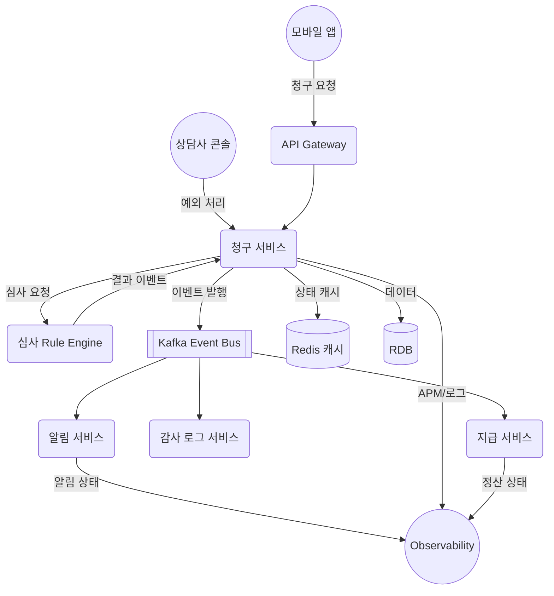

## 보험금 청구 자동화 백엔드
```
보험금 청구
 ├─ 사용자
 │   ├─ 모바일 신청
 │   ├─ 진행 상태 확인
 │   └─ 알림 수신
 │
 ├─ 시스템
 │   ├─ 트랜잭션 정합성
 │   ├─ 비동기 처리
 │   ├─ 장애 대응
 │   └─ 확장성
 │
 ├─ 데이터
 │   ├─ 개인정보 암호화
 │   ├─ 로그/감사
 │   ├─ 인덱스 최적화
 │   └─ 데이터 품질
 │
 ├─ 기술
 │   ├─ Kafka
 │   ├─ Redis
 │   ├─ RDB
 │   └─ Observability
 │
 └─ 비즈니스
     ├─ 처리 시간 단축
     ├─ 운영 비용 감소
     └─ 고객 신뢰
```

### 핵심 요구사항 요약
- **사용자**: 모바일 신청/알림 경로를 표준화하고 상태 추적 알림을 실시간 제공해야 한다.
- **시스템**: 이벤트 기반 비동기 처리와 장애 격리, 확장성 확보가 필수다.
- **데이터**: 암호화/감사/품질 관리 파이프라인을 초기 설계 단계에서 포함한다.
- **기술**: Kafka-Redis-RDB 조합과 Observability 스택을 일관된 패턴으로 배포한다.
- **비즈니스**: 처리 시간을 단축하면서 비용과 신뢰 지표를 동시에 개선한다.

### 다음 액션
1. 모듈 별 소유 팀 매핑 및 인터페이스 정의
2. 이벤트/스토리지 아키텍처 다이어그램 작성
3. SLA·성능 기준을 SMART 지표와 연결

### 시스템 구조 (Mermaid)


### 컴포넌트 역할
- **UserApp / Advisor**: 고객과 상담사가 각각 청구를 생성·조회·예외 처리하는 프런트 채널.
- **API Gateway**: 인증/레이트리밋을 맡고 청구 서비스로 트래픽을 라우팅.
- **Claim Service**: 청구 생성/상태 전환/데이터 적재를 담당하는 핵심 도메인 서비스.
- **Rule Engine**: 심사 규칙(자동 승인/보류) 실행 후 Claim 서비스에 결과 이벤트 전달.
- **Kafka Event Bus**: 상태 이벤트를 Notification·Audit·Disburse 서비스에 팬아웃.
- **Notification / Audit / Disburse**: 각각 고객 알림, 감사 로그 기록, 보험금 지급을 담당.
- **Redis / RDB**: 고속 상태 조회와 영속 데이터 저장소 역할.
- **Observability**: APM·로그·메트릭 수집으로 SLA/SMART 지표 모니터링.
