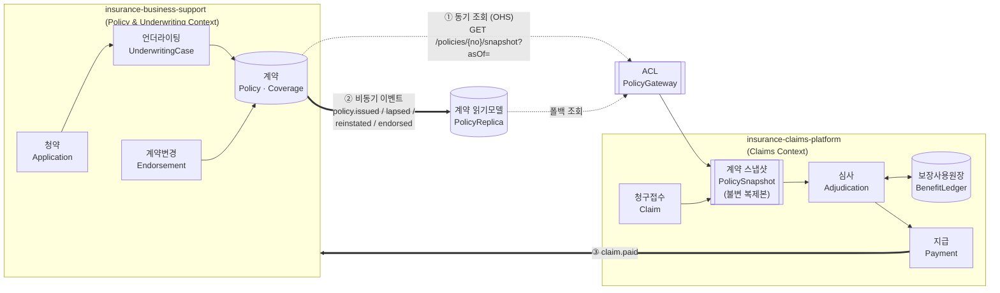

# 01. 컨텍스트 맵 — 두 레포의 경계

> 이 문서는 **두 저장소가 공유하는 정본**이다.
> `insurance-business-support/docs/design/01-context-map.md`는 이 문서를 참조하며, 내용이 갈라지면 이 문서가 우선한다.

---

## 1. 왜 두 개로 나누는가

실제 보험사 조직은 **계약계(契約係)**와 **보상계(補償係)**로 나뉜다. 이유는 조직도가 아니라 업무의 성질이 다르기 때문이다.

| | 계약 업무 | 보상 업무 |
|---|---|---|
| 시간 축 | 계약 시점에 한 번 정하고 **길게 유지** | 사고 때마다 **짧게 반복** |
| 변경 빈도 | 낮음 (연 1회 수준의 변경) | 높음 (건당 수 분 내 처리) |
| 트래픽 성격 | 청약 시즌·갱신월에 집중 | 상시 분산, 연말·명절 피크 |
| 실패 영향 | 계약 미성립 → 영업 손실 | 지급 지연 → **법적 책임 + 지연이자** |
| 규제 초점 | 불완전판매, 고지의무 | 지급기한, 부지급 사유 설명 |
| 데이터 변경 성격 | 갱신 위주 (mutable) | **추가 위주 (append-only)** |

즉 **변경 이유가 다르고, 변경 속도가 다르고, 장애 시 파급이 다르다.** 이것이 바운디드 컨텍스트를 나누는 정당한 근거다.

> ❌ 나누면 안 되는 이유였던 것: "MSA가 요즘 표준이라서".
> ✅ 나누는 진짜 이유: **계약 정보의 수명과 청구 처리의 수명이 다르고, 청구는 과거 시점의 계약을 봐야 한다.**

---

## 2. 컨텍스트 맵



| 번호 | 방향 | 방식 | 용도 |
|---|---|---|---|
| ① | BS → CP | **동기 REST** (Open Host Service) | 청구 접수 시점에 사고일 기준 계약 스냅샷을 확정 |
| ② | BS → CP | **비동기 이벤트** (Kafka) | 계약 상태 변화를 읽기모델에 반영, ①의 폴백·성능 보조 |
| ③ | CP → BS | **비동기 이벤트** | 지급 실적 통보 (갱신 심사·손해율 산정 참고용) |

### 2.1 관계 유형 (DDD 패턴)

- **business-support = Upstream / Open Host Service (OHS)**
  계약 스냅샷 API는 claims 전용이 아니라 **공표된 공용 계약(published contract)**이다.
  claims의 편의를 위해 스키마를 마음대로 바꾸지 않는다.

- **claims-platform = Downstream / Anti-Corruption Layer (ACL)**
  business-support의 모델(`Policy`, `Coverage`, `Exclusion`)을 그대로 쓰지 않고,
  `PolicyGateway`에서 claims의 언어(`CoverageTerms`, `ExclusionRule`)로 **번역**해서 들인다.
  → business-support의 스키마 변경이 claims 도메인까지 전파되지 않는다.

- **Customer/Supplier 아님**: claims가 "이런 필드 추가해 주세요"라고 요구하는 관계가 아니다.
  계약 스냅샷은 BS가 정의하고, CP는 필요한 것을 ACL에서 조립한다.

---

## 3. 핵심 통합 계약 — 계약 스냅샷 (Policy Snapshot)

**이 설계 전체에서 가장 중요한 단일 결정.**

### 3.1 문제

청구 심사는 **"지금의 계약"이 아니라 "사고일 시점의 계약"**을 봐야 한다.

```
2026-01-01  계약 체결 (척추 부담보 3년)
2026-03-14  사고 발생 ← 이 시점의 조건으로 심사해야 함
2026-04-02  청구 접수
2026-05-10  계약 변경: 부담보 해제
2026-06-01  민원 접수 → 재심사
```

재심사 시점(6월)에 계약을 조회하면 부담보가 이미 해제돼 있다.
그대로 심사하면 **4월의 심사 결과를 재현할 수 없고, 부지급 근거를 설명할 수 없다.**

### 3.2 해결

**청구 접수 시점에 사고일 기준 계약 상태를 조회해서, 청구 건에 불변 복제본으로 박아 넣는다.**

```
POST /claims (접수)
  → PolicyGateway.fetchSnapshot(policyNo, asOf = accidentDate)
  → business-support가 사고일 시점으로 시간여행(time-travel)해서 응답
  → claims가 그 JSON을 policy_snapshot 테이블에 원문 그대로 저장 (immutable)
  → 이후 모든 심사·재심사는 저장된 스냅샷만 본다. BS를 다시 부르지 않는다.
```

**효과**

| 얻는 것 | 설명 |
|---|---|
| 심사 재현성 | 1년 뒤 재심사해도 같은 입력 → 같은 결과 |
| 분쟁 대응 | "그때 계약은 이랬습니다"를 원문으로 제시 가능 |
| 장애 격리 | BS가 죽어도 **이미 접수된 건의 심사는 계속 진행**된다 |
| 성능 | 심사 루프에서 네트워크 호출 0회 |
| 감사 | 스냅샷 해시를 심사 트레이스에 남겨 변조 탐지 |

**대가**

| 잃는 것 | 대응 |
|---|---|
| 접수 이후 계약 정정이 자동 반영 안 됨 | 계약 정정 시 BS가 `policy.corrected` 발행 → claims가 영향받는 미지급 건을 **재심사 대상으로 표시** (자동 재심사가 아니라 심사자 큐로) |
| 저장 용량 | 청구당 수 KB. 문제되는 규모 아님 |

### 3.3 `asOf` 파라미터의 의미

business-support는 **이력 테이블(bitemporal)**을 유지해야 한다.

- `validFrom` / `validTo` : 그 사실이 **현실에서 유효했던** 기간 (사고일이 조회하는 축)
- `recordedAt` : 그 사실이 **시스템에 기록된** 시점 (소급 정정을 추적하는 축)

사고일 스냅샷 = `validFrom <= asOf < validTo` 인 레코드.
소급 정정이 있었다면 `recordedAt`이 다른 두 버전이 존재하며, 스냅샷에 **버전 번호를 포함**해 어느 쪽을 봤는지 남긴다.

---

## 4. 스냅샷 계약 스키마 (요약)

전체 명세는 [`05-api.md`](05-api.md) 및 business-support의 `05-api.md` 참조.

```jsonc
// GET /api/v1/policies/{policyNo}/snapshot?asOf=2026-03-14&insuredRef=CI-xxxx
{
  "snapshotId": "PSN-20260402-000123",
  "policyNo": "P2026-0001234",
  "asOf": "2026-03-14",
  "recordedAt": "2026-04-02T10:15:00+09:00",
  "snapshotVersion": 1,

  "product": {
    "productCode": "MED-INDEM-G4",
    "generation": "G4"                 // 자기부담 구조 분기의 최상위 키
  },

  "policyStatusAsOf": "IN_FORCE",      // IN_FORCE | GRACE | LAPSED | TERMINATED | MATURED
  "policyPeriod": { "from": "2026-01-01", "to": "2031-01-01" },
  "effectiveDate": "2026-01-01",       // 책임개시일

  "insured": {
    "insuredRef": "CI-xxxx",           // 주민번호 아님. 연계정보/내부 고객키
    "birthYear": 1988,                 // 나이 기반 룰용. 생년월일 전체는 불필요
    "relationToHolder": "SELF"
  },

  "coverages": [
    {
      "coverageCode": "COV-INPT-COVERED",
      "name": "급여 입원의료비",
      "treatmentTypes": ["INPATIENT"],
      "benefitCategory": "COVERED",              // COVERED | UNCOVERED | MAJOR_UNCOVERED
      "insuredAmount": 50000000,
      "terms": {
        "coinsuranceRate": "0.20",
        "minDeductible": null,                   // 입원은 최소공제 없음
        "annualLimit": 50000000,
        "perVisitLimit": null,
        "annualCountLimit": null
      },
      "waitingPeriodEnd": null,
      "coverageStatusAsOf": "ACTIVE"
    },
    {
      "coverageCode": "COV-OUTP-UNCOVERED",
      "name": "비급여 통원의료비",
      "treatmentTypes": ["OUTPATIENT"],
      "benefitCategory": "UNCOVERED",
      "terms": {
        "coinsuranceRate": "0.30",
        "minDeductible": 30000,
        "perVisitLimit": 200000,
        "annualCountLimit": 100
      },
      "coverageStatusAsOf": "ACTIVE"
    }
  ],

  "exclusions": [
    {
      "type": "BODY_PART",             // BODY_PART | DISEASE | KCD_RANGE
      "target": "척추 및 그 부속기관",
      "kcdRanges": ["M40-M54"],
      "from": "2026-01-01",
      "until": "2031-01-01",
      "reason": "언더라이팅 부담보"
    }
  ],

  "premium": {
    "paidThrough": "2026-03-31",       // 이 날까지 보험료 수납됨
    "inGracePeriod": false
  },

  "checksum": "sha256:9f2c..."         // 심사 트레이스에 기록. 변조 탐지용
}
```

### 4.1 스키마 설계 규칙

1. **claims가 심사에 필요한 것만 준다.** 계약자 주소, 수수료, 모집인 정보 등은 주지 않는다 (최소권한).
2. **주민등록번호를 주고받지 않는다.** `insuredRef`(CI 또는 내부 고객키)로만 식별.
3. **BS 내부 enum을 그대로 노출하지 않는다.** 공표용 값 집합을 별도로 정의하고, BS 내부 값 변경이 API를 깨지 않게 한다.
4. **필드 추가는 하위호환, 삭제·의미변경은 새 버전**(`/api/v2/...`). 삭제 예정 필드는 `deprecated` 헤더로 예고.
5. **`checksum`은 응답 본문(checksum 제외)의 정규화 해시.** claims가 재계산해 검증하고 트레이스에 남긴다.

---

## 5. 이벤트 통합 (②, ③)

동기 스냅샷이 정본이고, **이벤트는 보조 수단**이다. 역할을 섞지 않는다.

### 5.1 BS → CP : 계약 이벤트

| 이벤트 | 발행 시점 | claims의 반응 |
|---|---|---|
| `policy.issued` | 계약 성립 | 읽기모델에 계약 추가 (청구 접수 시 사전 검증용) |
| `policy.lapsed` | 실효 확정 | 읽기모델 상태 변경. **진행 중 청구는 건드리지 않음** (스냅샷이 정본) |
| `policy.reinstated` | 부활 | 읽기모델 상태 변경 |
| `policy.terminated` | 해지·만기 | 읽기모델 상태 변경 |
| `policy.endorsed` | 계약 변경 | 읽기모델 갱신 |
| `policy.corrected` | **소급 정정** | 영향받는 미지급 청구를 **재심사 대상으로 표시** → 심사자 큐 |

> `policy.corrected`만 특별하다. 나머지는 읽기모델만 갱신하고 진행 중 심사에 개입하지 않는다.
> 소급 정정은 "과거 사실이 틀렸었다"는 선언이라 스냅샷의 전제를 무너뜨리기 때문이다.

### 5.2 읽기모델(PolicyReplica)의 용도 — 한정적

| 쓰는 곳 | 안 쓰는 곳 |
|---|---|
| 청구 접수 화면에서 계약 목록 표시 | ❌ 심사 판정 |
| 접수 시 명백한 오류 조기 차단 (존재하지 않는 계약번호 등) | ❌ 금액 산출 |
| BS 장애 시 접수 계속 받기 (스냅샷은 보류 상태로 접수) | ❌ 부지급 근거 |

**심사는 스냅샷만 본다.** 읽기모델은 최종 일관성이라 심사 근거가 될 수 없다.

### 5.3 CP → BS : 지급 이벤트

| 이벤트 | 용도 |
|---|---|
| `claim.paid` | 손해율 집계, 갱신 심사 시 참고, 4세대 비급여 이용량 연동 보험료 산정 |
| `claim.reclaimed` | 환수 발생 통보 |

BS는 이 이벤트를 **통계·참고 목적**으로만 쓴다. 계약 상태를 자동으로 바꾸지 않는다.

---

## 6. 장애 시나리오와 격리

| 장애 | claims 영향 | 설계된 대응 |
|---|---|---|
| BS 전체 다운 | 신규 접수 시 스냅샷 확보 불가 | 청구를 `RECEIVED` + `snapshotStatus=PENDING`으로 접수 → 재시도 잡이 스냅샷 확보 → 확보 후 심사 진입. **고객 접수는 절대 막지 않는다** (지급기한이 접수일부터 기산되므로 접수 거부가 더 위험) |
| BS 응답 지연 | 접수 API 지연 | 타임아웃 3초 + 서킷브레이커. 열리면 위와 동일 경로 |
| Kafka 다운 | 읽기모델 갱신 지연 | 심사는 영향 없음 (스냅샷 기반). Outbox에 쌓였다가 복구 시 재발행 |
| 스냅샷 checksum 불일치 | 데이터 변조 의심 | 심사 진행 중단 + 즉시 수동심사 회부 + 보안 알림 |
| claims 다운 | BS 영향 없음 | BS는 claims를 동기 호출하지 않는다 (단방향 의존) |

**의존 방향은 claims → business-support 단방향.** BS는 claims의 존재를 몰라도 동작해야 한다.

---

## 7. 데이터 소유권 (누가 원천인가)

| 데이터 | 원천 | 사본 보유 |
|---|---|---|
| 계약·담보·부담보 조건 | **business-support** | claims (스냅샷 + 읽기모델) |
| 피보험자 식별자 | **business-support** | claims (참조만) |
| 보험료 수납 상태 | **business-support** | claims (스냅샷 내부) |
| 청구·진료내역·서류 | **claims-platform** | 없음 |
| 심사 판정·트레이스 | **claims-platform** | 없음 |
| 보장 사용 원장(한도 소진) | **claims-platform** | 없음 |
| 지급 실적 | **claims-platform** | business-support (이벤트 수신, 통계용) |

> **보장 사용 원장이 claims 소유인 이유**: 한도 소진은 *지급 사실*의 결과이지 계약의 속성이 아니다.
> 계약은 "연간 5천만원까지"를 정의하고, "지금까지 3천만원 썼다"는 보상 업무의 사실이다.

---

## 8. 저장소·배포 구조

| | insurance-business-support | insurance-claims-platform |
|---|---|---|
| 저장소 | 독립 | 독립 |
| DB | 독립 스키마 (**공유 DB 금지**) | 독립 스키마 |
| 배포 | 독립 | 독립 |
| 내부 구조 | 모듈러 모놀리스 (Gradle 멀티모듈) | 모듈러 모놀리스 |
| 공유 코드 | **없음.** 이벤트 스키마는 각자 정의하고 계약 테스트로 맞춤 | 동일 |

### 8.1 공유 라이브러리를 만들지 않는 이유

"이벤트 DTO를 공통 모듈로 빼자"는 유혹이 생기지만 하지 않는다.
공유 DTO는 두 컨텍스트를 컴파일 타임에 다시 묶어버려서, 바운디드 컨텍스트를 나눈 의미를 없앤다.

대신 **소비자 주도 계약 테스트(Consumer-Driven Contract)**를 쓴다:
- claims가 "내가 기대하는 스냅샷 응답/이벤트 형태"를 계약 파일로 선언
- business-support CI가 그 계약을 검증
- 계약이 깨지면 **BS의 빌드가 실패**한다

→ 결합 없이 안전성만 얻는다.

---

## 9. 이 경계에서 자주 틀리는 것

| 하기 쉬운 실수 | 왜 틀렸나 | 올바른 방법 |
|---|---|---|
| 심사 때마다 BS에 계약 조회 | 재현 불가 + BS 장애가 심사 중단으로 전파 | 접수 시 스냅샷 1회 |
| 읽기모델로 심사 판정 | 최종 일관성 데이터는 부지급 근거가 될 수 없음 | 스냅샷만 사용 |
| 한도 소진량을 BS가 관리 | 계약 속성이 아니라 보상 사실 | claims의 BenefitLedger |
| 두 DB를 하나로 | 배포·스키마가 다시 묶임 | 스키마 분리 유지 |
| 이벤트로 스냅샷 대체 | 순서·중복·지연 때문에 금액 계산의 근거로 부적합 | 동기 조회 + 불변 저장 |
| BS가 claims를 호출 | 순환 의존, 계약 업무가 보상 장애에 묶임 | 단방향 유지 |

---

## 다음 문서

- [`02-domain-model.md`](02-domain-model.md) — claims 애그리거트 설계
- [`03-adjudication.md`](03-adjudication.md) — 심사 룰 파이프라인
- business-support: `docs/design/02-domain-model.md` — 계약·언더라이팅 애그리거트
