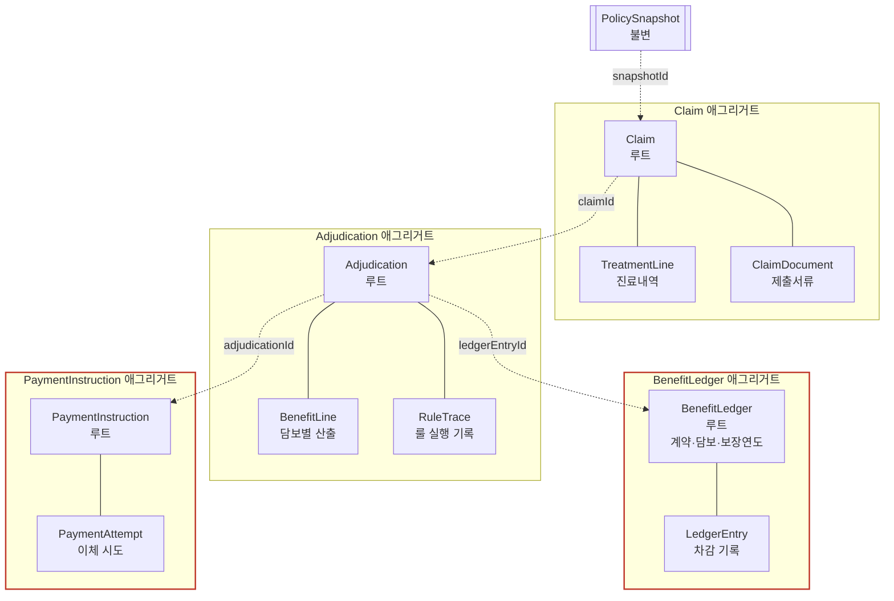
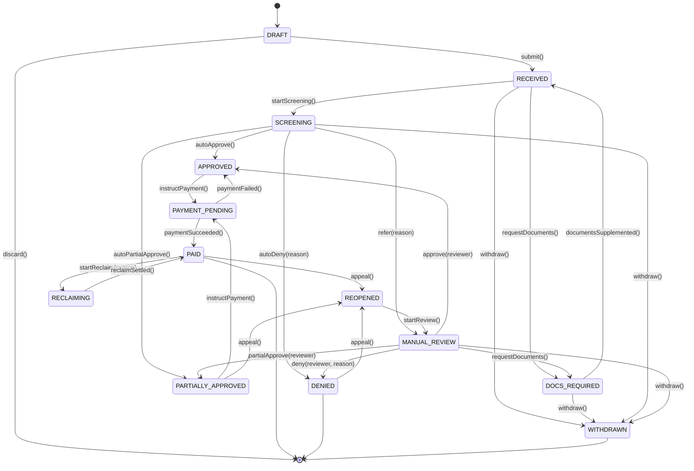

# 02. 도메인 모델 — 애그리거트와 상태머신

> 용어는 [`00-domain-glossary.md`](00-domain-glossary.md)를 따른다.

---

## 1. 애그리거트 식별

애그리거트 경계는 **"어디까지가 하나의 트랜잭션에서 함께 불변식을 지켜야 하는 범위인가"**로 정한다.
객체 그래프의 편의가 아니다.

| 애그리거트 | 루트 | 불변식의 성격 | 동시성 |
|---|---|---|---|
| **Claim** | `Claim` | 청구 1건의 상태 전이 + 진료내역 합계 | 건별 독립. 충돌 거의 없음 |
| **Adjudication** | `Adjudication` | 심사 1회의 판정·산출·트레이스가 원자적 | 청구당 순차 |
| **BenefitLedger** | `BenefitLedger` | **한도 초과 지급 금지** | ⚠️ **경합 지점** |
| **PaymentInstruction** | `PaymentInstruction` | **중복 이체 금지** | ⚠️ **경합 지점** |
| **PolicySnapshot** | `PolicySnapshot` | 불변. 생성 후 수정 없음 | 없음 |



**애그리거트 간 참조는 ID로만 한다.** 객체 참조를 두면 경계가 무너지고 한 트랜잭션에 여러 애그리거트가 끌려 들어온다.

---

## 2. Claim 애그리거트

### 2.1 구조

```java
// domain/claim/Claim.java — 프레임워크 의존성 0
public class Claim {
    private ClaimId id;
    private ClaimNo claimNo;              // CLM-YYYYMMDD-NNNNNN
    private ClaimStatus status;

    private PolicyRef policyRef;          // policyNo + insuredRef (BS 참조, ID만)
    private SnapshotId snapshotId;        // 확보된 계약 스냅샷 (nullable: PENDING 상태)
    private SnapshotStatus snapshotStatus; // PENDING | SECURED | FAILED

    private AccidentInfo accident;        // 사고일, 사고유형(상해/질병), 주상병 KCD
    private List<TreatmentLine> treatments;  // 진료내역 (최소 1건)
    private List<ClaimDocument> documents;

    private Money claimedAmount;          // 청구액 = 진료내역 합계 (파생, 캐시)
    private PayoutAccountRef payoutAccount;

    private ReceivedAt receivedAt;        // 접수 시각 — 지급기한 기산점
    private PaymentDueDate dueDate;       // 영업일 계산 결과
    private Duration clockPausedFor;      // 서류보완으로 정지된 누적 시간

    private List<DomainEvent> pendingEvents;  // 애그리거트가 이벤트를 기록
}
```

### 2.2 불변식

| # | 불변식 | 위반 시 |
|---|---|---|
| C1 | 진료내역이 최소 1건 있어야 접수 가능 | `EmptyTreatmentException` |
| C2 | 모든 진료일은 사고일 이후여야 함 | `InvalidTreatmentDateException` |
| C3 | 청구액 = Σ(진료내역 총진료비). 직접 대입 불가 | 파생 필드로만 노출 |
| C4 | 사고일로부터 3년 경과 시 접수 불가 | `RECEIVED` 전환 차단 → 수동심사 회부 |
| C5 | `PAID` 상태에서는 진료내역·서류 수정 불가 | `ClaimLockedException` |
| C6 | 상태 전이는 정의된 전이표에만 따름 | `IllegalTransitionException` |
| C7 | `DENIED` 전환 시 `DenialReason` 필수 | 컴파일 타임에 강제 (메서드 시그니처) |

> **C7의 구현 방식**: `claim.deny()`가 아니라 `claim.deny(DenialReason reason, String memo)`.
> "사유 없는 부지급"을 런타임 검증이 아니라 **타입 시스템으로 불가능하게** 만든다.

### 2.3 상태 전이표



**전이표 (코드의 단일 진실 공급원)**

| From | 허용 전이 |
|---|---|
| `DRAFT` | `RECEIVED`, (삭제) |
| `RECEIVED` | `DOCS_REQUIRED`, `SCREENING`, `WITHDRAWN` |
| `DOCS_REQUIRED` | `RECEIVED`, `WITHDRAWN` |
| `SCREENING` | `APPROVED`, `PARTIALLY_APPROVED`, `DENIED`, `MANUAL_REVIEW`, `WITHDRAWN` |
| `MANUAL_REVIEW` | `APPROVED`, `PARTIALLY_APPROVED`, `DENIED`, `DOCS_REQUIRED`, `WITHDRAWN` |
| `APPROVED` | `PAYMENT_PENDING` |
| `PARTIALLY_APPROVED` | `PAYMENT_PENDING`, `REOPENED` |
| `PAYMENT_PENDING` | `PAID`, `APPROVED` (이체 실패 복귀) |
| `PAID` | `REOPENED`, `RECLAIMING` |
| `DENIED` | `REOPENED` |
| `REOPENED` | `MANUAL_REVIEW` |
| `RECLAIMING` | `PAID` |
| `WITHDRAWN` | (종결) |

> v1 구현의 문제였던 "상태 전이 위반 시 500 에러"는, 전이 실패를 **`IllegalTransitionException` → HTTP 409 Conflict**로 매핑해 해결한다. ([`05-api.md`](05-api.md) 오류 표 참조)

### 2.4 지급기한 시계 (PaymentDueDate)

**설계상 가장 실무적인 부분.** 단순 타임스탬프가 아니라 도메인 개념이다.

```java
public record PaymentDueDate(
    LocalDate baseDate,        // 접수일
    int businessDays,          // 3 또는 10
    LocalDate dueDate,         // 영업일 계산 결과
    DueDateReason reason       // STANDARD_3BD | INVESTIGATION_10BD | EXTENDED
) {}
```

**규칙**

1. `RECEIVED` 진입 시 기본 **3영업일** 기한 설정
2. 조사 필요 판정(`MANUAL_REVIEW` 회부 등) 시 **10영업일**로 연장 + 연장 사유 기록
3. `DOCS_REQUIRED` 동안 **시계 정지**. 서류 보완 시 재개하고 정지 기간을 `clockPausedFor`에 누적
4. 10영업일 초과 예상 시 **고객 통지 이벤트 발행** (통지 누락 자체가 민원 사유)
5. 기한 초과 지급 시 **지연이자 자동 산출** → `Adjudication`에 별도 라인으로 추가

**영업일 계산**은 `BusinessCalendar` 포트로 분리한다 (공휴일 데이터는 인프라 관심사).

```java
public interface BusinessCalendar {
    LocalDate plusBusinessDays(LocalDate from, int days);
    int businessDaysBetween(LocalDate from, LocalDate to);
    boolean isBusinessDay(LocalDate date);
}
```

### 2.5 TreatmentLine (진료내역)

```java
public record TreatmentLine(
    TreatmentLineId id,
    LocalDate treatmentDate,
    TreatmentType type,               // INPATIENT | OUTPATIENT | PRESCRIPTION
    MedicalInstitution institution,   // 요양기관번호 + 종별
    KcdCode primaryDiagnosis,         // 주상병
    List<KcdCode> secondaryDiagnoses,
    ChargeBreakdown charges           // 금액 분해
) {}

public record ChargeBreakdown(
    Money coveredPatientShare,   // 급여 본인부담금  ← 보상 대상
    Money coveredNhisShare,      // 급여 공단부담금  ← 보상 대상 아님 (검증용으로만 보유)
    Money uncovered,             // 비급여 총액      ← 보상 대상
    Money majorUncovered         // 3대 비급여 (uncovered의 부분집합)
) {
    public Money totalCharge() { ... }       // 전체 진료비
    public Money claimBase() { ... }         // 보상 대상 기준액 = coveredPatientShare + uncovered
}
```

> **`coveredNhisShare`를 굳이 받는 이유**: 진료비계산서 총액과의 정합성 검증(`총액 = 본인부담 + 공단부담 + 비급여`)에 쓴다.
> 맞지 않으면 서류 오류로 보완 요청 → 잘못된 금액 심사를 입구에서 막는다.

---

## 3. BenefitLedger 애그리거트 ⚠️

**이 시스템에서 동시성 사고가 날 수 있는 두 곳 중 하나.**

### 3.1 왜 별도 애그리거트인가

한도는 **계약·담보·보장연도** 단위로 관리되고, **여러 청구가 동시에 같은 원장을 차감**한다.
Claim 안에 두면 "다른 청구가 얼마 썼는지"를 알 수 없어 한도 초과가 발생한다.

```
계약 P-001, 비급여 통원, 연간 100회 한도, 현재 99회 사용

청구 A (10:00:00.000)  조회: 99회 → 1회 남음 → 승인 → 100회
청구 B (10:00:00.010)  조회: 99회 → 1회 남음 → 승인 → 100회  ← 한도 초과 지급!
```

### 3.2 구조

```java
public class BenefitLedger {
    private LedgerId id;
    private PolicyNo policyNo;
    private CoverageCode coverageCode;
    private BenefitYear benefitYear;      // 계약 응당일 기준 (달력연도 아님)

    private Money annualLimit;
    private Money usedAmount;
    private Integer annualCountLimit;
    private Integer usedCount;

    private long version;                 // 낙관적 락

    /** 한도 내에서 차감하고, 실제 차감 가능했던 금액을 반환 */
    public LedgerReservation reserve(ClaimId claimId, Money requested, int count) {
        Money remaining = annualLimit.minus(usedAmount);
        Money granted   = Money.min(requested, remaining);

        if (annualCountLimit != null && usedCount + count > annualCountLimit) {
            return LedgerReservation.countExhausted(...);
        }
        this.usedAmount = usedAmount.plus(granted);
        this.usedCount  = usedCount + count;
        return LedgerReservation.granted(granted, remaining.minus(granted));
    }

    public void release(LedgerEntryId entryId) { ... }  // 부지급·철회 시 복원
}
```

### 3.3 동시성 전략

| 단계 | 방식 | 근거 |
|---|---|---|
| 1차 | **낙관적 락** (`@Version`) + 충돌 시 최대 3회 재시도 | 동일 계약 동시 청구는 드물다. 평시 오버헤드 0 |
| 2차 | 재시도 소진 시 **수동심사 회부** | 무한 재시도보다 사람이 보는 게 안전 |
| 예약-확정 분리 | 심사 시 `reserve` → 지급 성공 시 `confirm`, 실패·철회 시 `release` | 승인만 되고 미지급인 건이 한도를 영구 점유하는 것을 방지 |

> **비관적 락을 기본으로 쓰지 않는 이유**: 계약 단위 행 잠금은 동일 계약의 청구를 직렬화한다.
> 가족 단위로 같은 날 여러 건 청구되는 실손 특성상 불필요한 대기가 생긴다.

### 3.4 예약 만료

`reserve` 후 일정 시간(예: 7일) 내 확정되지 않은 예약은 배치가 자동 `release`한다.
이 값도 설정으로 둔다 (`claims.ledger.reservation-ttl`).

---

## 4. PaymentInstruction 애그리거트 ⚠️

**동시성 사고가 날 수 있는 두 번째 지점. 여기서 실수하면 중복 지급이다.**

### 4.1 구조

```java
public class PaymentInstruction {
    private PaymentInstructionId id;
    private ClaimId claimId;
    private AdjudicationId adjudicationId;
    private IdempotencyKey idempotencyKey;   // UNIQUE 제약. 중복 방지의 핵심
    private Money amount;
    private PayoutAccount account;           // 암호화 저장
    private PayoutStatus status;
    private List<PaymentAttempt> attempts;
}
```

### 4.2 중복지급 방지 3중 방어

| 층 | 수단 | 막는 것 |
|---|---|---|
| 1 | `UNIQUE(claim_id, adjudication_id)` DB 제약 | 같은 심사 결과로 지시가 2건 생성되는 것 |
| 2 | `idempotency_key`를 **외부 이체 API에 그대로 전달** | 우리가 재시도해도 은행이 1회만 처리 |
| 3 | 상태 전이 `PAYMENT_PENDING → PAID` 단방향 + 낙관적 락 | 동시 콜백으로 두 번 완료 처리되는 것 |

**멱등키 생성 규칙**: `sha256(claimId + adjudicationId + amount)` — 결정적(deterministic)이어야 재시도 시 같은 키가 나온다.
난수로 만들면 재시도할 때마다 새 키가 되어 멱등성이 깨진다.

### 4.3 이체 결과 불확실 처리

외부 이체 호출이 **타임아웃**되면 성공인지 실패인지 알 수 없다. 이때 재시도하면 중복지급 위험이다.

```
이체 요청 → 타임아웃
  → 상태를 UNKNOWN으로 두고 재시도하지 않음
  → 조회 API로 같은 idempotencyKey의 처리 결과를 확인 (reconciliation)
  → 확인될 때까지 PAID로 전환하지 않음
  → 일정 시간 내 미확인 시 운영자 알림
```

**타임아웃은 실패가 아니다.** 이 구분을 코드에 명시한다.

---

## 5. Adjudication 애그리거트

### 5.1 구조

```java
public class Adjudication {
    private AdjudicationId id;
    private ClaimId claimId;
    private SnapshotId snapshotId;        // 어떤 스냅샷으로 심사했는가
    private String snapshotChecksum;      // 변조 탐지

    private AdjudicationMode mode;        // AUTO | MANUAL
    private Decision decision;            // APPROVED | PARTIALLY_APPROVED | DENIED | REFERRED
    private List<BenefitLine> benefitLines;   // 담보별 산출 결과
    private Money totalPayable;
    private List<DenialReason> denialReasons;

    private List<RuleTrace> traces;       // 전체 룰 실행 기록 (append-only)
    private ReviewerRef reviewer;         // MANUAL인 경우
    private Instant adjudicatedAt;
    private String rulesetVersion;        // 어떤 버전의 룰셋으로 심사했는가
}
```

### 5.2 BenefitLine — 담보별 산출 1줄

```java
public record BenefitLine(
    CoverageCode coverageCode,
    TreatmentLineId treatmentLineId,
    Money claimBase,          // 보상 대상 기준액
    Money deductible,         // 자기부담금
    Money beforeLimit,        // 한도 적용 전
    Money limitReduction,     // 한도로 깎인 금액
    Money payable,            // 최종 지급액
    List<String> appliedRuleIds
) {}
```

**고객 통지문이 이 구조에서 그대로 생성된다.** "왜 30만원 청구했는데 12만원만 나왔나"에 대한 답이 여기 있다.

### 5.3 RuleTrace — 설명 가능성의 핵심

```jsonc
{
  "seq": 12,
  "ruleId": "R-CAL-020",
  "ruleName": "급여 자기부담금 차감",
  "rulesetVersion": "2026.01",
  "clause": "실손의료보험 표준약관 제3조 제1항",
  "input":  { "claimBase": 60000, "coinsuranceRate": "0.20", "minDeductible": 20000 },
  "output": { "deductible": 20000, "payable": 40000 },
  "verdict": "APPLIED",
  "evaluatedAt": "2026-04-02T10:15:03.221+09:00"
}
```

**불변 규칙**
- `traces`는 **append-only**. 수정·삭제 API를 제공하지 않는다.
- DB에도 `UPDATE`/`DELETE` 권한을 주지 않는다 (애플리케이션 DB 계정 수준에서 제한).
- 재심사는 **새 `Adjudication`을 생성**한다. 기존 것을 고치지 않는다.
  → 청구 1건에 심사 N건이 시간순으로 쌓인다. "처음엔 부지급이었다가 민원 후 지급"의 이력이 보존된다.

---

## 6. PolicySnapshot

```java
public record PolicySnapshot(
    SnapshotId id,
    PolicyNo policyNo,
    LocalDate asOf,
    int snapshotVersion,
    String rawJson,        // BS 응답 원문 그대로 (파싱 전)
    String checksum,
    Instant fetchedAt
) {}
```

**원문(`rawJson`)을 반드시 보관한다.** 파싱된 객체만 저장하면 나중에 스키마가 바뀌었을 때 과거 건을 재현할 수 없다.
파싱 실패나 스키마 변경 시에도 원문이 있으면 복구 가능하다.

---

## 7. 도메인 이벤트 — 애그리거트가 기록한다

v1의 문제는 **서비스가 이벤트를 만들어 발행**한 것이었다. 그러면 도메인 규칙과 이벤트가 분리되어,
새 경로로 상태를 바꿀 때 이벤트 발행을 빠뜨린다.

### 7.1 올바른 패턴

```java
// 도메인: 애그리거트가 자기 이벤트를 기록
public abstract class AggregateRoot {
    private final List<DomainEvent> pendingEvents = new ArrayList<>();
    protected void record(DomainEvent e) { pendingEvents.add(e); }
    public List<DomainEvent> pullEvents() {
        var copy = List.copyOf(pendingEvents);
        pendingEvents.clear();
        return copy;
    }
}

public class Claim extends AggregateRoot {
    public void submit(BusinessCalendar calendar) {
        transitionTo(ClaimStatus.RECEIVED);
        this.receivedAt = ReceivedAt.now();
        this.dueDate = PaymentDueDate.standard(receivedAt.toLocalDate(), calendar);
        record(new ClaimReceived(id, claimNo, policyRef, receivedAt, dueDate));  // ← 여기
    }
}

// 애플리케이션: pull해서 Outbox에 저장 (같은 트랜잭션)
@Transactional
public ClaimResult submit(SubmitClaimCommand cmd) {
    Claim claim = claimRepository.findById(cmd.claimId()).orElseThrow(...);
    claim.submit(businessCalendar);
    claimRepository.save(claim);
    outbox.append(claim.pullEvents());   // ← 커밋 전 발행 아님. 같은 트랜잭션에 INSERT
    return ...;
}
```

**상태를 바꾸는 모든 경로가 반드시 이벤트를 남긴다.** 빠뜨릴 수 없는 구조다.

### 7.2 Outbox를 쓰는 이유

v1은 `@Transactional` 안에서 `ApplicationEventPublisher.publishEvent()`를 호출했다.
→ 리스너가 **커밋 전에** 실행된다. 롤백되면 외부에 이미 나간 이벤트를 되돌릴 수 없다.

Outbox는 이벤트를 **같은 트랜잭션의 DB INSERT**로 만든다. 커밋되면 이벤트도 있고, 롤백되면 이벤트도 없다.
발행은 별도 릴레이가 담당한다. 상세는 [`04-events-and-integration.md`](04-events-and-integration.md).

---

## 8. 값 객체 (Value Objects)

| VO | 불변식 | 비고 |
|---|---|---|
| `Money` | 음수 불가, **KRW 정수(원 단위)** | v1의 `scale=2`를 교정. 통화 필드 없음 |
| `ClaimNo` | `CLM-YYYYMMDD-NNNNNN` | 일련번호는 DB 시퀀스. **v1의 난수 방식은 충돌 가능성 + 정렬 불가로 폐기** |
| `KcdCode` | KCD 형식 검증 (`^[A-Z]\d{2}(\.\d{1,2})?$`) | 면책 룰의 입력 |
| `PolicyNo` | BS 발급 형식 | claims는 생성하지 않고 참조만 |
| `CoinsuranceRate` | 0.0 ~ 1.0 | `BigDecimal`. `double` 금지 |
| `BenefitYear` | 계약 응당일 기준 연도 | 달력연도와 다름 |
| `InsuredRef` | CI 또는 내부 고객키 | **주민번호 아님** |
| `PayoutAccount` | 은행코드 + 계좌번호 + 예금주 | 암호화 저장, `toString()` 마스킹 |

### 8.1 `ClaimNo` 설계 변경

v1: `CLM-20260402-A7K2M` (난수 5자리)

문제:
- 난수 충돌 가능 (36^5 = 6천만이지만 생일 문제로 일 10만건이면 충돌 확률 유의미)
- 정렬해도 접수 순서가 아님
- 재시도 시 다른 번호가 생겨 멱등성 깨짐

재설계: `CLM-20260402-000123` — **일자별 DB 시퀀스**
- 충돌 불가
- 접수 순서 보존
- 일일 건수가 번호에서 읽힘 (운영 편의)
- 추측 가능성은 API에서 인가로 막는다 (번호를 비밀로 쓰지 않는다)

---

## 9. 도메인 서비스

애그리거트 하나에 넣기 어색한 로직만 도메인 서비스로 뺀다. **남발 금지.**

| 서비스 | 책임 | 왜 애그리거트가 아닌가 |
|---|---|---|
| `AdjudicationEngine` | 룰 파이프라인 실행 | Claim + Snapshot + Ledger 세 애그리거트를 가로지름 |
| `DeductibleCalculator` | 자기부담금 산출 | 순수 계산. 상태 없음 |
| `ProRataAllocator` | 비례보상 분담액 계산 | 타사 계약 정보가 입력으로 들어옴 |
| `LateInterestCalculator` | 지연이자 산출 | 이율은 외부 설정 |

**포트 (도메인이 정의, 인프라가 구현)**

```java
public interface PolicySnapshotPort {          // BS 조회
    PolicySnapshot fetch(PolicyNo no, InsuredRef insured, LocalDate asOf);
}
public interface BusinessCalendar { ... }      // 영업일
public interface FundTransferPort {            // 이체
    TransferResult transfer(TransferRequest req);  // 멱등키 포함
    TransferResult inquire(IdempotencyKey key);    // 결과 조회 (타임아웃 복구용)
}
public interface DuplicateInsuranceQueryPort { // 타사 실손 가입 조회
    List<OtherPolicy> query(InsuredRef insured, LocalDate asOf);
}
public interface FraudScreeningPort {          // FDS
    FraudScore score(Claim claim, ClaimHistory history);
}
```

> **v1의 실패 재발 방지**: v1은 `DomainEventPublisher` 포트를 만들고 아무도 안 썼다.
> 재설계에서는 **ArchUnit 테스트로 강제**한다 — 애플리케이션 계층이 Spring의 `ApplicationEventPublisher`를
> 직접 참조하면 빌드 실패. ([`07-architecture.md`](07-architecture.md) §5)

---

## 10. 모델링에서 의도적으로 하지 않은 것

| 안 한 것 | 이유 |
|---|---|
| 이벤트 소싱 | 상태 저장 + 이벤트 발행으로 충분. 이벤트 소싱은 조회 복잡도와 운영 난이도가 이 규모에 과함 |
| CQRS 완전 분리 | 심사자 콘솔 조회 정도는 동일 DB 읽기로 충분. 필요 시 Phase 6에서 읽기모델 추가 |
| `Customer` 애그리거트 | 고객 원장은 BS(또는 별도 고객 컨텍스트) 소유. claims는 `InsuredRef`만 |
| 담보를 애그리거트로 | 스냅샷 안의 값 객체. claims가 담보를 변경하지 않으므로 루트일 이유가 없음 |
| `Document` 별도 애그리거트 | Claim의 수명주기에 종속. 함께 트랜잭션 |

---

## 다음 문서

- [`03-adjudication.md`](03-adjudication.md) — 심사 룰 파이프라인과 계산 예시
- [`04-events-and-integration.md`](04-events-and-integration.md) — 이벤트 카탈로그와 Outbox
