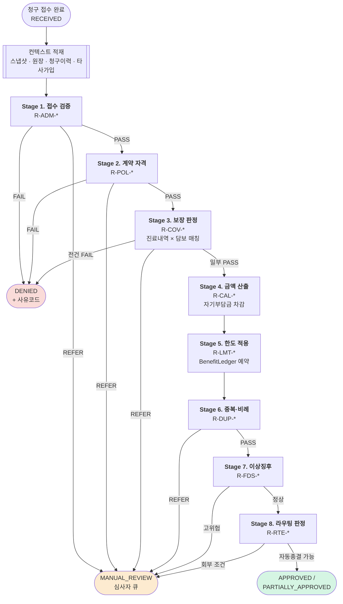

# 03. 심사 파이프라인 — 룰 카탈로그와 금액 산출

> ⚠️ 이 문서의 모든 수치(자기부담률, 최소공제금액, 한도)는 **설계 예시**다.
> 실제 구현 시 해당 상품의 약관과 상품 마스터로 검증해야 하며, 코드가 아니라 **설정 데이터**로 관리한다.
> 근거: 제도 개정이 잦고, 같은 세대 안에서도 상품별 예외가 있으며, 과거 사고건은 과거 기준으로 재현되어야 한다.

---

## 1. 설계 원칙

| 원칙 | 이유 |
|---|---|
| **모든 룰은 판정 근거를 남긴다** | 부지급·일부지급은 고객에게 설명할 법적 의무가 있다 |
| **룰은 순수 함수다** | `(입력) → (판정, 근거)`. DB·외부호출은 파이프라인 바깥에서 미리 채운다 |
| **파라미터는 데이터, 로직은 코드** | 요율·한도는 설정, 계산 구조는 코드. 섞으면 둘 다 못 바꾼다 |
| **애매하면 부지급이 아니라 회부** | 자동 부지급의 오탐은 민원·분쟁으로 직결. 사람에게 넘기는 비용이 훨씬 싸다 |
| **룰셋에 버전을 붙인다** | 심사 결과에 `rulesetVersion`을 기록해야 재현 가능 |

### 1.1 Drools를 쓰지 않는 이유

| 검토 | 판단 |
|---|---|
| Drools / Easy Rules | ❌ 룰이 수십 개 규모인데 DSL 학습비용·디버깅 난이도·트레이스 커스터마이징 부담이 이득보다 큼 |
| **코드 파이프라인 + 설정 테이블** | ✅ 채택. 룰은 Java 클래스(테스트 쉬움), 임계값은 DB(운영 중 변경) |

룰이 수백 개로 늘고 현업이 직접 룰을 편집해야 하는 단계가 오면 그때 도입을 재검토한다. **지금은 아니다.**

---

## 2. 파이프라인 전체 구조



### 2.1 단계별 조기 종료

Stage 1~2에서 실패하면 **금액 계산을 하지 않는다.** 계약이 실효인데 자기부담금을 계산할 이유가 없다.
Stage 3부터는 진료내역 단위로 부분 실패가 가능하다 (일부 항목만 면책).

### 2.2 컨텍스트 사전 적재

룰을 순수 함수로 유지하기 위해, 파이프라인 진입 **전에** 필요한 모든 데이터를 모아둔다.

```java
public record AdjudicationContext(
    Claim claim,
    PolicySnapshot snapshot,              // ① 사고일 시점 계약 (불변)
    Map<CoverageCode, BenefitLedgerView> ledgers,  // ② 한도 사용 현황
    ClaimHistory history,                 // ③ 동일 피보험자 과거 청구 (중복·FDS용)
    List<OtherPolicy> otherPolicies,      // ④ 타사 실손 가입 (비례보상용)
    RulesetParameters params,             // ⑤ 세대별 요율·한도 설정
    String rulesetVersion
) {}
```

**이 시점 이후 룰 실행 중에는 어떤 I/O도 발생하지 않는다.** 심사 전체가 인메모리 순수 계산이 되어
테스트가 쉽고(모킹 불필요), 빠르고, 재현 가능하다.

---

## 3. 룰 카탈로그

룰 ID 규칙: `R-{단계}-{일련번호}`

### Stage 1. 접수 검증 `R-ADM-*`

| ID | 룰 | 판정 | 결과 |
|---|---|---|---|
| `R-ADM-010` | 필수 서류 구비 (진료비계산서·영수증) | 누락 시 | `DOCS_REQUIRED` |
| `R-ADM-011` | 고액 청구(예: 100만원 초과) 시 진단서 필요 | 누락 시 | `DOCS_REQUIRED` |
| `R-ADM-020` | 진료비 총액 정합성<br/>`총액 = 본인부담 + 공단부담 + 비급여` | 불일치 | `DOCS_REQUIRED` (서류 오류) |
| `R-ADM-030` | 소멸시효 (사고일 + 3년) | 경과 | **`REFER`** (자동 부지급 아님) |
| `R-ADM-040` | 진료일 ≥ 사고일 | 위반 | `REFER` |
| `R-ADM-050` | 계좌 예금주 = 피보험자/수익자 | 불일치 | `REFER` |

> `R-ADM-030`이 부지급이 아니라 회부인 이유: 소멸시효 중단 사유(최고, 승인 등)가 있을 수 있어 법적 판단이 필요하다.

### Stage 2. 계약 자격 `R-POL-*`

| ID | 룰 | 판정 | 결과 |
|---|---|---|---|
| `R-POL-010` | 스냅샷 확보 여부 | `PENDING`/`FAILED` | 심사 보류 (재시도 대기) |
| `R-POL-011` | 스냅샷 checksum 검증 | 불일치 | `REFER` + 보안 알림 |
| `R-POL-020` | 사고일 ∈ 보험기간 | 벗어남 | `DENY: D-POL-001` |
| `R-POL-021` | 사고일 ≥ 책임개시일 | 이전 | `DENY: D-POL-001` |
| `R-POL-030` | 사고일 시점 계약상태 = `IN_FORCE` | `LAPSED` | `DENY: D-POL-002` |
| `R-POL-031` | 사고일 시점 상태 = `GRACE`(납입최고) | 해당 | **`REFER`** — 유예기간 중 사고는 보상 가능하나 미납보험료 상계 판단 필요 |
| `R-POL-040` | 면책기간(`waitingPeriodEnd`) 경과 | 미경과 | `DENY: D-POL-005` |
| `R-POL-050` | 부담보 조건 저촉 (KCD 범위 매칭) | 해당 | `DENY: D-POL-004` (해당 진료내역만) |
| `R-POL-051` | 부담보 경계 사례 (부(副)상병만 저촉) | 해당 | `REFER` |

**부담보 매칭 로직** — 실무에서 분쟁이 잦은 지점

```
주상병이 부담보 KCD 범위에 포함  → 해당 진료내역 전체 부지급
부상병만 포함, 주상병은 정상     → 회부 (인과관계 판단 필요)
부담보 기간 외 진료일            → 정상 보상
```

### Stage 3. 보장 판정 `R-COV-*`

진료내역(`TreatmentLine`) × 담보(`Coverage`) 를 매칭한다.

| ID | 룰 | 판정 | 결과 |
|---|---|---|---|
| `R-COV-010` | 진료구분에 맞는 담보 가입 여부 | 미가입 | `DENY: D-POL-003` |
| `R-COV-020` | 약관상 면책 KCD (미용·성형 등) | 해당 | `DENY: D-MED-001` |
| `R-COV-021` | 치과 비급여 (`K00-K14` 등) | 해당 | `DENY: D-MED-002` |
| `R-COV-022` | 한방 비급여 | 해당 | `DENY: D-MED-002` |
| `R-COV-023` | 건강검진·예방접종 (`Z00-Z13`) | 해당 | `DENY: D-MED-003` |
| `R-COV-024` | 임신·출산·산후기 (`O00-O99`) | 해당 | `DENY: D-MED-004` |
| `R-COV-025` | 정신질환 (`F00-F99`) 중 비보장 구간 | 해당 | `REFER` — 세대·상품별 보장범위 상이 |
| `R-COV-030` | 3대 비급여 항목 분류<br/>(도수·체외충격파·증식 / 비급여주사 / MRI·MRA) | 해당 | 전용 담보로 라우팅 |
| `R-COV-040` | 상해/질병 구분과 담보 성격 일치 | 불일치 | `REFER` |
| `R-COV-050` | 요양병원·한방병원 입원 제한 | 해당 | `REFER` |

> **면책 KCD 목록은 코드에 두지 않는다.** `exclusion_kcd_rule` 테이블에 (세대, 담보, KCD범위, 유효기간)으로 관리.
> 약관 개정 시 배포 없이 반영 가능해야 한다.

### Stage 4. 금액 산출 `R-CAL-*`

**실손 계산의 핵심.** 급여와 비급여를 **각각 따로** 계산한 뒤 합산한다.

| ID | 룰 | 내용 |
|---|---|---|
| `R-CAL-010` | 보상 대상 기준액 확정 | `claimBase = 급여 본인부담금 + 비급여` (공단부담금 제외) |
| `R-CAL-020` | **급여 자기부담금** | `max(급여본인부담금 × 급여정률, 급여최소공제)` |
| `R-CAL-021` | **비급여 자기부담금** | `max(비급여 × 비급여정률, 비급여최소공제)` |
| `R-CAL-022` | 입원은 최소공제 미적용 | 정률만 적용 |
| `R-CAL-023` | 통원 최소공제는 **요양기관 종별** 차등 | 의원 < 병원 < 종합 < 상급종합 |
| `R-CAL-024` | 처방조제 별도 최소공제 | 통원과 분리 계산 |
| `R-CAL-030` | 3대 비급여는 전용 자기부담률·한도 | 일반 비급여와 분리 |
| `R-CAL-040` | 원 미만 절사 | **담보별 보상액 확정 시점**에 1회 |
| `R-CAL-050` | 보상액 0원 | `DENY: D-CAL-001` (자기부담금 미달) |

#### 자기부담금 구조 (설계 예시 — 4세대 기준)

| 구분 | 정률 | 최소공제금액 |
|---|---|---|
| 급여 · 입원 | 20% | 없음 |
| 급여 · 통원 | 20% | 의원 1만 / 병원 1.5만 / 상급종합 2만 |
| 급여 · 처방조제 | 20% | 8천원 |
| 비급여 · 입원 | 30% | 없음 |
| 비급여 · 통원 | 30% | 3만원 |
| 3대 비급여 | 30% | 3만원 |

#### 계산 알고리즘

```java
// DeductibleCalculator — 순수 함수
public BenefitLine calculate(TreatmentLine tx, CoverageTerms terms, RulesetParameters p) {
    Money base = switch (terms.benefitCategory()) {
        case COVERED        -> tx.charges().coveredPatientShare();
        case UNCOVERED      -> tx.charges().uncovered().minus(tx.charges().majorUncovered());
        case MAJOR_UNCOVERED-> tx.charges().majorUncovered();
    };

    Money byRate = base.multiply(terms.coinsuranceRate());        // 정률
    Money minDed = terms.minDeductibleFor(tx.type(), tx.institution().grade());  // 정액 하한

    Money deductible = Money.max(byRate, minDed);                 // ★ 큰 쪽
    Money payable    = base.minus(deductible).floorToWon();       // 음수면 0

    return new BenefitLine(terms.coverageCode(), tx.id(),
                           base, deductible, payable, payable, Money.ZERO,
                           List.of("R-CAL-020", "R-CAL-023"));
}
```

### Stage 5. 한도 적용 `R-LMT-*`

| ID | 룰 | 내용 | 실패 시 |
|---|---|---|---|
| `R-LMT-010` | 회당 한도 (통원 1회당) | `min(payable, perVisitLimit)` | 차액은 `limitReduction` |
| `R-LMT-020` | 연간 누적 한도 | `BenefitLedger.reserve()` | 잔여만 지급 |
| `R-LMT-021` | 연간 한도 완전 소진 | 잔여 0 | `DENY: D-LMT-001` |
| `R-LMT-030` | 연간 횟수 한도 | 사용횟수 검사 | `DENY: D-LMT-002` |
| `R-LMT-040` | 3대 비급여 별도 한도 | 항목별 금액·횟수 | 상동 |
| `R-LMT-050` | 보장연도 산정 | **계약 응당일 기준** (달력연도 아님) | — |
| `R-LMT-060` | 원장 낙관적 락 충돌 3회 초과 | 재시도 소진 | `REFER` |

> **`R-LMT-050` 주의**: 2026-03-01 계약이면 보장연도는 `2026-03-01 ~ 2027-02-28`.
> 달력연도로 계산하면 한도가 틀어진다. v1 설계에 이 개념 자체가 없었다.

### Stage 6. 중복·비례 `R-DUP-*`

| ID | 룰 | 판정 | 결과 |
|---|---|---|---|
| `R-DUP-010` | 동일 요양기관·진료일·금액 중복 청구 | 해당 | `DENY: D-DUP-001` |
| `R-DUP-011` | 유사 중복 (금액만 다름) | 해당 | `REFER` |
| `R-DUP-020` | 타사 실손 중복가입 존재 | 해당 | **비례보상 분담 계산** |
| `R-DUP-021` | 비례보상 결과 분담액 산출 | — | `ProRataAllocator` |
| `R-DUP-030` | 본인부담상한제 환급 예상 건 | 해당 | 지급하되 **환수 대상 표시** |

#### 비례보상 (`R-DUP-021`)

동일 피보험자가 실손을 2건 이상 가입한 경우, **실제 손해액을 초과해 받을 수 없다.**

```
각 계약의 단독 보상액을 먼저 계산한 뒤:
    분담액_i = 실제손해액 × (단독보상액_i / Σ 단독보상액)
```

타사 정보는 `DuplicateInsuranceQueryPort`로 조회한다 (실제로는 보험개발원 등).
**조회 실패 시 자동 지급하지 않고 회부**한다 — 초과지급은 환수해야 하므로 비용이 크다.

### Stage 7. 이상징후 `R-FDS-*`

| ID | 룰 | 임계값(설정) | 결과 |
|---|---|---|---|
| `R-FDS-010` | 단기 다발 청구 | 30일 내 N건 초과 | 점수 가산 |
| `R-FDS-020` | 특정 요양기관 집중 | 동일 기관 비율 초과 | 점수 가산 |
| `R-FDS-030` | 금액 이상치 | 동일 상병 평균 대비 배수 | 점수 가산 |
| `R-FDS-040` | 계약 직후 청구 | 책임개시 후 N일 이내 | 점수 가산 |
| `R-FDS-050` | 3대 비급여 과다 이용 | 횟수 임계 | 점수 가산 |
| `R-FDS-100` | 종합 점수 판정 | 임계 초과 | `REFER` (조사 큐) |

> FDS는 **부지급을 결정하지 않는다.** 점수만 매기고 사람에게 넘긴다.
> 자동 부지급은 오탐 시 민원·소송 리스크가 크고, 보험업법상 지급 거절 사유 설명 의무도 있다.

### Stage 8. 라우팅 판정 `R-RTE-*`

| ID | 조건 | 결과 |
|---|---|---|
| `R-RTE-010` | 지급액 ≥ 자동승인 한도(예: 100만원) | `REFER` |
| `R-RTE-020` | 앞 단계에서 `REFER` 1건 이상 | `REFER` |
| `R-RTE-030` | FDS 점수 임계 초과 | `REFER` |
| `R-RTE-040` | 일부지급 + 삭감률 임계 초과 | `REFER` (고객 불만 예상 건 선제 검토) |
| `R-RTE-050` | 재심사(`REOPENED`) 건 | 항상 `REFER` |
| `R-RTE-060` | 위 전부 해당 없음 | **자동 종결** |

---

## 4. 계산 워크스루 (실무 예시)

### 예시 1 — 통원, 상급종합병원, 4세대

**청구 내용**

| 항목 | 금액 |
|---|---|
| 총 진료비 | 300,000원 |
| 급여 본인부담금 | 60,000원 |
| 급여 공단부담금 | 120,000원 |
| 비급여 | 120,000원 |

**계산**

```
[Stage 4] 급여 담보 (COV-OUTP-COVERED)
  보상 대상 기준액 = 60,000            (공단부담 120,000은 제외)
  정률 자기부담    = 60,000 × 20% = 12,000
  최소공제(상급종합) = 20,000
  자기부담금       = max(12,000, 20,000) = 20,000   ← 최소공제가 큼
  보상액           = 60,000 - 20,000 = 40,000

[Stage 4] 비급여 담보 (COV-OUTP-UNCOVERED)
  보상 대상 기준액 = 120,000
  정률 자기부담    = 120,000 × 30% = 36,000
  최소공제         = 30,000
  자기부담금       = max(36,000, 30,000) = 36,000   ← 정률이 큼
  보상액           = 120,000 - 36,000 = 84,000

[Stage 5] 한도
  회당 한도 200,000  vs  40,000 + 84,000 = 124,000  → 통과
  연간 횟수 1회 차감 (잔여 확인)

━━━━━━━━━━━━━━━━━━━━━━━━━━━━━━━
지급액 = 124,000원  (청구 300,000원 대비 41.3%)
```

**고객 통지문 (BenefitLine에서 자동 생성)**

> 청구하신 300,000원 중 124,000원을 지급합니다.
> - 공단부담금 120,000원은 보상 대상이 아닙니다.
> - 급여 자기부담금 20,000원(상급종합병원 최소공제금액)이 차감되었습니다.
> - 비급여 자기부담금 36,000원(30%)이 차감되었습니다.

### 예시 2 — 입원, 4세대

| 항목 | 금액 |
|---|---|
| 급여 본인부담금 | 2,000,000원 |
| 비급여 | 3,000,000원 |

```
[Stage 4] 급여 (입원 → 최소공제 없음)
  2,000,000 × (1 - 20%) = 1,600,000
[Stage 4] 비급여 (입원 → 최소공제 없음)
  3,000,000 × (1 - 30%) = 2,100,000

[Stage 5] 연간 한도 50,000,000, 기사용 0원 → 통과

━━━━━━━━━━━━━━━━━━━━━━━━━━━━━━━
지급액 = 3,700,000원
[Stage 8] R-RTE-010: 100만원 초과 → MANUAL_REVIEW 회부
```

### 예시 3 — 한도 소진 (일부지급)

```
비급여 통원, 연간 한도 잔여 50,000원
계산된 보상액 84,000원

[Stage 5] BenefitLedger.reserve(84,000)
  → granted = 50,000, limitReduction = 34,000

━━━━━━━━━━━━━━━━━━━━━━━━━━━━━━━
지급액 = 50,000원  → PARTIALLY_APPROVED
BenefitLine.limitReduction = 34,000  (통지문에 "연간 한도 소진으로 34,000원 미지급")
```

### 예시 4 — 부담보 저촉 (부지급)

```
계약: 척추(M40-M54) 5년 부담보, 2026-01-01 ~ 2031-01-01
진료: 2026-05-10, 주상병 M51.2 (요추 추간판 장애)

[Stage 2] R-POL-050
  M51.2 ∈ M40-M54  &&  진료일 ∈ 부담보 기간  → 저촉

━━━━━━━━━━━━━━━━━━━━━━━━━━━━━━━
DENIED: D-POL-004 (부담보 조건에 해당)
Stage 3~7은 실행되지 않음
```

---

## 5. 룰셋 버저닝

```
rulesetVersion = "2026.01"
```

- 룰 로직·파라미터가 바뀌면 버전이 올라간다
- 모든 `Adjudication`에 사용된 버전이 기록된다
- **재심사 시 원칙적으로 당시 버전으로 재현**하고, 새 버전 적용은 명시적 결정이 있을 때만
- 룰셋 버전별 회귀 테스트 세트를 유지한다 (골든 케이스)

### 5.1 골든 케이스 테스트

```
src/test/resources/golden/
├── 2026.01/
│   ├── case-001-outpatient-tertiary.json    ← 예시 1
│   ├── case-002-inpatient.json              ← 예시 2
│   ├── case-003-limit-exhausted.json        ← 예시 3
│   ├── case-004-exclusion-hit.json          ← 예시 4
│   └── ...
```

각 파일은 `{ context, expectedDecision, expectedBenefitLines, expectedTraceRuleIds }`.
**룰 변경 시 골든 케이스가 깨지면 의도한 변경인지 검토**한다. 무심코 금액이 바뀌는 것을 막는 안전망이다.

---

## 6. 파라미터 설정 구조

```sql
-- 세대·담보·진료구분·기관종별 조합의 요율·한도
CREATE TABLE ruleset_parameter (
    ruleset_version   VARCHAR(16)  NOT NULL,
    generation        VARCHAR(8)   NOT NULL,   -- G1..G4
    benefit_category  VARCHAR(20)  NOT NULL,   -- COVERED | UNCOVERED | MAJOR_UNCOVERED
    treatment_type    VARCHAR(20)  NOT NULL,   -- INPATIENT | OUTPATIENT | PRESCRIPTION
    institution_grade VARCHAR(20)  NULL,       -- NULL = 전체
    coinsurance_rate  NUMERIC(5,4) NOT NULL,
    min_deductible    BIGINT       NULL,       -- NULL = 미적용(입원)
    per_visit_limit   BIGINT       NULL,
    annual_limit      BIGINT       NULL,
    annual_count_limit INT         NULL,
    valid_from        DATE         NOT NULL,
    valid_to          DATE         NOT NULL,
    PRIMARY KEY (ruleset_version, generation, benefit_category,
                 treatment_type, institution_grade, valid_from)
);
```

**스냅샷의 `terms`가 우선, 없으면 이 테이블이 기본값**이다.
계약별 특약 조건이 표준과 다를 수 있으므로 스냅샷 값이 항상 이긴다.

---

## 7. 심사 엔진 인터페이스

```java
public interface AdjudicationEngine {
    AdjudicationResult adjudicate(AdjudicationContext ctx);
}

public record AdjudicationResult(
    Decision decision,
    List<BenefitLine> benefitLines,
    Money totalPayable,
    List<DenialReason> denialReasons,
    List<ReferReason> referReasons,
    List<RuleTrace> traces,
    String rulesetVersion
) {}
```

**엔진은 부작용이 없다.** 원장 차감조차 `reserve` 결과를 컨텍스트로 미리 받거나,
예약 요청을 결과로 반환하고 애플리케이션 계층이 실행한다. 그래야 테스트에서 DB가 필요 없다.

```java
// Stage 실행자 — 체인 구조
public interface AdjudicationStage {
    StageOutcome evaluate(AdjudicationContext ctx, AdjudicationState state);
}

// 등록 순서가 곧 파이프라인 순서
List.of(
    new IntakeValidationStage(),      // R-ADM-*
    new PolicyEligibilityStage(),     // R-POL-*
    new CoverageDeterminationStage(), // R-COV-*
    new BenefitCalculationStage(),    // R-CAL-*
    new LimitApplicationStage(),      // R-LMT-*
    new DuplicationStage(),           // R-DUP-*
    new FraudScreeningStage(),        // R-FDS-*
    new RoutingStage()                // R-RTE-*
);
```

---

## 8. 수동심사 (Manual Review)

자동심사가 회부한 건을 심사자가 처리한다. **claims-platform의 영역**이다 (business-support 아님).

### 8.1 심사자에게 제공해야 하는 것

| 항목 | 이유 |
|---|---|
| 회부 사유 (룰 ID + 설명) | 무엇을 봐야 하는지 |
| 자동심사가 계산한 잠정 금액 | 기준점 |
| 전체 룰 트레이스 | 어떻게 그 금액이 나왔는지 |
| 계약 스냅샷 원문 | 계약 조건 확인 |
| 동일 피보험자 청구 이력 | 패턴 파악 |
| 제출 서류 뷰어 | 원본 대조 |

### 8.2 심사자 결정 시 필수 입력

- 결정(`APPROVED` / `PARTIALLY_APPROVED` / `DENIED`)
- **금액을 자동 계산과 다르게 할 경우 사유 필수**
- `DENIED`는 사유코드 필수
- 심사자 ID·시각 자동 기록

심사자의 수정도 **새 `RuleTrace`로 기록**한다 (`verdict: "MANUAL_OVERRIDE"`).
자동 계산과 최종 결정의 차이가 추적 가능해야 한다 — 감사 대응의 핵심이다.

---

## 9. 자동화율 목표와 현실

| 구간 | 예상 비중 | 근거 |
|---|---|---|
| 자동 승인 | 60~70% | 소액 통원이 건수의 대부분 |
| 자동 부지급 | 5~10% | 계약 자격 미달·명백한 면책 |
| 수동 회부 | 25~30% | 고액·FDS·비례보상·경계 사례 |

> v1 문서의 "80% 자동 승인"은 근거 없는 숫자였다.
> 재설계에서는 **회부 사유별 비중을 측정**하고, 상위 사유부터 룰을 정교화해 자동화율을 올리는 방식으로 접근한다.
> 측정 없이 목표 숫자만 적는 것은 의미가 없다.

---

## 다음 문서

- [`04-events-and-integration.md`](04-events-and-integration.md) — 이벤트 카탈로그, Outbox, 멱등성
- [`06-data-model.md`](06-data-model.md) — 원장·트레이스 스키마
