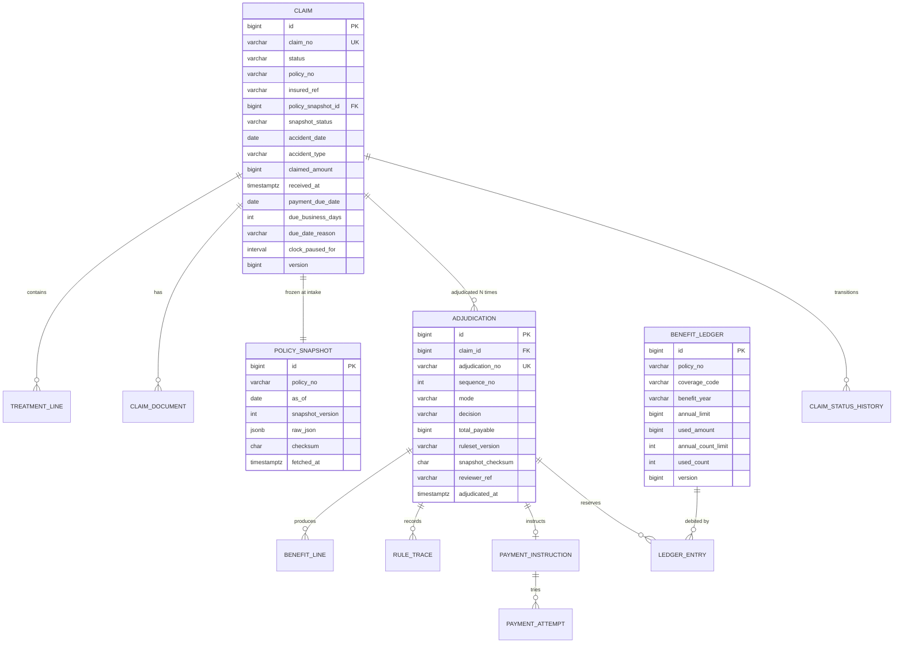

# 06. 데이터 모델 — claims-platform

DB: PostgreSQL 15 / 마이그레이션: Flyway
**스키마는 business-support와 완전히 분리된다.** 크로스 스키마 조인·FK 없음.

---

## 1. ERD



---

## 2. 핵심 테이블

### 2.1 `claim`

```sql
CREATE TABLE claim (
    id                  BIGSERIAL     PRIMARY KEY,
    claim_no            VARCHAR(24)   NOT NULL UNIQUE,
    status              VARCHAR(24)   NOT NULL,

    policy_no           VARCHAR(32)   NOT NULL,
    insured_ref         VARCHAR(64)   NOT NULL,          -- CI/내부 고객키. 주민번호 아님
    policy_snapshot_id  BIGINT        NULL REFERENCES policy_snapshot(id),
    snapshot_status     VARCHAR(16)   NOT NULL DEFAULT 'PENDING',

    accident_date       DATE          NOT NULL,
    accident_type       VARCHAR(16)   NOT NULL,          -- INJURY | DISEASE
    primary_diagnosis   BYTEA         NULL,              -- 🔒 KCD 암호화 (민감정보)
    accident_desc       BYTEA         NULL,              -- 🔒 암호화

    claimed_amount      BIGINT        NOT NULL,          -- 원 단위 정수
    payable_amount      BIGINT        NULL,

    payout_bank_code    VARCHAR(8)    NULL,
    payout_account_enc  BYTEA         NULL,              -- 🔒 암호화
    payout_holder_enc   BYTEA         NULL,              -- 🔒 암호화
    payout_account_hmac CHAR(64)      NULL,              -- 검색용 블라인드 인덱스

    received_at         TIMESTAMPTZ   NULL,
    payment_due_date    DATE          NULL,
    due_business_days   INT           NULL,
    due_date_reason     VARCHAR(24)   NULL,
    clock_paused_secs   BIGINT        NOT NULL DEFAULT 0,

    version             BIGINT        NOT NULL DEFAULT 0,  -- 낙관적 락
    created_at          TIMESTAMPTZ   NOT NULL DEFAULT NOW(),
    updated_at          TIMESTAMPTZ   NOT NULL DEFAULT NOW()
);

CREATE INDEX idx_claim_policy        ON claim (policy_no, accident_date DESC);
CREATE INDEX idx_claim_insured       ON claim (insured_ref, received_at DESC);
CREATE INDEX idx_claim_status_due    ON claim (status, payment_due_date)
                                      WHERE status IN ('RECEIVED','SCREENING','MANUAL_REVIEW','PAYMENT_PENDING');
CREATE INDEX idx_claim_snapshot_pend ON claim (snapshot_status) WHERE snapshot_status = 'PENDING';
```

> `idx_claim_status_due`는 **부분 인덱스**다. 종결된 건(PAID/DENIED)은 지급기한 감시 대상이 아니므로 인덱스에서 뺀다.
> 데이터가 쌓일수록 효과가 커진다.

**금액은 `BIGINT`(원 단위 정수)** — v1의 `NUMERIC(15,2)`는 원화에 맞지 않는다. 원화에 소수점은 없다.

### 2.2 `treatment_line`

```sql
CREATE TABLE treatment_line (
    id                    BIGSERIAL   PRIMARY KEY,
    claim_id              BIGINT      NOT NULL REFERENCES claim(id) ON DELETE CASCADE,
    line_no               INT         NOT NULL,
    treatment_date        DATE        NOT NULL,
    treatment_type        VARCHAR(16) NOT NULL,   -- INPATIENT|OUTPATIENT|PRESCRIPTION
    admission_date        DATE        NULL,       -- 입원인 경우
    discharge_date        DATE        NULL,

    institution_code      VARCHAR(16) NOT NULL,
    institution_name      VARCHAR(100) NOT NULL,
    institution_grade     VARCHAR(16) NOT NULL,   -- CLINIC|HOSPITAL|GENERAL|TERTIARY|PHARMACY

    primary_diagnosis     BYTEA       NOT NULL,   -- 🔒 암호화
    secondary_diagnoses   BYTEA       NULL,       -- 🔒 암호화 (JSON 배열)

    covered_patient_share BIGINT      NOT NULL,   -- 급여 본인부담금
    covered_nhis_share    BIGINT      NOT NULL,   -- 급여 공단부담금 (정합성 검증용)
    uncovered             BIGINT      NOT NULL,   -- 비급여
    major_uncovered       BIGINT      NOT NULL DEFAULT 0,  -- 3대 비급여

    UNIQUE (claim_id, line_no),
    CHECK (covered_patient_share >= 0 AND covered_nhis_share >= 0
           AND uncovered >= 0 AND major_uncovered >= 0),
    CHECK (major_uncovered <= uncovered)          -- 3대 비급여는 비급여의 부분집합
);

CREATE INDEX idx_treatment_dup ON treatment_line
    (institution_code, treatment_date, covered_patient_share, uncovered);  -- 중복청구 탐지
```

### 2.3 `policy_snapshot` — 불변

```sql
CREATE TABLE policy_snapshot (
    id               BIGSERIAL   PRIMARY KEY,
    snapshot_ref     VARCHAR(32) NOT NULL UNIQUE,   -- BS가 부여한 ID
    policy_no        VARCHAR(32) NOT NULL,
    insured_ref      VARCHAR(64) NOT NULL,
    as_of            DATE        NOT NULL,
    snapshot_version INT         NOT NULL,
    generation       VARCHAR(8)  NOT NULL,          -- G1..G4 (조회 최적화용 비정규화)
    policy_status    VARCHAR(16) NOT NULL,
    raw_json         JSONB       NOT NULL,          -- ★ BS 응답 원문 그대로
    checksum         CHAR(71)    NOT NULL,          -- "sha256:" + 64
    fetched_at       TIMESTAMPTZ NOT NULL DEFAULT NOW()
);

CREATE INDEX idx_snapshot_policy ON policy_snapshot (policy_no, as_of);

-- 불변 강제: UPDATE/DELETE 차단
CREATE RULE snapshot_no_update AS ON UPDATE TO policy_snapshot DO INSTEAD NOTHING;
CREATE RULE snapshot_no_delete AS ON DELETE TO policy_snapshot DO INSTEAD NOTHING;
```

> **원문(`raw_json`)을 보관하는 이유**: 파싱 결과만 저장하면 BS 스키마가 바뀐 뒤 과거 건을 재현할 수 없다.
> 원문이 있으면 언제든 복구·재해석이 가능하다.

### 2.4 `adjudication` — 청구당 N건

```sql
CREATE TABLE adjudication (
    id                BIGSERIAL    PRIMARY KEY,
    adjudication_no   VARCHAR(24)  NOT NULL UNIQUE,
    claim_id          BIGINT       NOT NULL REFERENCES claim(id),
    sequence_no       INT          NOT NULL,          -- 1차, 2차(재심사)...
    mode              VARCHAR(8)   NOT NULL,          -- AUTO | MANUAL
    decision          VARCHAR(24)  NOT NULL,
    total_payable     BIGINT       NOT NULL DEFAULT 0,
    ruleset_version   VARCHAR(16)  NOT NULL,
    snapshot_checksum CHAR(71)     NOT NULL,          -- 심사 시점 스냅샷 검증값
    reviewer_ref      VARCHAR(64)  NULL,              -- MANUAL인 경우
    override_reason   TEXT         NULL,
    adjudicated_at    TIMESTAMPTZ  NOT NULL DEFAULT NOW(),
    UNIQUE (claim_id, sequence_no)
);
```

**재심사는 새 행을 만든다.** 기존 심사를 수정하지 않는다 — "처음엔 부지급, 민원 후 지급"의 이력이 보존된다.

### 2.5 `benefit_line`

```sql
CREATE TABLE benefit_line (
    id                BIGSERIAL   PRIMARY KEY,
    adjudication_id   BIGINT      NOT NULL REFERENCES adjudication(id) ON DELETE CASCADE,
    treatment_line_id BIGINT      NOT NULL REFERENCES treatment_line(id),
    coverage_code     VARCHAR(32) NOT NULL,
    benefit_category  VARCHAR(20) NOT NULL,      -- COVERED|UNCOVERED|MAJOR_UNCOVERED
    claim_base        BIGINT      NOT NULL,      -- 보상 대상 기준액
    deductible        BIGINT      NOT NULL,      -- 자기부담금
    before_limit      BIGINT      NOT NULL,      -- 한도 적용 전
    limit_reduction   BIGINT      NOT NULL DEFAULT 0,
    payable           BIGINT      NOT NULL,      -- 최종 지급액
    applied_rule_ids  TEXT[]      NOT NULL,
    note              TEXT        NULL,          -- 고객 통지문 문구
    CHECK (payable = before_limit - limit_reduction),
    CHECK (before_limit = claim_base - deductible)
);
```

> `CHECK` 제약으로 **계산 항등식을 DB 레벨에서 강제**한다. 코드 버그로 금액이 어긋나면 커밋 자체가 실패한다.

### 2.6 `rule_trace` — append-only

```sql
CREATE TABLE rule_trace (
    id              BIGSERIAL   PRIMARY KEY,
    adjudication_id BIGINT      NOT NULL REFERENCES adjudication(id),
    seq             INT         NOT NULL,
    rule_id         VARCHAR(24) NOT NULL,
    rule_name       VARCHAR(128) NOT NULL,
    clause          VARCHAR(256) NULL,           -- 약관 근거 조항
    input_json      JSONB       NOT NULL,
    output_json     JSONB       NOT NULL,
    verdict         VARCHAR(24) NOT NULL,        -- PASS|FAIL|APPLIED|SKIPPED|REFER|MANUAL_OVERRIDE
    evaluated_at    TIMESTAMPTZ NOT NULL DEFAULT NOW(),
    UNIQUE (adjudication_id, seq)
);

CREATE RULE trace_no_update AS ON UPDATE TO rule_trace DO INSTEAD NOTHING;
CREATE RULE trace_no_delete AS ON DELETE TO rule_trace DO INSTEAD NOTHING;
```

**애플리케이션 DB 계정에 `UPDATE`/`DELETE` 권한을 부여하지 않는다.**

```sql
REVOKE UPDATE, DELETE ON rule_trace, policy_snapshot FROM claims_app;
GRANT  INSERT, SELECT  ON rule_trace, policy_snapshot TO   claims_app;
```

### 2.7 `benefit_ledger` ⚠️ 경합 지점

```sql
CREATE TABLE benefit_ledger (
    id                 BIGSERIAL   PRIMARY KEY,
    policy_no          VARCHAR(32) NOT NULL,
    coverage_code      VARCHAR(32) NOT NULL,
    benefit_year       VARCHAR(16) NOT NULL,     -- 계약 응당일 기준 (달력연도 아님)
    benefit_year_from  DATE        NOT NULL,
    benefit_year_to    DATE        NOT NULL,
    annual_limit       BIGINT      NULL,
    used_amount        BIGINT      NOT NULL DEFAULT 0,
    annual_count_limit INT         NULL,
    used_count         INT         NOT NULL DEFAULT 0,
    version            BIGINT      NOT NULL DEFAULT 0,   -- 낙관적 락
    UNIQUE (policy_no, coverage_code, benefit_year),
    CHECK (used_amount >= 0),
    CHECK (annual_limit IS NULL OR used_amount <= annual_limit),   -- ★ 한도 초과 방지
    CHECK (annual_count_limit IS NULL OR used_count <= annual_count_limit)
);
```

> **`CHECK (used_amount <= annual_limit)`이 최후의 방어선이다.**
> 애플리케이션 락이 뚫려도 DB가 거부한다. 한도 초과 지급은 절대 일어나선 안 되므로 이중으로 막는다.

### 2.8 `ledger_entry` — 예약/확정/해제

```sql
CREATE TABLE ledger_entry (
    id              BIGSERIAL   PRIMARY KEY,
    ledger_id       BIGINT      NOT NULL REFERENCES benefit_ledger(id),
    claim_id        BIGINT      NOT NULL REFERENCES claim(id),
    adjudication_id BIGINT      NOT NULL REFERENCES adjudication(id),
    entry_type      VARCHAR(16) NOT NULL,        -- RESERVE|CONFIRM|RELEASE
    amount          BIGINT      NOT NULL,
    count_delta     INT         NOT NULL DEFAULT 0,
    expires_at      TIMESTAMPTZ NULL,            -- RESERVE만. 만료 시 자동 RELEASE
    created_at      TIMESTAMPTZ NOT NULL DEFAULT NOW(),
    UNIQUE (ledger_id, adjudication_id, entry_type)
);

CREATE INDEX idx_ledger_entry_expiring ON ledger_entry (expires_at)
    WHERE entry_type = 'RESERVE' AND expires_at IS NOT NULL;
```

**예약-확정 분리**: 심사 시 `RESERVE` → 지급 성공 시 `CONFIRM`, 실패·철회·만료 시 `RELEASE`.
승인만 되고 미지급인 건이 한도를 영구 점유하는 것을 막는다.

### 2.9 `payment_instruction` ⚠️ 경합 지점

```sql
CREATE TABLE payment_instruction (
    id               BIGSERIAL    PRIMARY KEY,
    instruction_no   VARCHAR(24)  NOT NULL UNIQUE,
    claim_id         BIGINT       NOT NULL REFERENCES claim(id),
    adjudication_id  BIGINT       NOT NULL REFERENCES adjudication(id),
    idempotency_key  CHAR(64)     NOT NULL UNIQUE,     -- ★ 중복지급 방지
    amount           BIGINT       NOT NULL,
    late_interest    BIGINT       NOT NULL DEFAULT 0,  -- 지연이자
    status           VARCHAR(16)  NOT NULL DEFAULT 'PENDING',
                                  -- PENDING|IN_FLIGHT|SUCCESS|FAILED|UNKNOWN|CANCELLED
    bank_code        VARCHAR(8)   NOT NULL,
    account_enc      BYTEA        NOT NULL,            -- 🔒
    holder_enc       BYTEA        NOT NULL,            -- 🔒
    created_at       TIMESTAMPTZ  NOT NULL DEFAULT NOW(),
    completed_at     TIMESTAMPTZ  NULL,
    version          BIGINT       NOT NULL DEFAULT 0,

    CONSTRAINT uq_payment_per_adjudication UNIQUE (claim_id, adjudication_id)  -- ★
);

CREATE INDEX idx_payment_unknown ON payment_instruction (status, created_at)
    WHERE status IN ('UNKNOWN', 'IN_FLIGHT');
```

```sql
CREATE TABLE payment_attempt (
    id              BIGSERIAL    PRIMARY KEY,
    instruction_id  BIGINT       NOT NULL REFERENCES payment_instruction(id),
    attempt_no      INT          NOT NULL,
    requested_at    TIMESTAMPTZ  NOT NULL,
    responded_at    TIMESTAMPTZ  NULL,
    result          VARCHAR(16)  NOT NULL,    -- SUCCESS|FAILED|TIMEOUT
    external_ref    VARCHAR(64)  NULL,
    error_code      VARCHAR(32)  NULL,
    error_message   TEXT         NULL,
    UNIQUE (instruction_id, attempt_no)
);
```

### 2.10 `claim_status_history`

```sql
CREATE TABLE claim_status_history (
    id           BIGSERIAL    PRIMARY KEY,
    claim_id     BIGINT       NOT NULL REFERENCES claim(id),
    from_status  VARCHAR(24)  NULL,
    to_status    VARCHAR(24)  NOT NULL,
    actor_type   VARCHAR(16)  NOT NULL,    -- CUSTOMER|SYSTEM|ADJUSTER
    actor_ref    VARCHAR(64)  NULL,
    reason       TEXT         NULL,
    occurred_at  TIMESTAMPTZ  NOT NULL DEFAULT NOW()
);

CREATE INDEX idx_status_history_claim ON claim_status_history (claim_id, occurred_at);
```

고객 API의 `timeline`이 이 테이블에서 생성된다.

### 2.11 운영 테이블

```sql
-- Outbox (04-events-and-integration.md §4.2)
CREATE TABLE outbox_event ( ... );

-- 이벤트 소비 멱등성
CREATE TABLE processed_event (
    consumer_group VARCHAR(64) NOT NULL,
    event_id       VARCHAR(26) NOT NULL,
    processed_at   TIMESTAMPTZ NOT NULL DEFAULT NOW(),
    PRIMARY KEY (consumer_group, event_id)
);

-- API 멱등성
CREATE TABLE idempotency_record ( ... );

-- 계약 읽기모델 (심사에 사용 금지)
CREATE TABLE policy_replica (
    policy_no      VARCHAR(32) PRIMARY KEY,
    insured_ref    VARCHAR(64) NOT NULL,
    product_code   VARCHAR(32) NOT NULL,
    generation     VARCHAR(8)  NOT NULL,
    status         VARCHAR(16) NOT NULL,
    period_from    DATE        NOT NULL,
    period_to      DATE        NOT NULL,
    last_event_id  VARCHAR(26) NOT NULL,
    updated_at     TIMESTAMPTZ NOT NULL DEFAULT NOW()
);

-- 심사 룰 파라미터 (03-adjudication.md §6)
CREATE TABLE ruleset_parameter ( ... );

-- 면책 KCD 규칙
CREATE TABLE exclusion_kcd_rule (
    id              BIGSERIAL   PRIMARY KEY,
    ruleset_version VARCHAR(16) NOT NULL,
    generation      VARCHAR(8)  NULL,       -- NULL = 전 세대
    kcd_from        VARCHAR(8)  NOT NULL,
    kcd_to          VARCHAR(8)  NOT NULL,
    denial_code     VARCHAR(16) NOT NULL,   -- D-MED-001 등
    label           VARCHAR(128) NOT NULL,
    clause          VARCHAR(256) NULL,
    valid_from      DATE        NOT NULL,
    valid_to        DATE        NOT NULL
);

-- 감사 로그 (조회 포함)
CREATE TABLE audit_log (
    id           BIGSERIAL    PRIMARY KEY,
    actor_type   VARCHAR(16)  NOT NULL,
    actor_ref    VARCHAR(64)  NOT NULL,
    action       VARCHAR(64)  NOT NULL,    -- CLAIM_VIEW, DECISION_MADE, SNAPSHOT_FETCH...
    target_type  VARCHAR(32)  NOT NULL,
    target_ref   VARCHAR(64)  NOT NULL,
    client_ip    INET         NULL,
    metadata     JSONB        NOT NULL DEFAULT '{}',
    occurred_at  TIMESTAMPTZ  NOT NULL DEFAULT NOW()
) PARTITION BY RANGE (occurred_at);
```

> **`audit_log`는 조회도 기록한다.** 민감 건강정보 접근은 "누가 봤는가"가 감사 대상이다.
> 월 단위 파티셔닝으로 보존기간 관리와 성능을 동시에 잡는다.

---

## 3. 암호화 전략

| 대상 | 방식 |
|---|---|
| 알고리즘 | AES-256-GCM (인증 암호화) |
| 키 관리 | 애플리케이션 외부 (환경변수 → 이후 KMS/Vault) |
| 키 교체 | 컬럼에 `key_version` 프리픽스 포함, 복호화 시 버전별 키 선택 |
| 검색 | **블라인드 인덱스** — `HMAC-SHA256(key, 정규화값)`를 별도 컬럼에 저장 |

```
payout_account_enc  = AES-GCM(계좌번호)        ← 복호화용
payout_account_hmac = HMAC(정규화 계좌번호)     ← "같은 계좌 찾기"용
```

암호문은 매번 달라서(IV 랜덤) 동등 비교가 불가능하다. 그래서 HMAC 인덱스가 별도로 필요하다.

### 3.1 애플리케이션 적용

```java
@Convert(converter = EncryptedStringConverter.class)
private String accountNo;
```

JPA `AttributeConverter`로 투명하게 처리한다. 개발자가 암복호화를 의식하지 않게 만들어야 실수가 없다.

---

## 4. 마이그레이션 구성

```
src/main/resources/db/migration/
├── V1__baseline_claim.sql            -- claim, treatment_line, claim_document
├── V2__policy_snapshot.sql           -- 스냅샷 + 불변 RULE
├── V3__adjudication.sql              -- adjudication, benefit_line, rule_trace
├── V4__benefit_ledger.sql            -- ledger, ledger_entry
├── V5__payment.sql                   -- instruction, attempt
├── V6__outbox_and_idempotency.sql
├── V7__policy_replica.sql
├── V8__ruleset_parameters.sql
├── V9__audit_log_partitioned.sql
└── R__seed_ruleset_2026_01.sql       -- 반복 실행 (룰 파라미터 시드)
```

### 4.1 v1의 치명적 문제와 교정

> **v1**: 테스트는 H2 + `ddl-auto: create-drop` + `flyway.enabled: false`,
> 운영은 PostgreSQL + `ddl-auto: validate` + Flyway.
> → **`V1__init.sql`이 단 한 번도 실행된 적이 없었다.** 스키마 불일치가 운영 기동 시점에야 드러난다.

**교정**: 테스트도 **Testcontainers PostgreSQL + Flyway 실행**.

```java
@Testcontainers
abstract class IntegrationTestBase {
    @Container
    static final PostgreSQLContainer<?> POSTGRES =
        new PostgreSQLContainer<>("postgres:15-alpine").withReuse(true);

    @DynamicPropertySource
    static void props(DynamicPropertyRegistry r) {
        r.add("spring.datasource.url", POSTGRES::getJdbcUrl);
        r.add("spring.flyway.enabled", () -> true);        // ★ 마이그레이션 실제 실행
        r.add("spring.jpa.hibernate.ddl-auto", () -> "validate");  // ★ 운영과 동일
    }
}
```

**H2를 쓰지 않는다.** `JSONB`, 부분 인덱스, `RULE`, 파티셔닝, `INET` — 전부 H2에서 동작하지 않는다.
H2로 통과한 테스트는 PostgreSQL에서의 동작을 보장하지 않는다.

---

## 5. 보존·아카이빙

| 데이터 | 보존 | 근거 |
|---|---|---|
| `claim`, `adjudication`, `benefit_line` | **최소 5년** | 상법상 상사시효·분쟁 대응 |
| `rule_trace` | **최소 5년** | 부지급 근거 입증 |
| `policy_snapshot` | 청구와 동일 | 심사 근거 |
| `audit_log` | **최소 3년** | 개인정보 접근 이력 |
| `outbox_event` (PUBLISHED) | 30일 후 삭제 | 운영 데이터 |
| `idempotency_record` | 24시간 후 삭제 | 운영 데이터 |
| `processed_event` | 90일 후 삭제 | 운영 데이터 |

> 실제 보존기간은 관련 법령·내부 규정으로 확정해야 한다. 위 값은 설계 기준선이다.

---

## 6. 인덱스 설계 근거

| 인덱스 | 대응 쿼리 |
|---|---|
| `idx_claim_status_due` (부분) | 심사자 큐 — 기한 임박순 정렬 |
| `idx_claim_insured` | 고객 청구 이력, FDS 입력 |
| `idx_treatment_dup` | 중복청구 탐지 (`R-DUP-010`) |
| `idx_outbox_pending` (부분) | 릴레이 폴링 |
| `idx_payment_unknown` (부분) | 결과 불명 이체 대사 |
| `idx_snapshot_policy` | 재심사 시 스냅샷 조회 |

**부분 인덱스를 적극 쓴다.** 청구 데이터는 대부분 종결 상태로 쌓이는데,
운영 쿼리는 진행 중인 소수만 본다. 전체 인덱스는 낭비다.

---

## 다음 문서

- [`07-architecture.md`](07-architecture.md) — 모듈 구조, 기술 스택, 아키텍처 강제 장치
- [`08-roadmap.md`](08-roadmap.md) — 단계별 구현 계획
