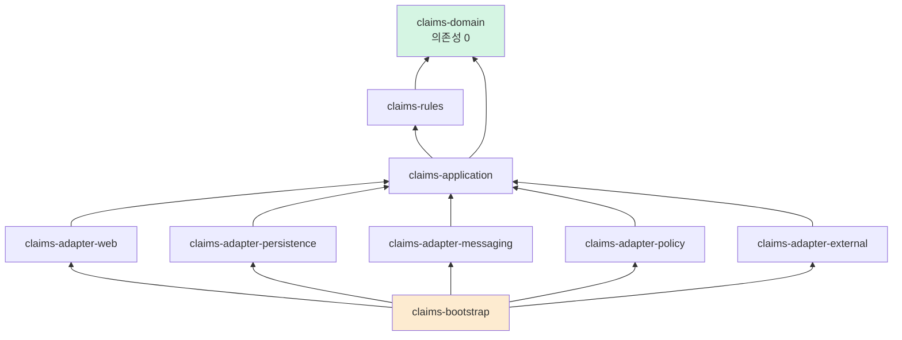

# 07. 아키텍처 — 모듈 구조와 강제 장치

> 이 문서의 목표는 "좋은 구조를 설명하는 것"이 아니라
> **"구조가 무너질 수 없게 만드는 것"**이다. v1은 원칙을 문서로 선언했지만 지키지 못했다.

---

## 1. v1에서 배운 것

| v1의 선언 | v1의 실제 | 왜 무너졌나 | 재설계의 강제 장치 |
|---|---|---|---|
| "application은 domain에만 의존" | `ClaimService`가 Spring `ApplicationEventPublisher` 직접 의존 | 컴파일이 되니까 | **ArchUnit + 모듈 분리** — 애초에 클래스패스에 없다 |
| "포트-어댑터" | `DomainEventPublisher` 포트를 만들고 아무도 안 씀 | 사용 강제 장치 없음 | ArchUnit: 미사용 포트 탐지 + 금지 타입 규칙 |
| "도메인은 순수 자바" | 지켜짐 ✅ | — | 모듈 분리로 물리적 보장 |
| "개인정보 보호" | 이름·이메일 INFO 로그 평문 출력 | 로깅 시 판단에 의존 | **타입 수준 마스킹** — 판단 여지 제거 |
| "테스트 커버리지" | 컨트롤러 8%, 예외 3% | 임계값 없음 | jacoco `violationRules` + CI 게이트 |
| "Flyway 마이그레이션" | 테스트에서 실행된 적 없음 | H2 + create-drop | Testcontainers 강제 |
| "문서=코드" | 경로·필드·상태값 전부 불일치 | 수동 동기화 | OpenAPI 생성 + 계약 테스트 |

**결론: 사람의 성실함에 기대는 규칙은 반드시 무너진다. 빌드가 실패하게 만들어야 한다.**

---

## 2. 모듈 구조 (Gradle 멀티모듈)

```
insurance-claims-platform/
├── claims-domain/              ← 순수 자바. 의존성 0
├── claims-application/         ← 유스케이스, 포트 정의
├── claims-rules/               ← 심사 룰 엔진
├── claims-adapter-web/         ← REST 컨트롤러
├── claims-adapter-persistence/ ← JPA, Flyway
├── claims-adapter-messaging/   ← Kafka, Outbox 릴레이
├── claims-adapter-policy/      ← business-support ACL 클라이언트
├── claims-adapter-external/    ← 이체·알림·FDS 어댑터(스텁)
└── claims-bootstrap/           ← Spring Boot 애플리케이션, 설정 조립
```

### 2.1 의존 방향



**모든 화살표가 안쪽(도메인)을 향한다.** 역방향 의존은 Gradle이 컴파일을 거부한다.

### 2.2 모듈별 허용 의존성

| 모듈 | 허용 | **금지** |
|---|---|---|
| `claims-domain` | JDK만 (+ Lombok compileOnly) | **Spring 전부, JPA, Jackson, 로깅 구현체** |
| `claims-rules` | `claims-domain` | Spring, JPA |
| `claims-application` | `claims-domain`, `claims-rules`, `spring-tx`, `spring-context`(DI만) | **JPA, 웹, Kafka, `ApplicationEventPublisher`** |
| `claims-adapter-*` | `claims-application` + 각자의 기술 | 다른 어댑터 |
| `claims-bootstrap` | 전부 | — |

#### `claims-domain`의 build.gradle

```groovy
dependencies {
    compileOnly 'org.projectlombok:lombok'
    annotationProcessor 'org.projectlombok:lombok'
    testImplementation 'org.junit.jupiter:junit-jupiter'
    testImplementation 'org.assertj:assertj-core'
    // Spring 없음. JPA 없음. 실수로도 못 쓴다.
}
```

> **핵심**: "Spring을 쓰지 말자"고 약속하는 게 아니라, **클래스패스에 Spring이 없어서 쓸 수가 없다.**
> v1이 무너진 지점이 여기다.

---

## 3. 패키지 구조

```
claims-domain/src/main/java/com/insurance/claims/domain/
├── shared/
│   ├── AggregateRoot.java          # pullEvents()
│   ├── DomainEvent.java
│   └── vo/  Money · BenefitYear · InsuredRef · Masked<T>
├── claim/
│   ├── Claim.java                  # 애그리거트 루트
│   ├── ClaimStatus.java
│   ├── ClaimTransitions.java       # 전이표 (단일 진실 공급원)
│   ├── TreatmentLine.java · ChargeBreakdown.java
│   ├── PaymentDueDate.java
│   ├── vo/  ClaimNo · KcdCode · MedicalInstitution
│   └── event/  ClaimReceived · ClaimAdjudicated · ClaimPaid ...
├── adjudication/
│   ├── Adjudication.java · BenefitLine.java · RuleTrace.java
│   ├── Decision.java · DenialReason.java
├── ledger/
│   ├── BenefitLedger.java · LedgerEntry.java · LedgerReservation.java
├── payment/
│   ├── PaymentInstruction.java · PaymentAttempt.java · IdempotencyKey.java
├── policy/
│   ├── PolicySnapshot.java · CoverageTerms.java · ExclusionRule.java
└── port/                           # 도메인이 정의, 인프라가 구현
    ├── PolicySnapshotPort.java
    ├── BusinessCalendar.java
    ├── FundTransferPort.java
    ├── DuplicateInsuranceQueryPort.java
    └── FraudScreeningPort.java
```

```
claims-application/.../application/
├── claim/
│   ├── SubmitClaimUseCase.java     # 인터페이스
│   ├── SubmitClaimService.java     # 구현 (@Transactional 경계)
│   └── command/ · result/
├── adjudication/  RunAdjudicationService · ConfirmDecisionService
├── payment/       InstructPaymentService · HandlePaymentResultService
├── outbox/        OutboxAppender.java   # 포트
└── port/out/      ClaimRepository · AdjudicationRepository · BenefitLedgerRepository
```

---

## 4. 기술 스택

| 영역 | 선택 | 근거 |
|---|---|---|
| 언어 | **Java 21 (LTS)** | v1의 "Java 24" 표기는 실제 빌드(21)와 불일치했다. LTS로 통일 |
| 프레임워크 | Spring Boot 3.x | 생태계. 단, 도메인 모듈에서는 배제 |
| 빌드 | Gradle 멀티모듈 | 모듈 경계를 빌드 도구가 강제 |
| DB | PostgreSQL 15 | `JSONB`, 부분 인덱스, 파티셔닝 필요 |
| 마이그레이션 | Flyway | — |
| ORM | Spring Data JPA (+ QueryDSL) | 복잡 조회는 QueryDSL |
| 메시징 | Kafka (Outbox 릴레이 경유) | — |
| 캐시 | Redis | 스냅샷 캐시, 룰 파라미터 캐시 |
| 테스트 | JUnit 5, AssertJ, **Testcontainers**, ArchUnit | H2 배제 |
| 문서 | springdoc-openapi | 코드에서 스펙 생성 |
| 관측 | Micrometer + Prometheus, OpenTelemetry | — |

### 4.1 Redis 용도 (v1은 의존성만 있고 코드 0줄이었다)

| 용도 | 키 | TTL |
|---|---|---|
| 룰 파라미터 캐시 | `ruleset:{version}:{gen}` | 1시간 |
| 스냅샷 조회 캐시 | `snapshot:{policyNo}:{asOf}` | 10분 |
| API 레이트리밋 | `rl:{userId}:{endpoint}` | 1분 |

> **분산락으로는 쓰지 않는다.** 한도 제어는 DB 낙관적 락 + `CHECK` 제약이 담당한다.
> Redis 분산락은 장애 시 정확성 보장이 약해서, 돈이 걸린 경로에 두지 않는다.

---

## 5. 아키텍처 강제 장치 ★

### 5.1 ArchUnit

```java
@AnalyzeClasses(packages = "com.insurance.claims")
class ArchitectureTest {

    @ArchTest
    static final ArchRule 도메인은_스프링을_모른다 =
        noClasses().that().resideInAPackage("..domain..")
            .should().dependOnClassesThat()
            .resideInAnyPackage("org.springframework..", "jakarta.persistence..",
                                "com.fasterxml.jackson..");

    @ArchTest  // ★ v1이 무너진 바로 그 지점
    static final ArchRule 애플리케이션은_스프링_이벤트퍼블리셔를_쓰지_않는다 =
        noClasses().that().resideInAPackage("..application..")
            .should().dependOnClassesThat()
            .haveFullyQualifiedName("org.springframework.context.ApplicationEventPublisher")
            .because("도메인 이벤트는 애그리거트가 record()하고 Outbox로 발행한다. "
                   + "v1은 이 규칙을 문서로만 두어 포트가 죽은 코드가 되었다.");

    @ArchTest
    static final ArchRule 의존은_안쪽으로만 =
        layeredArchitecture().consideringOnlyDependenciesInLayers()
            .layer("Domain").definedBy("..domain..")
            .layer("Rules").definedBy("..rules..")
            .layer("Application").definedBy("..application..")
            .layer("Adapter").definedBy("..adapter..")
            .whereLayer("Adapter").mayNotBeAccessedByAnyLayer()
            .whereLayer("Application").mayOnlyBeAccessedByLayers("Adapter")
            .whereLayer("Domain").mayOnlyBeAccessedByLayers("Application", "Rules", "Adapter");

    @ArchTest
    static final ArchRule 모든_포트는_구현체가_있다 =        // 죽은 포트 방지
        classes().that().resideInAPackage("..domain.port..").and().areInterfaces()
            .should(haveAtLeastOneImplementationInProduction());

    @ArchTest
    static final ArchRule 금액은_Money로만 =
        noClasses().that().resideInAPackage("..domain..")
            .should().haveFieldsOfType(BigDecimal.class)
            .because("금액은 Money VO로 표현한다");

    @ArchTest
    static final ArchRule 민감정보는_로그로_나가지_않는다 =
        noClasses().should().callMethodWhere(
            targetHasSensitiveParameter())   // KcdCode, PayoutAccount 등이 로깅 인자로
            .because("건강정보·금융정보는 로그 금지");
}
```

### 5.2 타입 수준 마스킹 — v1 로깅 버그의 근본 해결

v1은 로깅 시점에 `maskEmail()`을 호출했는데, **인자 순서를 잘못 넣어 마스킹이 무력화**됐다.
포맷 문자열과 인자를 맞추는 일은 사람이 실수하는 종류의 일이다.

**해결: 민감 타입은 `toString()` 자체가 마스킹된 값을 반환한다.**

```java
public final class PayoutAccount {
    private final String bankCode;
    private final String accountNo;
    private final String holderName;

    @Override
    public String toString() {
        return "PayoutAccount(bank=%s, acct=%s, holder=%s)"
            .formatted(bankCode, maskAccount(accountNo), maskName(holderName));
    }

    /** 복호화된 원문은 명시적 호출로만 얻는다 */
    public String revealAccountNo() { return accountNo; }
}
```

```java
log.info("지급 지시 생성: {}", payoutAccount);
// → PayoutAccount(bank=088, acct=110-***-***789, holder=홍*동)
// 개발자가 뭘 하든 원문이 로그에 나갈 수 없다
```

`revealXxx()`라는 이름이 의도를 드러내고, ArchUnit으로 **로깅 호출 경로에서의 `reveal*` 사용을 금지**한다.

### 5.3 CI 게이트 (v1은 CI가 아예 없었다)

```yaml
# .github/workflows/ci.yml
name: CI
on:
  pull_request: { branches: [develop, main] }
  push:         { branches: [develop, main] }

jobs:
  verify:
    runs-on: ubuntu-latest
    steps:
      - uses: actions/checkout@v4
      - uses: actions/setup-java@v4
        with: { distribution: temurin, java-version: '21', cache: gradle }

      - name: Build & Test (Testcontainers)
        run: ./gradlew clean build

      - name: Architecture rules
        run: ./gradlew :claims-bootstrap:test --tests '*ArchitectureTest'

      - name: Coverage gate
        run: ./gradlew jacocoTestCoverageVerification

      - name: Golden adjudication cases
        run: ./gradlew :claims-rules:test --tests '*GoldenCaseTest'

      - name: Contract verification
        run: ./gradlew contractTest

      - name: OpenAPI drift check       # 문서-코드 괴리 방지
        run: |
          ./gradlew generateOpenApiDocs
          git diff --exit-code docs/design/openapi.yaml \
            || (echo "::error::OpenAPI 스펙이 코드와 다릅니다. generateOpenApiDocs 후 커밋하세요."; exit 1)
```

**커버리지 임계값**

```groovy
jacocoTestCoverageVerification {
    violationRules {
        rule {   // 도메인·룰은 높게
            element = 'PACKAGE'
            includes = ['com.insurance.claims.domain.*', 'com.insurance.claims.rules.*']
            limit { counter = 'BRANCH'; minimum = 0.85 }
        }
        rule {   // 전체 기준선
            limit { counter = 'LINE';   minimum = 0.75 }
            limit { counter = 'BRANCH'; minimum = 0.65 }
        }
    }
}
check.dependsOn jacocoTestCoverageVerification
```

> v1 실측은 라인 68% / **브랜치 22%**였다. 브랜치 커버리지가 낮다는 건
> **분기(=비즈니스 규칙)를 테스트하지 않았다**는 뜻이다. 심사 로직에서는 치명적이다.

### 5.4 브랜치 보호

v1은 PR 7건 전부 리뷰 없이 30초~16분 만에 셀프 머지됐고, `main` 브랜치는 존재조차 하지 않았다.

| 설정 | 값 |
|---|---|
| 기본 브랜치 | `main` (실제로 생성) |
| 개발 브랜치 | `develop` |
| `main`/`develop` 직접 푸시 | 금지 |
| PR 필수 상태 검사 | `verify` job 전체 통과 |
| 셀프 승인 | — 1인 개발이면 리뷰어 요구는 비현실적. 대신 **CI 통과를 필수**로 |
| 브랜치 이름 | `feat/#이슈`, `fix/#이슈`, `docs/#이슈`, `refactor/#이슈` |

---

## 6. 테스트 전략

### 6.1 계층별

| 계층 | 유형 | 도구 | 목표 |
|---|---|---|---|
| 도메인 | 순수 단위 | JUnit + AssertJ | 브랜치 85%+. Spring 컨텍스트 없음 → 밀리초 단위 |
| 룰 엔진 | 단위 + **골든 케이스** | JUnit + JSON 픽스처 | 금액 계산 전 시나리오 |
| 애플리케이션 | 슬라이스 | Mockito (포트 모킹) | 트랜잭션 경계, 이벤트 기록 |
| 영속성 | 통합 | **Testcontainers PostgreSQL** | Flyway 실행, 제약·인덱스 검증 |
| 웹 | **MockMvc** | `@WebMvcTest` | **v1에 0건이었음.** 계약 불일치를 잡는 층 |
| 메시징 | 통합 | Testcontainers Kafka | Outbox → 발행 → 소비 |
| 전체 | E2E | Testcontainers 전체 스택 | 접수→심사→지급 해피패스 |

### 6.2 반드시 테스트해야 하는 시나리오

```
[동시성]
  □ 동일 계약 2건 동시 청구 시 한도 초과 지급되지 않음
  □ 원장 낙관적 락 충돌 시 재시도 후 정확한 금액
  □ 재시도 소진 시 MANUAL_REVIEW 회부

[멱등성]
  □ 같은 Idempotency-Key 재요청 → 동일 응답, 청구 1건만 생성
  □ 같은 이벤트 2회 소비 → 1회만 처리
  □ 이체 타임아웃 후 재시도 → 중복 이체 없음

[지급기한]
  □ 접수 시 3영업일 기한 설정 (공휴일 반영)
  □ 서류보완 중 시계 정지, 보완 시 재개
  □ 조사 연장 시 10영업일 + 고객 통지 이벤트
  □ 기한 초과 시 지연이자 산출

[스냅샷]
  □ BS 장애 시 202로 접수되고 스냅샷 PENDING
  □ 재시도 후 스냅샷 확보 → 심사 진입
  □ checksum 불일치 → 심사 중단 + 회부
  □ 접수 후 계약이 바뀌어도 심사 결과 동일 (재현성)

[상태 전이]
  □ 허용되지 않은 전이 → 409 (500 아님)
  □ PAID 상태에서 수정 시도 → 409

[심사 정확성]
  □ 골든 케이스 전건 (문서 §4 예시 1~4 포함)
  □ 부담보 주상병 저촉 → 부지급 / 부상병만 → 회부
  □ 보장연도 경계 (계약 응당일 기준)
```

### 6.3 Testcontainers 재사용

```properties
# ~/.testcontainers.properties
testcontainers.reuse.enable=true
```

컨테이너 기동 비용(수 초)을 테스트마다 내지 않도록 재사용한다. CI에서는 비활성화.

---

## 7. 문서-코드 동기화

v1의 문서는 훌륭했지만 **코드와 전부 어긋나 있었다** (경로·필드·상태값·Java 버전·브랜치 전략).
원인은 수동 동기화였다.

| 문서 | 생성 방식 |
|---|---|
| `openapi.yaml` | springdoc이 **코드에서 생성**. CI가 drift 검사 |
| `05-api.md` | `openapi.yaml`에서 렌더링 |
| ERD | 마이그레이션 SQL에서 생성 (SchemaSpy 등) |
| 이벤트 카탈로그 | 이벤트 클래스 어노테이션에서 생성 |
| 상태 전이도 | `ClaimTransitions` 전이표에서 Mermaid 생성 |
| **도메인 사전** | **수동** (설계 의도라 생성 불가) |

> 원칙: **코드에서 뽑을 수 있는 문서는 손으로 쓰지 않는다.**
> 손으로 쓰는 문서는 "왜 그렇게 설계했는가"만 남긴다.

---

## 8. 설정과 시크릿

v1은 `application.yml`에 DB 비밀번호 `changeme`가 평문으로 커밋돼 있었고,
README는 환경변수를 쓴다고 했지만 `${}` 플레이스홀더가 전혀 없었다.

```yaml
spring:
  datasource:
    url: ${DB_URL:jdbc:postgresql://localhost:5432/claims}
    username: ${DB_USERNAME:claims}
    password: ${DB_PASSWORD}          # 기본값 없음 → 미설정 시 기동 실패
  kafka:
    bootstrap-servers: ${KAFKA_BOOTSTRAP_SERVERS:localhost:9092}
  data:
    redis:
      host: ${REDIS_HOST:localhost}

claims:
  encryption:
    key: ${CLAIMS_ENCRYPTION_KEY}     # 기본값 없음
    key-version: ${CLAIMS_ENCRYPTION_KEY_VERSION:v1}
  adjudication:
    ruleset-version: ${RULESET_VERSION:2026.01}
    auto-approve-threshold: ${AUTO_APPROVE_THRESHOLD:1000000}
  ledger:
    reservation-ttl: ${LEDGER_RESERVATION_TTL:P7D}
  policy-gateway:
    base-url: ${POLICY_SERVICE_URL:http://localhost:8081}
    timeout: 3s
    circuit-breaker: { failure-rate-threshold: 50, wait-duration-in-open-state: 30s }
```

**비밀값에 기본값을 주지 않는다.** 설정 누락이 조용히 넘어가지 않고 **기동 실패**로 드러나야 한다.

로컬 개발용 값은 `.env.example`로 제공하고 `.env`는 `.gitignore`에 넣는다.
CI에 **시크릿 스캐닝**(gitleaks 등)을 추가한다.

---

## 9. 보안

| 항목 | 방식 |
|---|---|
| 인증 | Spring Security + JWT (고객) / mTLS 또는 서비스 토큰 (서비스 간) |
| 인가 | 고객은 **자기 계약의 청구만** 조회 가능 — 메서드 수준 권한 검사 |
| 심사자 권한 | `ROLE_ADJUSTER`, 금액 구간별 결재 권한 분리 |
| 전송 | 전 구간 TLS |
| 저장 | 민감 컬럼 AES-GCM ([`06-data-model.md`](06-data-model.md) §3) |
| 감사 | **조회 포함** 전 접근 기록 |
| 레이트리밋 | 고객 API IP·계정 단위 |
| 취약점 스캔 | CI에 OWASP Dependency-Check |

> v1은 Spring Security 의존성조차 없어 **모든 엔드포인트가 무인증**이었다.
> 청구번호만 알면 남의 건강정보를 조회할 수 있는 상태였다. Phase 1부터 인증을 넣는다.

---

## 10. 로컬 개발 환경

```yaml
# compose.yaml  (v1의 obsolete한 version: "3.9" 제거)
services:
  postgres:
    image: postgres:15-alpine
    environment:
      POSTGRES_DB: claims
      POSTGRES_USER: claims
      POSTGRES_PASSWORD: ${DB_PASSWORD:-localdev}
    ports: ["5432:5432"]
    healthcheck:
      test: ["CMD-SHELL", "pg_isready -U claims -d claims"]
      interval: 5s
      retries: 10

  redis:
    image: redis:7-alpine
    ports: ["6379:6379"]
    healthcheck:
      test: ["CMD", "redis-cli", "ping"]
      interval: 5s

  kafka:
    image: confluentinc/cp-kafka:7.5.0
    # KRaft 모드 — Zookeeper 불필요 (v1은 불필요하게 ZK를 띄웠다)
    environment:
      KAFKA_NODE_ID: 1
      KAFKA_PROCESS_ROLES: broker,controller
      KAFKA_CONTROLLER_QUORUM_VOTERS: 1@kafka:29093
      KAFKA_LISTENERS: PLAINTEXT://0.0.0.0:29092,CONTROLLER://0.0.0.0:29093,EXTERNAL://0.0.0.0:9092
      KAFKA_ADVERTISED_LISTENERS: PLAINTEXT://kafka:29092,EXTERNAL://localhost:9092
      KAFKA_LISTENER_SECURITY_PROTOCOL_MAP: PLAINTEXT:PLAINTEXT,CONTROLLER:PLAINTEXT,EXTERNAL:PLAINTEXT
      KAFKA_CONTROLLER_LISTENER_NAMES: CONTROLLER
      KAFKA_INTER_BROKER_LISTENER_NAME: PLAINTEXT
      KAFKA_OFFSETS_TOPIC_REPLICATION_FACTOR: 1
    ports: ["9092:9092"]
    healthcheck:
      test: ["CMD-SHELL", "kafka-broker-api-versions --bootstrap-server localhost:9092"]
      interval: 10s
      retries: 10
```

**모든 서비스에 healthcheck를 둔다.** v1은 Kafka·Redis에 healthcheck가 없어
"컨테이너는 떴는데 아직 준비 안 된" 상태에서 앱이 붙어 실패하는 문제를 겪을 구조였다.

---

## 11. 비기능 요구사항

| 항목 | 목표 | 측정 |
|---|---|---|
| 청구 접수 응답 | p99 < 500ms | `http.server.requests` |
| 자동심사 소요 | p99 < 2s | `claim.adjudication.duration` |
| 지급기한 준수 | **초과 0건** | `claim.due_date.exceeded` |
| Outbox 발행 지연 | p99 < 5s | `outbox.pending.age` |
| 중복지급 | **0건** | `payment` 정합성 배치 |
| 한도 초과 지급 | **0건** | DB `CHECK` + 정합성 배치 |
| 가용성 | 99.9% | — |

> **"처리시간 10분 → 7분" 같은 목표는 쓰지 않는다.** v1 문서에 있었지만 측정 수단도 기준선도 없었다.
> 측정 가능한 것만 목표로 둔다.

---

## 다음 문서

- [`08-roadmap.md`](08-roadmap.md) — 단계별 구현 계획
