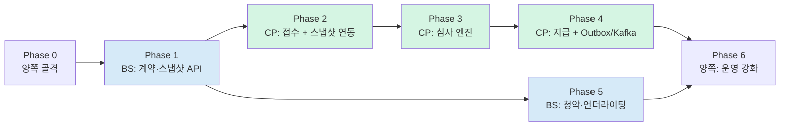

# 08. 구현 로드맵 (두 레포 통합)

> 이 로드맵은 **두 저장소를 함께** 다룬다. business-support의 로드맵 문서도 같은 내용을 참조한다.

---

## 1. v1 일정에서 배운 것

| v1 계획 | v1 실제 |
|---|---|
| 16일 (2025-12-28 ~ 2026-01-12) 전 Phase 완료 | Phase 2가 2026-01-20에 머지. **Phase 3~5 미착수** |
| Phase당 2~4일 | 실제로는 일정이 의미를 갖지 못함 |

**원인**: 달력 날짜로 계획했는데 개인 프로젝트는 가용 시간이 일정하지 않다.

**교정**: **날짜가 아니라 "완료 조건(Definition of Done)"으로 관리**한다.
각 단계는 *"이것이 되면 끝"*이 명확하고, 순서 의존성만 지키면 된다.

---

## 2. 의존 순서



**핵심 제약: business-support의 스냅샷 API가 먼저 있어야 claims가 진행된다.**
그래서 BS의 계약 모델이 Phase 1이고, 청약·언더라이팅은 뒤로 미룬다 (claims가 의존하지 않으므로).

| 색 | 의미 |
|---|---|
| 🔵 파랑 | insurance-business-support |
| 🟢 초록 | insurance-claims-platform |

---

## Phase 0 — 양쪽 골격 ✅ 구현 완료

**목표: 코드 한 줄 쓰기 전에, 잘못된 코드가 머지될 수 없는 상태를 만든다.**

### 작업

| # | 레포 | 작업 | 상태 |
|---|---|---|---|
| 0-1 | 둘 다 | Gradle 멀티모듈 골격 ([`07-architecture.md`](07-architecture.md) §2) | ✅ |
| 0-2 | 둘 다 | `domain` 모듈에 Spring 의존성 없음 | ✅ |
| 0-3 | 둘 다 | ArchUnit 규칙 작성 + 통과 | ✅ |
| 0-4 | 둘 다 | Testcontainers 베이스 (PostgreSQL + Flyway 실행) | ✅ |
| 0-5 | 둘 다 | GitHub Actions CI (build, arch, coverage gate, gitleaks) | ✅ |
| 0-6 | 둘 다 | jacoco `violationRules` 설정 | ✅ |
| 0-7 | 둘 다 | `main`/`develop` 브랜치 + 보호 규칙 | ⚠️ 수동 설정 필요 |
| 0-8 | 둘 다 | `compose.yaml` (KRaft Kafka, healthcheck 포함) | ✅ |
| 0-9 | 둘 다 | 설정 외부화 (`${}` 플레이스홀더, `.env.example`) | ✅ |
| 0-10 | 둘 다 | Spring Security 스켈레톤 | ✅ |
| 0-11 | 둘 다 | Outbox 기반 (테이블 + `OutboxAppender` 포트/어댑터) | ✅ |

### 완료 조건 — 검증 결과

```
☑ ./gradlew build 통과
      claims-platform  : 59건 통과 / 실패 0
      business-support : 73건 통과 / 실패 0

☑ 도메인이 Spring을 참조하면 빌드가 실패한다  ← 실제로 확인함
      1차 방어선(Gradle): domain 모듈에 @Component 를 넣자 컴파일 단계에서 실패
          error: package org.springframework.stereotype does not exist
      2차 방어선(ArchUnit): application 계층에 ApplicationEventPublisher 주입을 넣자
          '애플리케이션은_스프링_이벤트퍼블리셔를_쓰지_않는다' 규칙이 위반 3건을 잡고 빌드 실패
      → v1을 무너뜨린 바로 그 코드가 이제 머지될 수 없다

☑ Testcontainers + Flyway 검증 테스트 작성
      FlywayMigrationTest, OutboxAppenderIntegrationTest
      Docker가 있는 환경(CI)에서 실행되고, 없으면 실패가 아니라 skip 된다
      (@Testcontainers(disabledWithoutDocker = true))
      ※ 설계 시점 로컬 환경에 Docker 데몬이 없어 실제 실행은 CI 첫 구동 시 확인 필요

☑ 커버리지 게이트가 동작한다
      claims-domain  : line 99.1% / branch 98%  (기준 90% / 85%)
      policy-domain  : line 99.1% / branch 99%  (기준 90% / 85%)
      → v1 실측은 line 68% / branch 22%였다

☑ 비밀값에 기본값이 없다
      DB_PASSWORD, CLAIMS_ENCRYPTION_KEY 미설정 시 기동 실패

☐ main 브랜치 + 보호 규칙  ← GitHub 저장소 설정에서 수동 적용 필요
      · main 브랜치 생성
      · main/develop 직접 푸시 차단
      · PR 필수 상태 검사: verify, secret-scan
```

> **0-3, 0-4가 이 단계의 핵심이다.** v1이 실패한 지점을 구조적으로 막는 작업이라
> 여기서 타협하면 나머지가 다시 무너진다.

### Phase 0에서 실제로 잡힌 것

골격을 짜는 동안 안전장치가 두 번 일했다. 기록해 둘 만하다.

1. **ArchUnit이 검사 대상을 0개로 잡고 있었다.**
   `ImportOption.DoNotIncludeJars`가 형제 모듈의 JAR까지 걸러내서, 모든 규칙이
   "검사할 클래스 없음"으로 조용히 통과할 뻔했다. `검사_대상이_비어있지_않다`
   안전장치 테스트가 이걸 잡았다. **규칙이 통과하는 것과 검사할 대상이 없는 것은 다르다.**

2. **빈 모듈이 레이어 규칙을 깨뜨렸다.**
   `claims-rules`가 Phase 3까지 비어 있는데 ArchUnit은 빈 레이어를 위반으로 본다.
   `withOptionalLayers(true)` + `allowEmptyShould(true)`로 "아직 비어 있음"을 명시했다.

---

## Phase 1 🔵 — business-support: 계약 모델 + 스냅샷 API

**목표: claims가 의존할 수 있는 계약 원천을 만든다.**

### 작업

| # | 작업 |
|---|---|
| 1-1 | `Policy` · `Coverage` · `Insured` 애그리거트 (도메인) |
| 1-2 | **Bitemporal 이력 테이블** (`valid_from`/`valid_to` + `recorded_at`) |
| 1-3 | 계약 상태머신 (정상/납입최고/실효/부활/해지/만기) |
| 1-4 | `Exclusion`(부담보) 모델 + KCD 범위 |
| 1-5 | **`GET /policies/{no}/snapshot?asOf=`** — 시점 조회 |
| 1-6 | 스냅샷 checksum 생성 |
| 1-7 | 계약 상태 변경 시 `policy.*` 이벤트 (Outbox) |
| 1-8 | 테스트 데이터 시드 (4세대 실손 계약 N건, 부담보 케이스 포함) |

### 완료 조건

```
□ 같은 계약에 asOf를 달리하면 다른 스냅샷이 나온다
□ 소급 정정(recorded_at 다른 두 버전) 후에도 과거 조회가 재현된다
□ 부담보 조건이 스냅샷에 포함된다
□ checksum이 응답 본문과 일치한다
□ 계약 상태 변경 시 outbox_event에 행이 쌓인다
□ 계약 테스트 픽스처(claims가 기대하는 형태)를 만족한다
```

---

## Phase 2 🟢 — claims: 청구 접수 + 스냅샷 연동

**목표: 접수가 되고, 사고일 시점 계약이 청구에 고정된다.**

### 작업

| # | 작업 |
|---|---|
| 2-1 | `Claim` 애그리거트 + 상태 전이표 + `pullEvents()` |
| 2-2 | `TreatmentLine` · `ChargeBreakdown` + 총액 정합성 검증 |
| 2-3 | `Money` (원 단위 정수), `ClaimNo` (일자별 시퀀스) |
| 2-4 | `PaymentDueDate` + `BusinessCalendar` (공휴일 반영) |
| 2-5 | `PolicySnapshotPort` + ACL 어댑터 (BS 호출, 서킷브레이커) |
| 2-6 | 스냅샷 원문 저장 (불변 테이블) |
| 2-7 | `POST /claims`, `GET /claims/{claimNo}`, 목록, 철회 |
| 2-8 | API 멱등성 (`Idempotency-Key`) |
| 2-9 | 인증·인가 (자기 계약만 조회) |
| 2-10 | **MockMvc 웹 계층 테스트** (v1에 0건이었던 부분) |
| 2-11 | 스냅샷 PENDING 재시도 잡 |

### 완료 조건

```
□ 접수 → 201, 스냅샷 SECURED, 지급기한 계산됨
□ BS를 내려도 접수가 202로 성공하고, 복구 후 스냅샷이 확보된다
□ 같은 Idempotency-Key 재요청 시 청구가 1건만 생성된다
□ 남의 청구 조회 시 403
□ 상태 전이 위반 시 409 (500 아님)
□ 진료비 총액 불일치 시 DOCS_REQUIRED
□ 접수 후 BS에서 계약을 바꿔도 저장된 스냅샷은 변하지 않는다
```

---

## Phase 3 🟢 — claims: 심사 엔진

**이 프로젝트의 핵심. 가장 많은 시간을 여기 쓴다.**

### 작업

| # | 작업 |
|---|---|
| 3-1 | `AdjudicationContext` 사전 적재 (I/O를 파이프라인 밖으로) |
| 3-2 | Stage 1~2: 접수 검증 · 계약 자격 (`R-ADM-*`, `R-POL-*`) |
| 3-3 | Stage 3: 보장 판정 + `exclusion_kcd_rule` 테이블 (`R-COV-*`) |
| 3-4 | Stage 4: **자기부담금 계산** (`R-CAL-*`) — 급여/비급여 분리, 최소공제 |
| 3-5 | `ruleset_parameter` 테이블 + 세대별 파라미터 |
| 3-6 | Stage 5: `BenefitLedger` + 예약-확정-해제 (`R-LMT-*`) |
| 3-7 | **보장연도 계산** (계약 응당일 기준) |
| 3-8 | Stage 6~8: 중복·FDS·라우팅 |
| 3-9 | `RuleTrace` 기록 (append-only, DB 권한 제한) |
| 3-10 | **골든 케이스 테스트 세트** |
| 3-11 | 심사자 API (큐, 상세+트레이스, 결정 확정) |
| 3-12 | 고객용 `settlement` 응답 (산출 내역 설명) |

### 완료 조건

```
□ 문서 §4 예시 1~4가 골든 케이스로 전건 통과
□ 동일 계약 동시 청구 2건에서 한도 초과 지급이 발생하지 않는다
□ 원장 낙관적 락 충돌 3회 초과 시 MANUAL_REVIEW로 회부된다
□ 부담보 주상병 저촉 → 부지급 / 부상병만 저촉 → 회부
□ 보장연도 경계(계약 응당일)에서 한도가 리셋된다
□ 모든 판정에 사유코드와 트레이스가 있다
□ rule_trace에 UPDATE 시도 시 실패한다
□ 심사자가 금액을 변경하면 overrideReason 없이는 400
□ 도메인·룰 모듈 브랜치 커버리지 85% 이상
```

---

## Phase 4 🟢 — claims: 지급 + Outbox/Kafka

### 작업

| # | 작업 |
|---|---|
| 4-1 | `PaymentInstruction` + 결정적 멱등키 |
| 4-2 | `FundTransferPort` 스텁 (지연·실패·타임아웃 시뮬레이션) |
| 4-3 | **타임아웃 = UNKNOWN 처리** + 조회 대사 |
| 4-4 | 원장 `CONFIRM` / `RELEASE` 연동 |
| 4-5 | `outbox_event` 테이블 + `OutboxAppender` |
| 4-6 | 폴링 릴레이 (`FOR UPDATE SKIP LOCKED`) |
| 4-7 | Kafka 발행 + 토픽 구성 |
| 4-8 | `processed_event` 기반 소비 멱등성 |
| 4-9 | DLQ + 재처리 API |
| 4-10 | 지급기한 감시 스케줄러 + 지연이자 산출 |
| 4-11 | 알림 어댑터 스텁 |
| 4-12 | 환수(`RECLAIMING`) 흐름 |

### 완료 조건

```
□ 이체 성공 → PAID → claim.paid 이벤트가 Kafka에 발행된다
□ 트랜잭션 롤백 시 outbox_event에 행이 남지 않는다 (커밋 전 발행 없음)
□ 이체 타임아웃 시 재시도하지 않고 UNKNOWN으로 남는다
□ 같은 심사에 대해 지급지시가 2건 생성되지 않는다 (DB 제약 확인)
□ 같은 이벤트를 2번 소비해도 1번만 처리된다
□ 릴레이 2개 동시 실행 시 중복 발행이 없다
□ 지급기한 초과 시 지연이자가 산출되고 알림이 발생한다
□ 부지급·철회 시 원장 예약이 해제된다
```

---

## Phase 5 🔵 — business-support: 청약 + 언더라이팅

**claims가 의존하지 않으므로 Phase 2~4와 병행 가능하다.**

### 작업

| # | 작업 |
|---|---|
| 5-1 | `Application`(청약) 애그리거트 + 고지사항 |
| 5-2 | `UnderwritingCase` + 심사 상태머신 |
| 5-3 | **자동 언더라이팅 룰 (AUW)** — 연령·직업급수·고지 기반 |
| 5-4 | 인수 결정: 표준체 / 할증 / **부담보** / 감액 / 연기 / 거절 |
| 5-5 | 부담보 결정이 `Coverage`·`Exclusion`에 반영 → **스냅샷에 나타남** |
| 5-6 | 계약 성립 → `policy.issued` 이벤트 |
| 5-7 | 계약 보전: 납입최고·실효·부활·해지 + 각 이벤트 |
| 5-8 | 부활 시 재고지 + 면책기간 재기산 |
| 5-9 | UW 심사자 API |
| 5-10 | `claim.paid` 구독 → 손해율 집계 |

### 완료 조건

```
□ 청약 → AUW → 자동 인수 → policy.issued 전 흐름 동작
□ 부담보 결정이 스냅샷 API 응답에 반영된다
□ AUW가 회부한 건이 UW 심사자 큐에 나타난다
□ 실효 → 부활 시 면책기간이 재기산된다
□ 계약 변경이 bitemporal 이력으로 쌓인다 (과거 조회 불변)
□ claims가 부담보 저촉 건을 정확히 부지급한다 (레포 간 E2E)
```

---

## Phase 6 — 양쪽: 운영 강화

### 작업

| # | 레포 | 작업 |
|---|---|---|
| 6-1 | 둘 다 | 민감 컬럼 암호화 + 블라인드 인덱스 |
| 6-2 | 둘 다 | **타입 수준 마스킹** 전면 적용 |
| 6-3 | 둘 다 | `audit_log` (조회 포함) + 파티셔닝 |
| 6-4 | 둘 다 | Micrometer 지표 + Grafana 대시보드 |
| 6-5 | 둘 다 | OpenTelemetry 분산추적 (레포 간 traceId 연결) |
| 6-6 | 둘 다 | OpenAPI 생성 + CI drift 검사 |
| 6-7 | 🟢 | Debezium CDC로 Outbox 릴레이 전환 (선택) |
| 6-8 | 둘 다 | 부하 테스트 (k6) + p99 측정 |
| 6-9 | 둘 다 | 장애 시나리오 문서 + 런북 |
| 6-10 | 둘 다 | 정합성 배치 (중복지급·한도초과·미대사 이체 탐지) |

### 완료 조건

```
□ 민감정보가 로그·이벤트·API 응답에 평문으로 나타나지 않는다 (자동 검사)
□ traceId로 claims 접수 → BS 스냅샷 조회 → 심사 → 지급을 한 화면에서 추적 가능
□ OpenAPI가 코드와 다르면 CI가 실패한다
□ 정합성 배치가 이상 0건을 보고한다
□ 런북대로 장애 복구가 가능하다 (실제로 한 번 해본다)
```

---

## 3. 단계별 데모 가능 상태

각 Phase 종료 시 **보여줄 수 있는 것**이 있어야 한다.

| Phase | 데모 |
|---|---|
| 0 | "규칙을 어기면 빌드가 깨집니다" — ArchUnit 위반 커밋 시연 |
| 1 | "같은 계약을 다른 날짜로 조회하면 다른 결과가 나옵니다" |
| 2 | "계약 서버를 꺼도 접수는 됩니다" |
| 3 | **"30만원 청구가 왜 12만 4천원인지 룰 단위로 설명됩니다"** ← 핵심 데모 |
| 4 | "이체가 타임아웃돼도 중복 지급되지 않습니다" |
| 5 | "부담보로 인수된 계약이 청구 단계에서 정확히 부지급됩니다" |
| 6 | "traceId 하나로 두 서비스를 관통해 추적됩니다" |

> Phase 3의 데모가 이 프로젝트의 정체성이다.
> 대부분의 포트폴리오가 CRUD에서 멈추는데, **설명 가능한 심사**는 흔치 않다.

---

## 4. 범위에서 제외한 것

| 제외 | 이유 |
|---|---|
| 실제 EMR·전송대행기관 연동 | 인터페이스만 정의. 실연동은 기관 계약 필요 |
| 실제 펌뱅킹 | 스텁. 실패·타임아웃 시뮬레이션으로 대체 |
| 프론트엔드 | 백엔드 설계가 목적. 필요 시 심사자 콘솔만 최소 구현 |
| 쿠버네티스·IaC | 로컬 compose로 충분 |
| 다통화 | KRW 단일 |
| 자동차보험·생명보험 | 별도 보종 |

### 4.1 v1 클라이언트 UI 처리

`docs/` 의 GitHub Pages UI는 백엔드와 경로·필드가 전부 불일치하고 대시보드는 목 데이터였다.

**결정**: 현 상태로는 유지 가치가 없으므로 `docs/archive/v1/`로 함께 보관하고,
새 UI가 필요해지는 시점(Phase 3 심사자 콘솔)에 **실제 API 계약에 맞춰 다시 만든다.**
동작하지 않는 UI를 남겨두면 "되는 것처럼 보이는" 잘못된 신호를 준다.

---

## 5. 작업 추적

GitHub Issues + 마일스톤으로 관리한다.

| 규칙 | 내용 |
|---|---|
| 마일스톤 | `Phase 0` ~ `Phase 6` |
| 이슈 제목 | `[Phase 3] 자기부담금 계산 룰 구현` |
| 브랜치 | `feat/#이슈번호` |
| 커밋 | `feat: 급여/비급여 자기부담금 분리 계산 #42` |
| PR | 완료 조건 체크리스트를 본문에 복사해 체크 |
| 머지 | **CI 통과 필수.** v1처럼 30초 만에 셀프 머지하지 않는다 |

---

## 관련 문서

- [`00-domain-glossary.md`](00-domain-glossary.md) — 도메인 사전
- [`01-context-map.md`](01-context-map.md) — 두 레포 경계
- [`03-adjudication.md`](03-adjudication.md) — 심사 룰
- [`07-architecture.md`](07-architecture.md) — 강제 장치
- business-support: `docs/design/08-roadmap.md`
